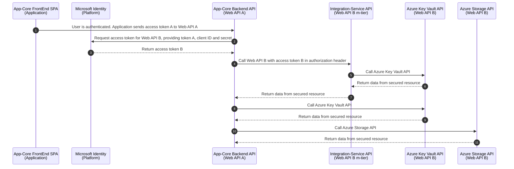
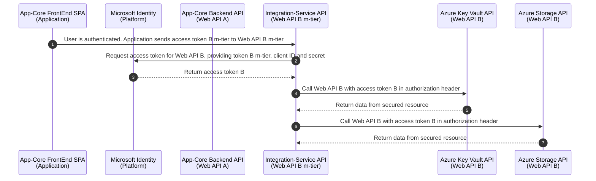

# Table of Contents

1. [Enterprise App-Core Automation and Self-Service](#enterprise-app-core-automation-and-self-service)
2. [Automation Glossary](#automation-glossary)
3. [Introduction to Security Principals with authentication and authorization](#introduction-to-security-principals-with-authentication-and-authorization)
4. [AAD endpoints](#aad-endpoints)
5. [Azure AD OBO Flow](#azure-ad-obo-flow)
6. [App-Core and App-Analysis authentication with OAuth permissions](#app-core-and-app-analysis-authentication-with-oauth-permissions)
   1. [Tech Stack](#tech-stack)
      1. [Security Tokens](#security-tokens)
      2. [Security Token Flows implemented in App-Core](#security-token-flows-implemented-in-app-core)
         1. [Sign-in and OBO Flow by a App-Core user - a human being](#sign-in-and-obo-flow-by-a-app-core-user---a-human-being)
         2. [Sign-in and OBO Flow by a Integration-Service-OnPrem instance - an app](#sign-in-and-obo-flow-by-a-integration-service-onprem-instance---an-app)
      3. [Single Page Application settings](#single-page-application-settings)
      4. [Web API settings](#web-api-settings)
   2. [Diagram 1 App-Core Login Workflow](#diagram-1-app-core-login-workflow)
   3. [Diagram 2 App-Core Uploading Core-Data assets from the browser](#diagram-2-app-core-uploading-core-data-assets-from-the-browser)
   4. [App-Analysis Viewer authentication with OAuth permissions](#app-analysis-viewer-authentication-with-oauth-permissions)
   5. [API Security and Authentication Flow References](#api-security-and-authentication-flow-references)
7. [Azure DevOps YAML Pipelines and Configuration Files](#azure-devops-yaml-pipelines-and-configuration-files)
8. [Azure Resource Groups with Azure DevOps key-vaults and Terraform State Files](#azure-resource-groups-with-azure-devops-key-vaults-and-terraform-state-files)
9. [Azure Storage Account Settings and Azure Blob Settings with Terraform State Files](#azure-storage-account-settings-and-azure-blob-settings-with-terraform-state-files)
10. [Environments](#environments)
    1. [Matrix table](#matrix-table)
    2. [Terraform tfvars vs variables - Setting up environments in tfvars](#terraform-tfvars-vs-variables---setting-up-environments-in-tfvars)
    3. [Azure Multi Region settings in tfvars](#azure-multi-region-settings-in-tfvars)
11. [Architecture and Permissions](#architecture-and-permissions)
12. [App-Core App Registrations in AAD](#app-core-app-registrations-in-aad)
13. [Requirements](#requirements)
    1. [DNS Zones with assigned Azure Subscriptions and AAD Tenants](#dns-zones-with-assigned-azure-subscriptions-and-aad-tenants)
    2. [Environments and Permissions](#environments)
    3. [Configure the Admin consent worklow](#configure-the-admin-consent-worklow)
       1. [After Deployment - Manage consent and permissions in appr-app-core-back-env](#after-deployment---manage-consent-and-permissions-in-appr-app-core-back-env)
14. [App Gateway Certificates and Purchased Wildcard Certificates - Create certificates to allow the backend with Azure Application Gateway](#app-gateway-certificates-and-purchased-wildcard-certificates---create-certificates-to-allow-the-backend-with-azure-application-gateway)
    1. [App Gateway Prerequisites](#app-gateway-prerequisites)
    2. [Create Signed Wildcard Certificates in Production Environment](#create-signed-wildcard-certificates-in-production-environment)
    3. [Export and Import an App Service Certificate Order](#export-and-import-an-app-service-certificate-order)
    4. [Table with Signed Wildcard Certificates](#table-with-signed-wildcard-certificates)
15. [Render terraform graphs with Graphviz](#render-terraform-graphs-with-graphviz)
16. [How to rollback in a GitOps flow with Azure DevOps pipelines](#how-to-rollback-in-a-gitops-flow-with-azure-devops-pipelines)
17. [RBAC](#rbac)
    1. [Azure AD Custom Roles](#azure-ad-custom-roles)
    2. [Azure ARM Custom Roles](#azure-arm-custom-roles)
    3. [Azure AD Built-in Roles](#azure-ad-built-in-roles)
    4. [Azure ARM Built-in Roles](#azure-arm-built-in-roles)
    5. [Microsoft Graph Permissions related to Azure RBAC and Azure Resources](#rbac)
18. [Azure Regions](#azure-regions)
    1. [Azure Region Codes aka Short Notation in Cloud Resource Naming Convention - Azure Naming rules and restrictions](#azure-region-codes-aka-short-notation-in-cloud-resource-naming-convention---azure-naming-rules-and-restrictions)
19. [Known Issues and Solutions](#known-issues-and-solutions)
    1. [App-Core Known Issues and Solutions](#known-issues-and-solutions)
    2. [Terraform State files](#terraform-state-files)
    3. [Azure DevOps pipeline gets stuck in Terraform Plan with error too many command line arguments](#azure-devops-pipeline-gets-stuck-in-terraform-plan-with-error-too-many-command-line-arguments)
20. [Troubleshooting and Debugging](#troubleshooting-and-debugging)
    1. [Test Users](#test-users)
    2. [DNS Troubleshooting](#dns-troubleshooting)
    3. [Troubleshooting App-Core by debugging Az PowerShell](#troubleshooting-app-core-by-debugging-az-powershell)
    4. [Debugging App Service logs](#debugging-app-service-logs)
    5. [Azure App Service Debug Console](#azure-app-service-debug-console)
    6. [Debugging local code from a laptop](#debugging-local-code-from-a-laptop)
    7. [Troubleshooting Token Grant Flow - OBO Flow](#troubleshooting-token-grant-flow---obo-flow)
       1. [Chrome DevTools Debugging](#chrome-devtools-debugging)
       2. [Troubleshooting logs in Chrome DevTools and App-Core Back - Example of Microsoft Graph authorization error](#troubleshooting-logs-in-chrome-devtools-and-app-core-back---example-of-microsoft-graph-authorization-error)
    8. [Troubleshooting Azure Services](#troubleshooting-azure-services)
21. [GitOps Development Tips](#gitops-development-tips)
    1. [Desktop development in a small terraform sandbox environment](#desktop-development-in-a-small-terraform-sandbox-environment)
    2. [Interactive command line console for evaluating and experimenting with expressions in terraform](#interactive-command-line-console-for-evaluating-and-experimenting-with-expressions-in-terraform)
22. [Coding Style Guide and VSCode settings](#coding-style-guide-and-vscode-settings)
23. [Improvements and Ideas](#improvements-and-ideas)
24. [References](#api-security-and-authentication-flow-references)

## Enterprise App-Core Automation and Self-Service

This repo developed by the [Platform Engineering](https://softwareengineeringdaily.com/2020/02/13/setting-the-stage-for-platform-engineerin) team contains two **Azure DevOps IaC pipelines** that deploy, update and destroy **Enterprise App-Core** on Azure with Azure DevOps and Terraform. All of these automated pipelines **run in parallel**.

Environments are automatically created, updated and destroyed via Azure DevOps Pipelines. These pipelines might require [approvals](https://learn.microsoft.com/en-us/azure/devops/pipelines/process/approvals) in order to accept or reject changes. A [GitOps pattern](https://developers.redhat.com/articles/2022/07/20/git-workflows-best-practices-gitops-deployments) (the correct way of doing [DevOps](https://www.techworld-with-nana.com/devops-roadmap)) with Terraform is the approach being used here. Terraform is an [Infrastructure as Code (IaC)](https://thenewstack.io/struggling-with-it-staff-leaving-try-infrastructure-as-code/) solution.

**Note:** Once you start using Terraform to deploy your Azure resources, it’s a best practise to continue using terraform for this. **Try to avoid using the Azure Portal UI to make further changes as that may cause issues in your Terraform configuration.**

A **Gitflow** branching model is currently setup on this configuration repository. It involves creating two main branches - “main” and “develop” - and using feature branches to develop new features. Once a feature is complete, it is merged into the “develop” branch. When the “develop” branch is stable, it is merged into the “main” branch:

- **main** branch with a **dedicated** terraform **state** file.
- **develop** branch and **other develop** branches with a **shared** terrraform **state** file:
    - All the existing branches **except main branch** are develop branches.
    - **develop** branch is the main development branch.
    - We can work on separated branches for development purposes (*development* branch, *develop_feature* branch, *feature/item* branch, *bugfix/item* branch, etc), with **all of them sharing the same terraform state file**. Check *"GIT_BRANCH"* var in:
        - [configuration/variable-group-with-secrets.yml](configuration/variable-group-with-secrets.yml)
        - [templates/terraform-validate.yml](templates/terraform-validate.yml)
        - [templates/terraform-plan.yml](templates/terraform-plan.yml)
        - [templates/terraform-apply.yml](templates/terraform-apply.yml)
        - [templates/terraform-destroy.yml](templates/terraform-destroy.yml)
    - Therefore, we can have several development branches with different solutions / architecture designs in case we are not sure which one is the *winning horse*.
    - **Make sure you only have one azure devops develop pipeline** pointing out to one of these git branches, otherwise more than one pipeline could have access to the same terraform state file. Each running pipeline acquires the lock of the terraform state file [to prevent others from corrupting your state](https://www.terraform.io/language/state/locking).
    - Having a dedicated state file per git branch is another option, but **we want to reuse the already deployed resources with different settings per branch** (faster than creating all the resources from scratch).


[youtube: Git Branches Tutorial](https://www.youtube.com/watch?v=e2IbNHi4uCI)

**Azure Multi-Region feature**: We are now able to deploy App-Core on both **Azure Europe** and **Azure United States** regions. This process is **fully automated with one single click** and it will help us to be more efficient while also improving the quality of our products.

Six optional environments have been defined: **DEV**, **QA**, **UAT**, **PRE**, **PRO**, **DEM (DEMO)**. Non-production environments can be managed with a **“Self-Service approach”**. Security is achieved via permissions and approvals.

One of my favourite quotes that motivates me to implement automation:

[*“The absolutely difficult thing is reaching volume production without going bankrupt, that is the actual hard thing”*](https://www.youtube.com/watch?v=cdZZpaB2kDM&t=2024s) Elon Musk

## Automation Glossary

- **Infrastructure as code (IaC)** is the managing and provisioning of infrastructure through code instead of through manual processes. With IaC, configuration files contain your infrastructure specifications, making them easier to edit and distribute. This also ensures consistency in the environments you provision, and helps aid in configuration management.
- **Configuration management** is a process for maintaining computer systems, servers, and software in a consistent desired state. It ensures that a system performs as expected as changes are made over time. Configuration management can be automated, reducing cost, complexity and the chance for errors.
- Containers are [ephemeral, idempotent and immutable](https://containerjournal.com/topics/ephemeral-idempotent-and-immutable-infrastructure/).
- **Terraform is declarative and idempotent:**
    - Terraform configuration files are **declarative**, meaning that they describe the end state of your infrastructure. You do not need to write step-by-step instructions to create resources because Terraform handles the underlying logic.
    - A Terraform configuration is **idempotent** when a second apply results in 0 changes. An idempotent configuration ensures that: What you define in Terraform is exactly what is being deployed. Detection of bugs in Terraform resources and providers that might affect your configuration.
    - Cloud resources created using Terraform are maintained using Infrastructure as Code. Any changes, commissioning, and decommissioning of resources are supposed to be handled using IaC. **Teams who have adapted Terraform for infrastructure management usually have strict compliance with manual changes via the web console.**
- **GitOps** is an approach to managing infrastructure and application configurations using Git, an open source version control system. GitOps works by using Git as a single source of truth for declarative infrastructure and applications.
    - GitOps uses **Git pull requests** to automatically manage infrastructure provisioning and deployment, allowing teams to manage infrastructure using the same tools and processes they use for software development.
- **[Gitflow](https://www.atlassian.com/git/tutorials/comparing-workflows/gitflow-workflow):** Gitflow is a popular branching model that is widely used in software development. It involves creating two main branches - “master” and “develop” - and using feature branches to develop new features. Once a feature is complete, it is merged into the “develop” branch. When the “develop” branch is stable, it is merged into the “master” branch.
- **[Trunk-based development ref 1 - trunkbaseddevelopment.com](https://trunkbaseddevelopment.com/):** Trunk-based development involves working directly on the main branch, which is usually “master” or “main”. Developers create feature branches for new features, but instead of merging them back into a development branch, they merge them directly into the main branch. This strategy requires a high level of discipline and automated testing to ensure that the main branch remains stable at all times.
- **[Trunk-based development ref 2](https://developers.redhat.com/articles/2022/07/20/git-workflows-best-practices-gitops-deployments):** This method defines one branch as the "trunk" and carries out development on each environment in a different short-lived branch. When development is complete for that environment, the developer creates a pull request for the branch to the trunk. Developers can also create a fork to work on an environment, and then create a branch to merge the fork into the trunk.
    - Once the proper approvals are done, the pull request (or the branch from the fork) gets merged into the trunk. The branch for that feature is deleted, keeping your branches to a minimum. Trunk-based development trades branches for directories.
    - You can think of the trunk as a "main" or primary branch. production and prod are popular names for the trunk branch.
    - Trunk-based development came about to enable continuous integration and continuous delivery by supplying a development model focused on the fast delivery of changes to applications. But this model also works for GitOps repositories because it keeps things simple. When you record deltas between environments, you can clearly see what changes will be merged into the trunk. You won’t have to cherry-pick nearly as often, and you’ll have the confidence that what is in your Git repository is what is actually going into your environment. This is what you want in a GitOps workflow.
- [**Trunk-based development ref 3 - GitFlow VS Trunk-based development model**](https://dzone.com/articles/why-i-prefer-trunk-based-development-over-feature)
- An [**immutable infrastructure**](https://www.hashicorp.com/resources/what-is-mutable-vs-immutable-infrastructure) is another infrastructure paradigm in which servers are never modified after they’re deployed. If something needs to be updated, fixed, or modified in any way, new servers built from a common image with the appropriate changes are provisioned to replace the old ones. After they’re validated, they’re put into use and the old ones are decommissioned.
    - The benefits of an immutable infrastructure include more consistency and reliability in your infrastructure and a simpler, more predictable deployment process. It mitigates or entirely prevents issues that are common in mutable infrastructures, like **configuration drift** and **snowflake servers**. However, using it efficiently often includes comprehensive deployment automation, fast server provisioning in a cloud computing environment, and solutions for handling stateful or ephemeral data like logs.
    - **Normal Flow:**      Develop ---> Deploy    ---> Configure
    - **Immutable Flow:**   Develop ---> Configure ---> Deploy

- **Configuration Drift** occurs when unplanned changes happen and a resource’s configuration moves away from the designed baseline. Drift is common because of frequent software and hardware updates, particularly in a colocation facility or when using virtual machines.
    - Production, staging, development and recovery configurations are designed to be identical (or near identical) to maintain consistency. As the configurations in the different environments change, a configuration gap develops, which can lead to a variety of issues, including disaster recovery and high availability failures.
- In DevOps, a **snowflake** is a server that requires special configuration beyond that covered by automated deployment scripts. You do the automated deployment, and then you tweak the snowflake system by hand. For a long time (through the '90s, at least), snowflake configurations were the rule.
- **Self Service in Infrastructure:**
    - [dabase.com: The problem: Ticket based systems for provisioning Infrastructure](https://dabase.com/blog/2022/devops-self-service/)
    - [lucidchart.com: Self-service in DevOps](https://www.lucidchart.com/blog/self-service-in-devops): Before DevOps self-servicing, software engineers typically built an application or a product feature and then waited for the IT operators to “dispatch” it. With self-service DevOps, however, engineers are no longer dependent on a separate team of IT operators to bring their product features to life. Instead, DevOps teams can build infrastructure that allows software engineers to deploy updates without waiting for DevOps resources to become available.
        - As the rate of software innovation has accelerated, it’s become clear that the traditional way of working (where a centralized IT team handled the automated procedures and were the gatekeepers to executing tasks) no longer makes sense. Developers spent time waiting for the operations team to **respond to a ticket request** and additional time was lost as the operation team tried to make sense of the new feature in the live environment.
        - This is why, according to The New Stack, tech companies first popularized the idea of DevOps—dispersing centralized IT functions throughout the organization and embedding operations engineers within development teams. While this worked for tech companies, other enterprises struggled to adopt DevOps roles at scale. Services like AWS, Azure, and Google began offering IT services on-demand to help the average company adopt the DevOps model. But self-service DevOps is more than just picking IT capabilities from a menu.
        - Self-service DevOps can break down silos and increase productivity, but, like any process, it can be challenging to implement in the beginning. One roadblock can be an increase in costs. With engineers able to deploy at scale, it’s a good idea to put parameters in place.
        - According to Stelligent, one way to control costs is to launch smaller instances. That is, use less expensive servers to maintain your infrastructure while also creating and keeping autoscaling policies so that a spike in demand doesn’t automatically translate to a spike in costs. Another strategy is to use mock services instead of always deploying to a live environment.
        - You’ll also want to ensure that self-service automation doesn’t lead to engineers going rogue. Be sure to design parameters within the on-demand self-service environment that the engineers understand. Stelligent recommends thinking about **a one-button deployment**, with distinct options and a failsafe built into the pipeline. Having strict parameters in place also helps mitigate security concerns.
    - [thenewstack.io: What We Learned from Enabling Developer Self-Service](https://thenewstack.io/what-we-learned-from-enabling-developer-self-service/): Developer self-service means developers need not be experts in the entire deployment toolchain. When it comes to repetitive tasks like spinning up new features or preview environments, enabling developer self-service saves teams time. Without it, you face slowing down the development life cycle, with increases in change failure rates, bottlenecks and key person dependencies.

## Introduction to Security Principals with authentication and authorization

A [**security principal**](https://learn.microsoft.com/en-us/azure/key-vault/general/authentication) is an object that represents a user, group, service, or application that's requesting access to Azure resources. Azure assigns a unique object ID to every security principal.

- A **user** security principal identifies an individual who has a profile in Azure Active Directory.
- A **group** security principal identifies a set of users created in Azure Active Directory. Any roles or permissions assigned to the group are granted to all of the users within the group.
- A **service principal** is a type of security principal that identifies an application or service, which is to say, a piece of code rather than a user or group. A service principal's object ID acts like its username; the service principal's **client secret** acts like its password.

For applications, there are two ways to obtain a service principal:

- Recommended: enable a system-assigned **managed identity** for the application.
    - With managed identity, Azure internally manages the application's service principal and automatically authenticates the application with other Azure services. Managed identity is available for applications deployed to a variety of services.
    - If you go to [Microsoft docs](https://docs.microsoft.com/en-us/azure/active-directory/managed-identities-azure-resources/overview), here is the definition of managed identities you will get: *"Managed identities provide an identity for applications to use when connecting to resources that support Azure Active Directory (Azure AD) authentication. Applications may use the managed identity to obtain Azure AD tokens. For example, an application may use a managed identity to access resources like Azure Key Vault where developers can store credentials in a secure manner or to access storage accounts."*
    - In simple words, any azure resource that supports azure ad authentication can have managed identities. Once we enable managed identity for an azure, a service principal will be created in active directory on behalf of that azure resource you create. With this, you can grant access to the an Azure resource that has managed identity enabled on the target azure resource you want to access.
    - For example, if you want to have a webapp access your key vault, all you need to do is to enable managed identity on your webapp and grant access to the managed identity of your webapp in the access policies of the key vault.
    - Without managed identities, in the above mentioned scenario you would need a [service principal](https://docs.microsoft.com/en-us/powershell/azure/create-azure-service-principal-azureps?view=azps-5.9.0#:~:text=An%20Azure%20service%20principal%20is,accessed%20and%20at%20which%20level.) and a client secret to be created for your application (webapp in above scenario), and that service principal has to be granted permission on the target azure resource (key vault in above scenario). You need to configure your webapp to use the client id and secret to make calls to key vault to fetch the secrets.
    - You would have to manage the client id and secret by yourself. In case the service principal credentials are compromised, you need to change the secret every time and update the application code to consume the new secret. This is not only a bit insecure, but also tedious to update client secrets in multiple places.
    - [Managed Identities to rescue](https://dev.to/vivekanandrapaka/access-secrets-from-akv-using-managed-identities-for-aks-91p):
        - With managed identities you no longer have to create a service principal for your app, but when the feature is enabled on the azure resource, it will not only create an SP for you, but also it would manage rotation of keys by itself. You no longer need to keep client id and client secret of your service principal in your source code to access the target resource.
        - Kindly note that we are removing the burden of maintaining the service principal credentials in your code.
        - But you still need to have appropriate libraries and respective code to access the target resource. For example, if your app is going to access key vault and if the app is going to be on a webapp with managed identity enabled, you no longer need to pass the service principal credentials to call the key vault api endpoint. You can call the key vault api endpoint directly from your webapp as it has managed identity enabled and that managed identity is granted permission on the key vault.
    - For more information, see the [Managed identity overview](https://learn.microsoft.com/en-us/azure/active-directory/managed-identities-azure-resources/overview). Also see [Azure services that support managed identity](https://learn.microsoft.com/en-us/azure/active-directory/managed-identities-azure-resources/services-support-managed-identities), which links to articles that describe how to enable managed identity for specific services (such as App Service, Azure Functions, Virtual Machines, etc.).
- If you cannot use managed identity, you instead register the application with your Azure AD tenant, as described on [Quickstart: Register an application with the Azure identity platform](https://learn.microsoft.com/en-us/azure/active-directory/develop/quickstart-register-app). Registration also creates a second application object that identifies the app across all tenants.

For more information on requesting access tokens from Azure AD for users and service principals, see [Authentication scenarios for Azure AD](https://learn.microsoft.com/en-us/azure/active-directory/develop/authentication-vs-authorization).

For more information about requesting access tokens for resources configured with managed identities, see [How to use managed identities for Azure resources on an Azure VM to acquire an access token](https://learn.microsoft.com/en-us/azure/active-directory/managed-service-identity/how-to-use-vm-token).

## AAD endpoints

| Item                                  | endpoint                                                                                                                 |
|---------------------------------------|--------------------------------------------------------------------------------------------------------------------------|
| OAuth 2.0 authorization endpoint (v2) | https://login.microsoftonline.com/00000000-0000-0000-0000-000000000000/oauth2/v2.0/authorize                             |
| OAuth 2.0 token endpoint (v2)         | https://login.microsoftonline.com/00000000-0000-0000-0000-000000000000/oauth2/v2.0/token                                 |
| OAuth 2.0 authorization endpoint (v1) | https://login.microsoftonline.com/00000000-0000-0000-0000-000000000000/oauth2/authorize                                  |
| OAuth 2.0 token endpoint (v1)         | https://login.microsoftonline.com/00000000-0000-0000-0000-000000000000/oauth2/token                                      |
| OpenID Connect metadata document      | https://login.microsoftonline.com/00000000-0000-0000-0000-000000000000/v2.0/.well-known/openid-configuration             |
| Microsoft Graph API endpoint          | https://graph.microsoft.com                                                                                              |
| Federation metadata document          | https://login.microsoftonline.com/00000000-0000-0000-0000-000000000000/federationmetadata/2007-06/federationmetadata.xml |
| WS-Federation sign-on endpoint        | https://login.microsoftonline.com/00000000-0000-0000-0000-000000000000/wsfed                                             |
| SAML-P sign-on endpoint               | https://login.microsoftonline.com/00000000-0000-0000-0000-000000000000/saml2                                             |
| SAML-P sign-out endpoint              | https://login.microsoftonline.com/00000000-0000-0000-0000-000000000000/saml2                                             |

<details>
    <summary>AAD endpoints. Click to expand!</summary>


</details>

## Azure AD OBO Flow

- Area of concern
    - Usually happens when one API needs to call another
    - Requires additional scrutiny: Why is the developer requesting both?
    - Application becomes the arbitrator of what a user can do
        - Will the application get it right?
    - Occasionally done for developer ease
    - Can be avoided by using the On Behalf Flow
- Avoid mixing delegated and application permission: Use On Behalf Of when one API calls another
- Permissions Grant for OBO flow: How can middleware get user's Consent to access backend web API/service on behalf of the user? There's no user interaction in the middleware to get access token for the backend... Main options are:
    1. known Client Applications
       1. Middleware AAD applications adds client to the KnownClientApplications section in its manifest
       2. Token request will use .default scope
       3. Consent grant prompt will include permissions scopes for application to middleware and from middleware to backend
    2. Pre-authorized applications
       1. A given application always has permissions for certain scopes
       2. Must be registered in preAuthorizedApplications section of the manifes
    3. Admin consent
       1. Tenant admin can grant tenant-wide permissions to middleware to call certain API with certain permission scopes

- Why OBO flow? If you run complex and/or long running tasks. Users can close the browser and make your Code "feel lost".
- With OBO you can run tasks in the middleware:
    - In your middleware you can filter requests based on the consumer component/user
    - And you can run background tasks on behalf of the user

| Item                                                                                               | Youtube                                                                                                                                                                                                  |
|----------------------------------------------------------------------------------------------------|----------------------------------------------------------------------------------------------------------------------------------------------------------------------------------------------------------|
| Using the Azure AD on-behalf-of flow within your SharePoint Framework solution                     | [](https://www.youtube.com/watch?v=R86R1kM3Byk)                     |
| Service-to-Service calls with Delegated Identity using Azure Active Directory                      | [](https://www.youtube.com/watch?v=RIEz1n4A0e0)                      |
| Mixing delegated and application permissions (the on-behalf-of flow) - Microsoft identity platform | [](https://www.youtube.com/watch?v=M5yXU6oWchU) |

## App-Core and App-Analysis authentication with OAuth permissions

The [Microsoft identity platform](https://learn.microsoft.com/en-us/azure/active-directory/develop/) supports two types of OAuth permissions: **delegated permissions** and **application permissions**. They often have similar or even identical names, but the difference is very important:

- **Delegated permissions** (**“Scope”** in terraform):
    - They are used **by apps that have a signed-in user present**. For these apps, **either the user or an administrator consents to the permissions that the app requests. The app is delegated with the permission to act as a signed-in user when it makes calls to the target resource.**
    - Some delegated permissions can be consented to by non administrators. But some high-privileged permissions require [administrator consent](https://docs.microsoft.com/en-us/azure/active-directory/develop/v2-permissions-and-consent#admin-restricted-permissions). To learn which administrator roles can consent to delegated permissions, see [Administrator role permissions in Azure Active Directory (Azure AD)](https://docs.microsoft.com/en-us/azure/active-directory/roles/permissions-reference).
- **Application permissions** (**“Role”** in terraform) are used **by apps that run without a signed-in user present**, for example, apps that run as background services or daemons. Only [an administrator can consent to](https://docs.microsoft.com/en-us/azure/active-directory/develop/v2-permissions-and-consent#requesting-consent-for-an-entire-tenant) application permissions. See ["Introduction to permissions and consent"](https://learn.microsoft.com/en-us/azure/active-directory/develop/permissions-consent-overview#the-default-scope) for more details.

The **OAuth 2.0 on-behalf-of (OBO) flow** (delegated permission) describes the scenario of a web API using an identity other than its own to call another web API. Referred to as delegation in OAuth, the intent is to **pass a user's identity and permissions through the request chain**.

For the middle-tier service to make authenticated requests to the downstream service, it needs to secure an access token from the Microsoft identity platform.
It only uses delegated scopes and not application roles. Roles remain attached to the principal (the user) and never to the application operating on the user's behalf.
This occurs to prevent the user gaining permission to resources they shouldn't have access to.


### Tech Stack

| Item                               | Tech Stack                                                                                | Service Type / Runs in                                                                                                             | Functionality & Details                                                                                                                                                                                                                                                                                                                                                                                                                                                                                                                                                                                                                                                                                                                                                                                                                                                                                                  |
|------------------------------------|-------------------------------------------------------------------------------------------|------------------------------------------------------------------------------------------------------------------------------------|--------------------------------------------------------------------------------------------------------------------------------------------------------------------------------------------------------------------------------------------------------------------------------------------------------------------------------------------------------------------------------------------------------------------------------------------------------------------------------------------------------------------------------------------------------------------------------------------------------------------------------------------------------------------------------------------------------------------------------------------------------------------------------------------------------------------------------------------------------------------------------------------------------------------------|
| AAD                                | [Azure AD](https://learn.microsoft.com/en-us/azure/active-directory/)                     | Managed Service (PaaS with public IP)                                                                                              | Microsoft identity platform                                                                                                                                                                                                                                                                                                                                                                                                                                                                                                                                                                                                                                                                                                                                                                                                                                                                                              |
| Microsoft REST API                 | [Microsoft REST API Guidelines 🌟🌟🌟](https://github.com/microsoft/api-guidelines)       | [Azure](https://portal.azure.com/)                                                                                                 | Microsoft's internal company-wide REST API design guidelines. Teams at Microsoft typically reference this document when setting API design policy.                                                                                                                                                                                                                                                                                                                                                                                                                                                                                                                                                                                                                                                                                                                                                                       |
| Microsoft Graph API                | [Microsoft Graph](https://learn.microsoft.com/en-us/graph/)                               | Managed Service (PaaS with public IP)                                                                                              | [Graph API REST (beta)](https://learn.microsoft.com/en-us/graph/api/overview?view=graph-rest-beta)<br>[Introduction (a must read!) 🌟🌟🌟](https://dev.azure.com/EnterpriseDev/GitOps/_git/App-Core?path=/docs/aad-api-security-oauth2.md)<br>A gateway to volumes of information stored across Microsoft 365 services.<br>AAD is managed through this Microsoft Graph API<br>[You can use the Azure AD APIs in Microsoft Graph](https://learn.microsoft.com/en-us/graph/azuread-identity-access-management-concept-overview) to query the user's profile, find other users, manage organizational relationships, track assignments, or create original solutions that incorporate existing organizational data.<br>[Microsoft Graph Overview 🌟](https://learn.microsoft.com/en-us/graph/overview)<br>[Microsoft Graph REST API Guidelines 🌟🌟🌟](https://github.com/microsoft/api-guidelines/blob/vNext/graph/GuidelinesGraph.md) |
| Azure Key Vault API                | [Azure Key Vault](https://learn.microsoft.com/en-us/azure/key-vault/)                     | Managed Service (PaaS with public IP)                                                                                              | Vault                                                                                                                                                                                                                                                                                                                                                                                                                                                                                                                                                                                                                                                                                                                                                                                                                                                                                                                    |
| Azure Storage API                  | [Azure Storage](https://learn.microsoft.com/en-us/azure/storage/)                         | Managed Service (PaaS with public IP)                                                                                              | Storage                                                                                                                                                                                                                                                                                                                                                                                                                                                                                                                                                                                                                                                                                                                                                                                                                                                                                                                  |
| Azure Application Gateway API      | [Azure Application Gateway](https://learn.microsoft.com/en-us/azure/application-gateway/) | Managed Service (PaaS with public IP)                                                                                              | A L7 web traffic load balancer that enables you to manage traffic to your web applications:<br>- WAF as an option<br>- HTTP(S) round-robin load balancing<br>- Cookie-based session affinity<br>- SSL (TLS really) offloading with optional TLS re-encryption to the backend<br>- URL-based and multi-site routing, diagnostics, and monitoring<br>- HTTP to HTTPS redirection<br>- WebSocket support<br>- SSL policies                                                                                                                                                                                                                                                                                                                                                                                                                                                                                                  |
| MongoDB Atlas API                  | [MongoDB Atlas](https://www.mongodb.com/)                                                 | Managed Service (PaaS with public IP)                                                                                              | MongoDB Atlas runs on AWS, Microsoft Azure, and Google Cloud Platform.<br>Currently not integrated with Enterprise's AAD ([federated identity provider](terraform-manifests/modules/appcore_module/28-mongodb-federated-identity-provider.tf)): local user credential (connection string) shared within the same instance among all the users (No OAuth 2.0 OBO Flow)<br>Currently without an Azure Private Endpoint<br>To be replaced by [Azure Cosmos DB for MongoDB](https://devblogs.microsoft.com/cosmosdb/bigger-and-more-secure-new-features-for-azure-cosmos-db-for-mongodb/)                                                                                                                                                                                                                                                                                                                                         |
| App-Core FrontEnd SPA               | [Typescript](https://en.wikipedia.org/wiki/TypeScript)                                    | Azure App Service (PaaS with public IP) - [Single-page application aka SPA](https://en.wikipedia.org/wiki/Single-page_application) | Sign in users in single-page apps (SPA) via the authorization code flow.<br>Web interface designed for the user to manage assets, analyses, and custom settings.                                                                                                                                                                                                                                                                                                                                                                                                                                                                                                                                                                                                                                                                                                                                                        |
| App-Core Backend API                | [Nest](https://nestjs.com/) (Node.js framework)                                           | Azure App Service (PaaS with public IP) - [REST API](https://www.geeksforgeeks.org/rest-api-introduction/)                         | This service handles all requests exclusively related to App-Core Front-End application.                                                                                                                                                                                                                                                                                                                                                                                                                                                                                                                                                                                                                                                                                                                                                                                                                                  |
| Integration-Service Cloud API (aka integration-auth Cloud) | [Java 17](https://dzone.com/articles/features-of-java-17)                                 | Azure App Service (PaaS with public IP) - [REST API](https://www.geeksforgeeks.org/rest-api-introduction/)                         | Cloud Integration & management of [Core-Data](https://en.wikipedia.org/wiki/Core-Data) files.<br>This service handles the communication and storage of enterprise images. It acts as a router that receives files in Core-Data format from different sources (e.g., a Core-Data node or App-Core Front-End) and sends them to their destination, facilitating access to images from different services                                                                                                                                                                                                                                                                                                                                                                                                                                                                                                                                       |
| App-Analysis FrontEnd SPA           | [Typescript](https://en.wikipedia.org/wiki/TypeScript)                                    | Azure App Service (PaaS with public IP) - [Single-page application aka SPA](https://en.wikipedia.org/wiki/Single-page_application) | Sign in users in single-page apps (SPA) via the authorization code flow.<br>Web interface focused on providing a rich user experience around the enterprise image viewer and integrated reporting solution.                                                                                                                                                                                                                                                                                                                                                                                                                                                                                                                                                                                                                                                                                                                 |
| App-Analysis Viewer Backend API     | [Nest](https://nestjs.com/) (Node.js framework)                                           | Azure App Service (PaaS with public IP) - [REST API](https://www.geeksforgeeks.org/rest-api-introduction/)                         | **Multi-tenant: 1 instance per centerName/client.**<br>This service handles all requests related to App-Analysis Front-End application. In addition, it also manages communication with other services.                                                                                                                                                                                                                                                                                                                                                                                                                                                                                                                                                                                                                                                                                                                   |
| PDF Renderer                       | [Nest](https://nestjs.com/) (Node.js framework)                                           | Azure App Service (PaaS with public IP) - *No REST API settings (No Auth)*                                                         | This service is designed to receive structured information and return a PDF object according to the indicated templates. To be replaced by a k8s batch job.                                                                                                                                                                                                                                                                                                                                                                                                                                                                                                                                                                                                                                                                                                                                                              |
| App-Analysis Algorithm              | Machine Learning model with Python libraries                                              | [Azure Kubernetes Service aka AKS](https://azure.microsoft.com/en-us/products/kubernetes-service) (PaaS with public IP)            | This is the AI-based enterprise image analysis algorithm. The application will start a new process for each analysis, and it will be ended after completion (a batch job).                                                                                                                                                                                                                                                                                                                                                                                                                                                                                                                                                                                                                                                                                                                                                  |
| Monitor Client                     | Custom [Prometheus Exporter](https://prometheus.io/docs/instrumenting/exporters/)         | Azure App Service (PaaS with public IP)                                                                                            | Currently not implemented in App-Core.<br>Currently setup in *Enterprise AppAnalysis 3*.<br>Monitor Client is a custom “Prometheus Exporter” that gathers the metrics of one or more “collectors”. These metrics (app + platform metrics) are pushed from this Monitor Client to a “Prometheus Push Gateway” (“pushing metrics” instead of “pulling metrics”). Prometheus Server runs in AKS.                                                                                                                                                                                                                                                                                                                                                                                                                                                                                                                                   |
| Prometheus Server                  | [Prometheus Server](https://prometheus.io/)                                               | [Azure Kubernetes Service aka AKS](https://azure.microsoft.com/en-us/products/kubernetes-service) (PaaS with public IP)            | Currently not implemented in App-Core.<br>Currently setup in *Enterprise AppAnalysis 3* as a **Push-Based Metrics System** aka **"Prometheus Push Gateway"**. To be replaced by a **Pull-Based Metric System** where metrics are grabbed from "/metrics" endpoint and client libraries or exporters don't send metrics directly to Prometheus. Prometheus pulls (or scrapes) metrics whenever it needs (a pull-based system) and it's a good approach when you have to monitor a lot of servers and apps. You'd prefer to have data arriving late, rather than to lose data.<br>It could be replaced by [Azure Monitor managed service for Prometheus](https://techcommunity.microsoft.com/t5/azure-observability-blog/introducing-azure-monitor-managed-service-for-prometheus/ba-p/3600185)                                                                                                                                   |
| App-Core Monitoring Dashboard       | [Grafana](https://grafana.com/)                                                           | [Azure Kubernetes Service aka AKS](https://azure.microsoft.com/en-us/products/kubernetes-service) (PaaS with public IP)            | Observability Platform with custom monitoring dashboards.<br>Currently not implemented in App-Core.<br>It could be replaced by [Azure Managed Grafana](https://azure.microsoft.com/en-us/services/managed-grafana/#overview)                                                                                                                                                                                                                                                                                                                                                                                                                                                                                                                                                                                                                                                                                              |


#### Security Tokens

How each flow emits tokens and codes: Depending on how your client is built, it can use one (or several) of the authentication flows supported by the Microsoft identity platform. These flows can produce various tokens (ID tokens, refresh tokens, access tokens) and authorization codes. They require different tokens to make them work. This table provides an overview.

| Flow                                                                                                                                             | Requires      | ID token | Access token | Refresh token | Authorization code |
|--------------------------------------------------------------------------------------------------------------------------------------------------|---------------|:--------:|:------------:|:-------------:|:------------------:|
| [Authorization code flow](https://learn.microsoft.com/en-us/azure/active-directory/develop/v2-oauth2-auth-code-flow)                             |               |    x     |      x       |       x       |         x          |
| [Implicit flow](https://learn.microsoft.com/en-us/azure/active-directory/develop/v2-oauth2-implicit-grant-flow)                                  |               |    x     |      x       |               |                    |
| [Hybrid OIDC flow](https://learn.microsoft.com/en-us/azure/active-directory/develop/v2-protocols-oidc#protocol-diagram-access-token-acquisition) |               |    x     |              |               |         x          |
| [Refresh token redemption](https://learn.microsoft.com/en-us/azure/active-directory/develop/v2-oauth2-auth-code-flow#refresh-the-access-token)   | Refresh token |    x     |      x       |       x       |                    |
| [On-behalf-of flow](https://learn.microsoft.com/en-us/azure/active-directory/develop/v2-oauth2-on-behalf-of-flow)                                | Access token  |    x     |      x       |       x       |                    |
| [Client credentials](https://learn.microsoft.com/en-us/azure/active-directory/develop/v2-oauth2-client-creds-grant-flow)                         |               |          | x (App only) |               |                    |

Tokens issued via the implicit mode have a length limitation because they're passed back to the browser via the URL, where **response_mode** is **query** or **fragment**. Some browsers have a limit on the size of the URL that can be put in the browser bar and fail when it's too long. As a result, these tokens don't have **groups** or **wids** claims.

Reference: [Security tokens](https://learn.microsoft.com/en-us/azure/active-directory/develop/security-tokens)

#### Security Token Flows implemented in App-Core

Check [this reference on Enterprise's Confluence](https://enterprise.atlassian.net/wiki/spaces/DEV/pages/00000000)

##### Sign-in and OBO Flow by a App-Core user - a human being

| Step                                                                                                                                                   | Step Type                                        | How to generate a Integration-Service Bearer Token for testing purposes                                |
|--------------------------------------------------------------------------------------------------------------------------------------------------------|--------------------------------------------------|--------------------------------------------------------------------------------------------|
| 1/3 OpenID Connect (OIDC)                                                                                                                              | Sign-in (login)                                  | Sign in App-Core NEDEV with a valid user account from an incognito window on Chrome browser |
| 2/3 OAuth 2.0 auth code grant with PKCE from a Single-Page Application (SPA) in App-Core-FrontEnd with scope of App-Core-BackEnd with OAuth 2.0 token v2 | OAuth 2.0 auth code grant with PKCE (Delegation) | Grab the Access Token from Chrome DevTools (Network)                                       |
| 3/3 OAuth 2.0 on-behalf-flow with access_token obtained from previous step and the scope of Integration-Service Cloud with OAuth 2.0 token v1                      | user_impersonation (AAD OAuth 2.0 OBO Flow)      | Trigger an API POST request with the help of Postman                                       |

##### Sign-in and OBO Flow by a Integration-Service-OnPrem instance - an app

| Step                                                                             | Step Type                         | How to generate a Integration-Service Bearer Token for testing purposes                                                                                               |
|----------------------------------------------------------------------------------|-----------------------------------|-----------------------------------------------------------------------------------------------------------------------------------------------------------|
| 1/1 OAuth 2.0 client credentials flow in App-Core Backend with OAuth 2.0 token v2 | OAuth 2.0 client credentials flow | Client Credentials flow in Postman with a valid integration-onprem registered app like i.e. “appr-integration-onprem-partner-org-test-app-2022-07-19-14h-40m-14s-4014ms” |

#### Single Page Application settings

The same solution should be implemented in all our apps. Choose:

- One sign-in solution per SPA: [MSAL](https://learn.microsoft.com/en-us/azure/active-directory/develop/msal-overview) or [App Service authentication](https://learn.microsoft.com/en-us/azure/app-service/overview-authentication-authorization).
- OAuth 2.0 token grant flows on each SPA: auth code, implicit flow, OBO flow, etc

| [SPA](https://learn.microsoft.com/en-us/azure/active-directory/develop/v2-app-types#single-page-apps-javascript) | OpenID Connect sign-in with SPA: MSAL or App Service auth<br>(choose 1)                | OAuth 2.0 Flow                                                                                                                     | [AAD OAuth 2.0 OBO Flow](https://learn.microsoft.com/en-us/azure/active-directory/develop/v2-oauth2-on-behalf-of-flow) |
|------------------------------------------------------------------------------------------------------------------|----------------------------------------------------------------------------------------|------------------------------------------------------------------------------------------------------------------------------------|------------------------------------------------------------------------------------------------------------------------|
| App-Core FrontEnd SPA                                                                                             | [MSAL](https://learn.microsoft.com/en-us/azure/active-directory/develop/msal-overview) | [OAuth 2.0 auth code grant (with PKCE)](https://learn.microsoft.com/en-us/azure/active-directory/develop/v2-oauth2-auth-code-flow) | YES                                                                                                                    |
| App-Analysis FrontEnd SPA (when App-Analysis viewer is not reached from App-Core platform)                          | [MSAL](https://learn.microsoft.com/en-us/azure/active-directory/develop/msal-overview) | [OAuth 2.0 implicit Flow](https://learn.microsoft.com/en-us/azure/active-directory/develop/v2-oauth2-implicit-grant-flow) (when App-Analysis viewer is not reached from App-Core platform) | NO                                                                                                                     |

#### Web API settings

| Web API                            | API: OAuth 2.0 endpoints & access token versions                                       | API: [OAuth 2.0 Permission Scope](https://oauth.net/2/scope/)<br>The value that is used for the scp claim in OAuth 2.0 access tokens          |
|------------------------------------|----------------------------------------------------------------------------------------|-----------------------------------------------------------------------------------------------------------------------------------------------|
| AAD                                | [AAD endpoints](#aad-endpoints)<br>OAuth 2.0 authorization & token endpoints (v1 & v2) | --                                                                                                                                            |
| Microsoft Graph API                | [Microsoft Graph API endpoint](https://graph.microsoft.com)                            | --                                                                                                                                            |
| Azure Key Vault API                | [Azure Key Vault REST API](https://learn.microsoft.com/en-us/rest/api/keyvault/)       | ```user_impersonation``` ([OAuth 2.0 OBO Flow](https://learn.microsoft.com/en-us/azure/active-directory/develop/v2-oauth2-on-behalf-of-flow)) |
| Azure Storage API                  | [Azure Storage REST API](https://learn.microsoft.com/en-us/rest/api/storageservices/)  | ```user_impersonation``` ([OAuth 2.0 OBO Flow](https://learn.microsoft.com/en-us/azure/active-directory/develop/v2-oauth2-on-behalf-of-flow)) |
| App-Core Backend API                | ```requested_access_token_version = 2``` in terraform (OAuth 2.0 token v2)             | ```user_impersonation``` ([OAuth 2.0 OBO Flow](https://learn.microsoft.com/en-us/azure/active-directory/develop/v2-oauth2-on-behalf-of-flow)) |
| Integration-Service Cloud API (aka integration-auth Cloud) | ```requested_access_token_version = 1``` in terraform (OAuth 2.0 token v1)             | ```General```<br>To be replaced by user_impersonation (OAuth 2.0 OBO Flow)                                                                    |
| App-Analysis Viewer Backend API     | ```requested_access_token_version = 2``` in terraform (OAuth 2.0 token v2)             | ```access_as_user``` ([OAuth 2.0 authorization code flow](https://learn.microsoft.com/en-us/azure/active-directory/develop/v2-oauth2-auth-code-flow) or  [OAuth 2.0 implicit flow](https://learn.microsoft.com/en-us/azure/active-directory/develop/v2-oauth2-implicit-grant-flow))<br>To be replaced by user_impersonation (OAuth 2.0 OBO Flow) |

### Diagram 1 App-Core Login Workflow

<details>
<summary><b>📊 Click to expand Diagram: Diagram 1 App-Core Login Workflow</b></summary>



</details>

Tip: Sequence diagram rendered with Mermaid.

The scenario is the following one:

- Downstream Services (**Web API B** in the diagram, **these are going to be our resource servers**):
    - Azure Key Vault API (**Web API B** in the diagram):
        - It exposes **1 OAuth 2.0 scope** (delegated permission in Microsoft Identity AAD): **"user_impersonation"**
        - Reached from:
            - App-Core Back API
            - Integration-Service Cloud API
    - Azure Storage API (**Web API B** in the diagram):
        - It exposes **1 OAuth 2.0 scope** (delegated permission in Microsoft Identity AAD): **"user_impersonation"**
        - Reached from App-Core Back API
- Integration-Service Cloud API (**Web API B m-tier** in the diagram, integration_cloud_api in terraform):
    - **This is Integration-Service middle-tier service** reached from App-Core Back API.
    - It exposes **1 OAUTH 2.0 scope** (delegated permission in Microsoft Identity AAD): **"user_impersonation"**
    - Obtains an access_token from the AAD token endpoint (propagated throughout App-Core Backend API) and uses it to attain access to:
        - Azure Key Vault API (Consumes the Azure Key Vault API using a Client Credential)
- App-Core Backend API (**Web API A** in the diagram, app-core_back_api in terraform):
    - **This is App-Core middle-tier service** reached from App-Core FrontEnd SPA (app-core_front_spa in terraform)
    - It exposes **1 OAUTH 2.0 scope** (delegated permission in Microsoft Identity AAD): **"user_impersonation"**
    - It has **2 application roles** (application permissions in Microsoft Identity AAD): **Viewer** and **Admin**
    - Obtains an access_token from the AAD token endpoint and uses it to attain access to:
        - Integration-Service Cloud API (Consumes the Integration-Service Cloud API using a Client Credential)
        - Azure Key Vault API (Consumes the Azure Key Vault API using a Client Credential)
        - Azure Storage API (Consumes the Azure Storage API using a Client Credential)
- App-Core FrontEnd SPA (**Application** in the diagram, app-core_front_spa in terraform):
    - It’s a “Single Page Application” written in a Javascript framework (typescript).
    - The FrontEnd SPA app has permission only to ask for the **"user_impersonation"** scope.
    - Consumes the App-Core Backend API using OBO flow.
        - Obtains an access_token from the AAD token endpoint and uses it to attain access to the App-Core Backend API.
- Users: This pipeline creates several test users in AAD:
    - **testuser1** has assigned a **Viewer** role in the App-Core Backend API app
    - **test_user2** has assigned a **Viewer** role in the App-Core Backend API app
    - **testadmin** has assigned an **Admin** role in the App-Core Backend API app

#### Summary & Key Takeaways
*   **OAuth 2.0 On-Behalf-Of (OBO) Flow**: Ensures that middle-tier services (App-Core Back API) act strictly on behalf of the authenticated user when accessing downstream resources.
*   **Fine-Grained Scopes & Roles**: Restricts access via delegated `user_impersonation` scopes and directory application roles (`Viewer`, `Admin`).
*   **Zero Direct Resource Exposure**: FrontEnd SPAs cannot directly access Azure Key Vault or Storage; all calls are verified and brokered through middle-tier APIs.

#### Conclusion
The App-Core Login Workflow enforces Microsoft Identity platform best practices for multi-tier microservices, eliminating direct resource access by propagating cryptographic user impersonation tokens across all internal service boundaries.

### Diagram 2 App-Core Uploading Core-Data assets from the browser

- App-Core FrontEnd SPA sanitizes [Core-Data](https://en.wikipedia.org/wiki/Core-Data) metadata ([ref1](https://www.Core-Datalibrary.com/Core-Data/Core-Data-tags/),[ref2](https://Storage-Nodebootcamp.com/what-is-a-Core-Data-tag/)) before [Core-Data assets 🌟](https://enterprise.atlassian.net/wiki/spaces/DEV/pages/00000000) are uploaded to Integration-Service cloud.
- Check [terraform-manifests/template-appcore-front-angular-settings.json](terraform-manifests/template-appcore-front-angular-settings.json)

<details>
<summary><b>📊 Click to expand Diagram: Diagram 2 App-Core Uploading Core-Data assets from the browser</b></summary>



</details>

Tip: Sequence diagram rendered with Mermaid.

#### Diagram 2 Description & Direct Upload Workflow Breakdown
*   **Browser-Side Sanitization**: `App-Core FrontEnd SPA` validates and sanitizes medical Core-Data metadata before initiating uploads to prevent ingestion of malicious attributes.
*   **Delegated Token Transmission**: The SPA transmits access token B m-tier directly to the middle-tier `Integration-Service Cloud API`.
*   **OBO Token Exchange**: Integration-Service calls Microsoft Identity Platform (AAD) to exchange the delegated token for downstream Azure Storage and Key Vault bearer tokens.
*   **Secure Downstream Storage Write**: Integration-Service uses the scoped bearer token to write assets to Azure Storage while logging access events.

#### Summary & Key Takeaways
*   **Decoupled Ingestion Pipeline**: Ingestion orchestration is isolated within the Integration-Service tier rather than overloading the primary App-Core web app.
*   **Secretless Authorization**: Downstream write permissions are authorized strictly through ephemeral OAuth tokens issued by Entra ID.
*   **Auditable Traceability**: Every upload operation is cryptographically tied to the originating user principal.

#### Conclusion
The Core-Data Upload Workflow ensures that high-volume asset ingestion is fully auditable, sanitized before transit, and authorized via fine-grained delegated permissions without static storage credentials.

### App-Analysis Viewer authentication with OAuth permissions

To do.

Similar scenario with App-Analysis Viewer:

- FrontEnd SPA: ```app-analysis_viewer_front_spa``` in terraform code
- 1 Backend per client/centerName: ```app-analysis_viewer_back_api_myclient``` in terraform code


### API Security and Authentication Flow References

API Security and OAuth 2 in AAD - Microsoft APIs - Securing APIs and Authentication Flow:

- [learn.microsoft.com: Introduction to permissions and consent 🌟](https://learn.microsoft.com/en-us/azure/active-directory/develop/permissions-consent-overview)
- [learn.microsoft.com: OpenID Connect on the Microsoft identity platform 🌟🌟](https://learn.microsoft.com/en-us/azure/active-directory/develop/v2-protocols-oidc)
- [oauth.net: OAuth 2.0 Permission Scope](https://oauth.net/2/scope/)
- [openid.net: OpenID Connect Scope Values (aka Scope Claims) 🌟](https://openid.net/specs/openid-connect-core-1_0.html#ScopeClaims)
- Token Grant Flow used by App-Core: [learn.microsoft.com: OAuth 2.0 - OBO Flow 🌟🌟🌟](https://learn.microsoft.com/en-us/azure/active-directory/develop/v2-oauth2-on-behalf-of-flow)
- **Markdown doc in this repo:** [API Security and OAuth 2.0 in AAD. Microsoft APIs, Securing APIs & Authentication Flow 🌟🌟🌟](docs/aad-api-security-oauth2.md)
- [enterprise.atlassian.net: App-Core Authentication/Authorization](https://enterprise.atlassian.net/wiki/spaces/DEV/pages/00000000)
- [enterprise.atlassian.net: API Security and OAuth 2.0. Microsoft APIs, Securing APIs & Authentication Flow](https://enterprise.atlassian.net/wiki/spaces/DEV/pages/00000000)
- [stackoverflow.com: Why is Azure Storage API permission not listed in azure portal?](https://stackoverflow.com/questions/55415534/why-is-azure-storage-api-permission-not-listed-in-azure-portal)
- [stackoverflow.com: Access a blob file via URI over a web browser using new AAD based access control](https://stackoverflow.com/questions/55352689/access-a-blob-file-via-uri-over-a-web-browser-using-new-aad-based-access-control/55415011#55415011)
- [Azure Storage Authentication - Use OAuth access tokens for authentication](https://learn.microsoft.com/en-gb/rest/api/storageservices/authorize-with-azure-active-directory#use-oauth-access-tokens-for-authentication)
- Azure Key Vault Authentication:
    - https://learn.microsoft.com/en-us/azure/key-vault/general/authentication
    - https://learn.microsoft.com/en-us/azure/key-vault/general/authentication-requests-and-responses
    - https://learn.microsoft.com/en-gb/rest/api/keyvault/

## Azure DevOps YAML Pipelines and Configuration Files

Azure DevOps YAML Pipelines:

- [01-terraform-provision-catalog3-pipeline.yml](01-terraform-provision-catalog3-pipeline.yml): Pipeline with Terraform Create
- [02-terraform-destroy-catalog3-pipeline.yml](02-terraform-destroy-catalog3-pipeline.yml): Pipeline with Terraform Destroy

Configuration files of this repo's pipelines:

- [configuration/developbranch-service-connections.yml](configuration/developbranch-service-connections.yml): Azure DevOps Service Connection used on this repo develop branch (GitOps pattern with a trunk branch model)
- [configuration/mainbranch-service-connections.yml](configuration/mainbranch-service-connections.yml): Azure DevOps Service Connection used on this repo main branch (GitOps pattern with a trunk branch model)
- [configuration/shared-azure-devops-pipeline-vars.yml](configuration/shared-azure-devops-pipeline-vars.yml): Shared variables among both develop and main branches.
- [configuration/variable-group-with-secrets.yml](configuration/variable-group-with-secrets.yml): Azure DevOps Variable Groups with secrets to be injected in Terraform code and pulled from Azure Key Vaults.

## Azure Resource Groups with Azure DevOps key-vaults and Terraform State Files

- This Azure Resource Group [rg-azuredevops-pro](https://portal.azure.com/#@enterprise.com/resource/subscriptions/00000000-0000-0000-0000-000000000000/resourceGroups/rg-azuredevops-pro/overview) contains:
    - Azure Key Vault with secrets used by Azure DevOps Pipelines, setup in:
        - [Azure DevOps Library](https://dev.azure.com/EnterpriseDev/GitOps/_library) and
        - [configuration/variable-group-with-secrets.yml](configuration/variable-group-with-secrets.yml)
    - **Terraform State files**, setup in [configuration/shared-azure-devops-pipeline-vars.yml](configuration/shared-azure-devops-pipeline-vars.yml)
- This Azure Resource Group [CertificatesResourceGroup](https://portal.azure.com/#@enterprise.com/resource/subscriptions/00000000-0000-0000-0000-000000000000/resourceGroups/CertificatesResourceGroup/overview) contains:
    - Azure Key Vault with enterprise.com wildcard certificates: [kv-wildcards-enterprise-com](https://portal.azure.com/#@enterprise.com/resource/subscriptions/00000000-0000-0000-0000-000000000000/resourceGroups/CertificatesResourceGroup/providers/Microsoft.KeyVault/vaults/kv-wildcards-enterprise-com/overview)

## Azure Storage Account Settings and Azure Blob Settings with Terraform State Files

Terraform State data is saved in remote storage within an Azure Blob. The following steps contain the settings of how the [current remote storage](configuration/shared-azure-devops-pipeline-vars.yml) has been setup via the Azure Portal UI:

- **Applied settings in Azure Portal - Create a Storage Account:**
    - Standard
    - Geo-zone-redundant storage (GZRS): Optimal data protection solution that includes the offering of both GRS and ZRS. Recommended for critical data scenarios.
    - Make read access to data available in the event of regional unavailability.
    - Security:
        - Require secure transfer for REST API operations
        - Allow enabling public access on containers
        - Enable storage account key access
        - Default to Azure Active Directory authorization in the Azure portal (When this property is enabled, the Azure portal authorizes requests to blobs, queues, and tables with Azure Active Directory by default)
        - Minimum TLS version: Version 1.2
        - Permitted scope for copy opertions (preview): From storage accounts in the same Azure AD tenant (Restrict copy operations from source storage accounts that are within the same Azure AD tenant or that have a private link to the same virtual network as this storage account)
    - Blob storage:
        - Allow cross-tenant replication
        - Access tier: Hot (Frequently accessed data and day-to-day usage scenarios).
    - Network connectivity:
        - Network access: Enable public access from all networks
        - Network routing: Routing preference - Microsoft network routing
    - Data protection:
        - Enable soft delete for blobs: Soft delete enables you tu recover blobs that were previously marked for deletion, including blobs that were overwritten.
            - Days to retain deleted blobs: 7
        - Enable soft delete for containers: Soft delete enables you to recover containers that were previously marked for deletion.
            - Days to retain deleted containers: 7
        - Enable soft delete for file shares
            - Days to retain deleted file shares: 7
    - Tracking:
        - Enable versioning for blobs: Use versioning to automatically maintain previous versions of your blobs.
            - Consider your workloads, their impact on the number of versions created, and the resulting costs. Optimize costs by automatically managing the data lifecycle.
        - Enable blob change feed: Keep track of create, modification, and delete changes to blobs in your account.
            - Delete change feed logs after (in days): 7
    - Access control:
        - Disable version-level immutability support: Allows you to set time-based retention policy on the account-level that will apply to all blob versions. Enable this feature to set a default policy at the account level.
        - Without enabling this, you can still set a default policy at the container level or set policies for specific blob versions. Versioning is required for this property to be enabled
    - Encryption:
        - Encryption type: Microsoft-managed keys (MMK)
        - Enable support for customer-managed keys: Blobs and files only
        - Disable infrastructure encryption: By default, Azure encrypts storage account data at rest. Infrastructure encryption adds a second layer of encryption to your storage account's data.
    - Tags:
        - env: pro
        - Environment: production
- **Applied settings in Azure Portal - New Container:**
    - Public access level: Private (no anonymous access)
    - Enable version-level immutability support: Specify whether to enable version-level immutability for this container. Version-level immutability can be applied to specific blobs (any or all) in the container.
        - For blobs with version-level immutability set, blob overwrites will still be allowed, but Azure will maintain immutable versions of each blob. Once enabled, this setting cannot be removed.
        - Versioning is required for this feature, and cannot be disabled on a storage account while version-level policies are in place.

## Environments

- **DEV** environment is used for developer’s tasks, like merging commits in the first place, running unit tests. Dev environment is usually not guaranteed to be stable. The operation can be disrupted by commit, and it doesn’t do harm for the whole company. DEV environment is usually hooked to some CI/CD system. When developers do code merge, the build is automatically triggered, and application code is automatically redeployed to Dev.
- **QA** is for testing by Quality Assurance team, both manual and automated, including running automated integration tests. It’s considered to be more stable than Dev, because code doesn't change so often on every merge, as in Dev.
  So, developers cannot disrupt ongoing work of QA engineers by “risky” change.
- **UAT (User Acceptance Testing)** environment is for pre-release testing, the environment in which user acceptance testing is performed. Note the emphasis on user - your QA testing is different, UAT is a chance for actual users (or at least your training team, sales, support staff etc...) to try out new features and evaluate the software before it is deployed to their production systems. It is used by QA engineers, business analysts, product owners, for verifying functional requirements. UAT is required to be stable, because it’s used not only by developers but also by business users , who serve as “functional testers”. It also can be used as demo environment for showing new features to the customers. What this means exactly will depend on your processes:
    - UAT (the environment) might be "level" with production, and is essentially a sandbox for users to try new features with.
    - UAT (the environment) might be "ahead" of production, so that new features are not deployed to production until they have been evaluated. (I'm not keen on this approach as it necessarily means you have longer lead times).
    - It you have a multi-tenant system you might not even need a UAT environment, instead you could choose to have users evaluate new features in production systems by making use of feature flags.
- **Staging aka Pre-production (PRE)** environment is often set up with a copy of production data, sometimes sanitized. Many organizations regularly "refresh" their staging database from a production snapshot. The primary focus is to ensure that the application will work in production the same way it worked in UAT. Instead of setting up new data, testers will search the database for profiles and products that match an essential set of test cases. Often the "real" data have quirks in them that give rise to unexpected edge cases that were missed during UAT. Also, any data migration testing would need to take place in the staging environment.
- **PRO** is production environment, serving primary business purpose. Access of developers to it usually limited only to perform technical support duties.
- **DEM** (DEMO) environment is for Enterprise´s Business/Sales Demos. **It is considered as a critical/production environment.**
- **RES** (RESEARCH) environment is for Enterprise's AppAnalysis team (R&D)

Sometimes, there are more intermediate test environments, called IT, SIT (for integration testing ), or Regression (pre-release regression testing). From testing perspective, these environments ordered in such way, so application migrates to the next environment only after it is passed all tests at previous stage.

**Example:** DEV (dev tests passed) -> deploy to QA (QA integration tests passed) - > deploy to UAT (UAT acceptance tests passed) -> deploy to PRE aka STAGING (Staging tests passed) -> deploy to PRO

In terms of Continuous Deployment / Continuous Delivery, the staging environment is used to test software in a "production-like" environment, as its likely that developers will be working in an environment with significant differences to production (e.g. no load balancing, a smaller dataset etc..).

### Matrix table

| Env                        | Service Principal in AAD | Service Connection in Azure DevOps | Deployment Target Azure Subscription                                                                                                         | Git branch                           | Details                                                                                                                                                        |
|:---------------------------|:-------------------------|:-----------------------------------|:---------------------------------------------------------------------------------------------------------------------------------------------|:-------------------------------------|:---------------------------------------------------------------------------------------------------------------------------------------------------------------|
| DEV,QA,UAT,PRE             | sp-app-core-enterprise-dev     | svccon-app-core-dev                  | [Enterprise DevTest Subscription](https://portal.azure.com/#@enterprise.com/resource/subscriptions/00000000-0000-0000-0000-000000000000/overview)    | main                                 | A Non-Production Deployment Target Subscription (main branch)                                                                                                  |
| PRO,DEM,RES                | sp-app-core-enterprise-pro     | svccon-app-core-pro                  | [Enterprise Production Subscription](https://portal.azure.com/#@enterprise.com/resource/subscriptions/00000000-0000-0000-0000-000000000000/overview) | main                                 | A Production Deployment Target Subscription (main branch)                                                                                                      |
| DEV,QA,UAT,PRE,PRO,DEM,RES | sp-app-core-enterprise-devops  | svccon-app-core-devops               | [Enterprise DevOps Subscription](https://portal.azure.com/#@enterprise.com/resource/subscriptions/00000000-0000-0000-0000-000000000000/users)        | develop & other development branches | This is the Azure Subscription **where Terraform TFSTATE files are located** and a Non-Production + Production Deployment Target Subscription (develop branch) |

### Terraform tfvars vs variables - Setting up environments in tfvars

What is a [Terraform .tfvars](https://www.terraform.io/language/values/variables#variable-definitions-tfvars-files) file? This is a confusing topic as **terraform.tfvars** and **variables.tf** serve a similar role, as in both are variable files. However, **a tfvars file stores the default values from a variables.tf file and allows you to override values if required**.

The .tfvars files are NOT committed in git when terraform is triggered manually from a laptop (containing sensitive data/credentials).

Since our terraform code is triggered by Azure DevOps, **we want to include [.tfvars](terraform-manifests/dev-mainbranch.tfvars) to separate environments. Credentials are not saved here but in Azure KeyVault.**

| Env                 | .tfvars Develop Branch<br>Subscription Deployment: [Enterprise DevOps](https://portal.azure.com/#@enterprise.com/resource/subscriptions/00000000-0000-0000-0000-000000000000/overview) | .tfvars Main Branch                                                                                                                                                                                                                           | AAD Tenant                                        |
|---------------------|--------------------------------------------------------------------------------------------------------------------------------------------------------------------------------|-----------------------------------------------------------------------------------------------------------------------------------------------------------------------------------------------------------------------------------------------|---------------------------------------------------|
| dev                 | [dev-developbranch.tfvars](terraform-manifests/dev-developbranch.tfvars)                                                                                                       | [dev-mainbranch.tfvars](terraform-manifests/dev-mainbranch.tfvars)<br>Subscription Deployment: [Enterprise DevTest](https://portal.azure.com/#@enterprise.com/resource/subscriptions/00000000-0000-0000-0000-000000000000/overview)                   | enterprise.com - 00000000-0000-0000-0000-000000000000 |
| qa                  | [qa-developbranch.tfvars](terraform-manifests/qa-developbranch.tfvars)                                                                                                         | [qa-mainbranch.tfvars](terraform-manifests/qa-mainbranch.tfvars)<br>Subscription Deployment: [Enterprise DevTest](https://portal.azure.com/#@enterprise.com/resource/subscriptions/00000000-0000-0000-0000-000000000000/overview)                     | enterprise.com - 00000000-0000-0000-0000-000000000000 |
| uat                 | [uat-developbranch.tfvars](terraform-manifests/uat-developbranch.tfvars)                                                                                                       | [uat-mainbranch.tfvars](terraform-manifests/uat-mainbranch.tfvars)<br>Subscription Deployment: [Enterprise DevTest](https://portal.azure.com/#@enterprise.com/resource/subscriptions/00000000-0000-0000-0000-000000000000/overview)                   | enterprise.com - 00000000-0000-0000-0000-000000000000 |
| pre (staging)       | [pre-developbranch.tfvars](terraform-manifests/pre-developbranch.tfvars)                                                                                                       | [pre-mainbranch.tfvars](terraform-manifests/pre-mainbranch.tfvars)<br>Subscription Deployment: [Enterprise DevTest](https://portal.azure.com/#@enterprise.com/resource/subscriptions/00000000-0000-0000-0000-000000000000/overview)                   | enterprise.com - 00000000-0000-0000-0000-000000000000 |
| pro                 | [pro-developbranch.tfvars](terraform-manifests/pro-developbranch.tfvars)                                                                                                       | [pro-mainbranch.tfvars](terraform-manifests/pro-mainbranch.tfvars)<br>Subscription Deployment: [Enterprise Core](https://portal.azure.com/#@enterprise.com/resource/subscriptions/00000000-0000-0000-0000-000000000000/overview) (a PRO subscription) | enterprise.com - 00000000-0000-0000-0000-000000000000 |
| dem (demo)          | [dem-developbranch.tfvars](terraform-manifests/dem-developbranch.tfvars)                                                                                                       | [dem-mainbranch.tfvars](terraform-manifests/dem-mainbranch.tfvars)<br>Subscription Deployment: [Enterprise Core](https://portal.azure.com/#@enterprise.com/resource/subscriptions/00000000-0000-0000-0000-000000000000/overview) (a PRO subscription) | enterprise.com - 00000000-0000-0000-0000-000000000000 |
| res (RR&D DiscoveryD AppAnalysis) | [res-developbranch.tfvars](terraform-manifests/res-developbranch.tfvars)                                                                                                       | [res-mainbranch.tfvars](terraform-manifests/res-mainbranch.tfvars)<br>Subscription Deployment: [Enterprise Core](https://portal.azure.com/#@enterprise.com/resource/subscriptions/00000000-0000-0000-0000-000000000000/overview) (a PRO subscription) | enterprise.com - 00000000-0000-0000-0000-000000000000 |

### Azure Multi Region settings in tfvars

Each App-Core environment can be deployed on two Azure Regions: **Europe** and **United States**. These settings can be enabled or disabled on each [.tfvars file](terraform-manifests/dev-mainbranch.tfvars) with the following *Terraform Feature Flags*:

```yaml
deploy_Europe         = true
deploy_United_States  = false
```

## Architecture and Permissions

| Item                           | Web App | API Service | App Registration API permissions:<br>required_resource_access with<br>user_impersonation (OAuth 2.0 Scope with OBO Flow) | App Registration:<br>oauth2_permission_scope<br>scp claim in Azure AD Acess Token |                                                            Key Vault Permission Model                                                             |
|--------------------------------|:-------:|:-----------:|:------------------------------------------------------------------------------------------------------------------------:|:---------------------------------------------------------------------------------:|:-------------------------------------------------------------------------------------------------------------------------------------------------:|
| App-Core Frontend               |   Yes   |     No      |                                                                                                                          |                                                                                   |                                                                                                                                                   |
| App-Core Backend                |   No    |     Yes     |                                                     Azure Key Vault                                                      |                 user_impersonation (OAuth 2.0 Scope aka OBO FLow)                 |                                                                                                                                                   |
| App-Core Backend                |   No    |     Yes     |                                                      Azure Storage                                                       |                 user_impersonation (OAuth 2.0 Scope aka OBO FLow)                 |                                                                                                                                                   |
| App-Core Backend                |   No    |     Yes     |                                                      Integration-Service Cloud                                                       |                             General (OAuth 2.0 Scope)                             |                                                                                                                                                   |
| Integration-Service Cloud                  |   No    |     Yes     |                                                     Azure Key Vault                                                      |                 user_impersonation (OAuth 2.0 Scope aka OBO FLow)                 |                                                                                                                                                   |
| App-Analysis Viewer Frontend    |   Yes   |     No      |                                                                                                                          |                                                                                   |                                                                                                                                                   |
| App-Analysis Viewer Backend     |   No    |     Yes     |                                                     Azure Key Vault                                                      |               ~~user_impersonation (OAuth 2.0 Scope aka OBO FLow)~~               |                                                                                                                                                   |
| App-Analysis Viewer Backend     |   No    |     Yes     |                                                      Azure Storage                                                       |               ~~user_impersonation (OAuth 2.0 Scope aka OBO FLow)~~               |                                                                                                                                                   |
| Azure App Gateway              |   No    |     No      |                                                                                                                          |                                                                                   |                                                User Assigned Managed Identity<br>(id-kv-core-$env)                                                |
| Azure Key Vault (1 per client) |   No    |     Yes     |                                                                                                                          |                                                                                   | Vault Access Policy:<br>App-Core Back: OBO FLow with Compound Identity (aka application-plus-user)<br>Integration-Service Cloud: No OBO Flow/Compound Identity |
| Azure Key Vault App Gateway    |   No    |     Yes     |                                                                                                                          |                                                                                   |                                         RBAC:<br>Key Vault Secrets User<br>Key Vault Certificate Officer                                          |

## App-Core App Registrations in AAD


## Requirements

### DNS Zones with assigned Azure Subscriptions and AAD Tenants

Take into account a new entry within the same DNS Zone should not have conflicts with an existing one (i.e. when the same client name is found in both AppAnalysis & App-Core platforms).

| DNS Zone (subdomain of enterprise.com) | Git Branch | Environments                          | Example (indicative)        | Azure Subscription (indicative)                                                                                                                                     |                    AAD Tenant                     |
|:-----------------------------------|------------|:--------------------------------------|:----------------------------|:--------------------------------------------------------------------------------------------------------------------------------------------------------------------|:-------------------------------------------------:|
| eng.enterprise.com                     | main       | Dev, QA, UAT, Pre                     | app-coredev.eng.enterprise.com    | [Enterprise DevTest](https://portal.azure.com/#@enterprise.com/resource/subscriptions/00000000-0000-0000-0000-000000000000/overview)                                        | enterprise.com - 00000000-0000-0000-0000-000000000000 |
| deng.enterprise.com                    | develop    | Dev, QA, UAT, Pre<br>**Pro**, **Dem** | app-coredev.deng.enterprise.com   | [Enterprise DevOps](https://portal.azure.com/#@enterprise.com/resource/subscriptions/00000000-0000-0000-0000-000000000000/overview)                                         | enterprise.com - 00000000-0000-0000-0000-000000000000 |
| apps.enterprise.com                    | main       | Pro, Dem, Res                         | app-core.apps.enterprise.com      | [Enterprise DevTest](https://portal.azure.com/#@enterprise.com/resource/subscriptions/00000000-0000-0000-0000-000000000000/overview) (to be replaced by a PRO subscription) | enterprise.com - 00000000-0000-0000-0000-000000000000 |
| ~~dapps.enterprise.com~~               | develop    | ~~Pro, Dem~~                          | ~~app-core.dapps.enterprise.com~~ | [Enterprise DevOps](https://portal.azure.com/#@enterprise.com/resource/subscriptions/00000000-0000-0000-0000-000000000000/overview)                                         | enterprise.com - 00000000-0000-0000-0000-000000000000 |

### Environments and Permissions

1. Azure Subscriptions (indicative):
    1. Azure Subscription with Terraform TFSTATE and Azure Key Vault with Secrets: **Enterprise DevOps Subscription**
    2. Azure Subscription with Azure Key Vault with Wildcard Certificates: **Enterprise Infrastructure Subscription**
    3. Azure Subscription on main branch with **DEV** deployment target: **Enterprise DevTest Subscription**
    4. Azure Subscription on main branch with **QA** deployment target: **Enterprise DevTest Subscription**
    5. Azure Subscription on main branch with **UAT** deployment target: **Enterprise DevTest Subscription**
    6. Azure Subscription on main branch with **PRE** deployment target: **Enterprise DevTest Subscription**
    7. Azure Subscription on main branch with **PRO** deployment target: **Enterprise Production Subscription** (a PROduction subscription)
    8. Azure Subscription on main branch with **DEM** (DEMO) deployment target: **Enterprise DevTest Subscription**
    9. Azure Subscription on main branch with **RES** (RESEARCH) deployment target: **Enterprise DevTest Subscription**
2. [Azure DevOps Terraform Extension: Terraform by Microsoft DevLabs](https://marketplace.visualstudio.com/items?itemName=ms-devlabs.custom-terraform-tasks)
3. Azure DevOps Environments: Make sure the following environments are defined in [Azure DevOps environments](https://dev.azure.com/EnterpriseDev/GitOps/_environments):
    - dev
    - qa
    - uat
    - pre
    - pro
    - dem
    - res
4. **sp-app-core-enterprise-devops** Service Principal leveraged by this pipeline with these settings:
    1. API Permissions:
        - User.Read - Delegated
        - One of the following application roles (Microsoft Graph - Application permissions):
            - **Application.ReadWrite.All** or **Directory.ReadWrite.All**: Otherwise this pipeline won't be able to run [terraform-manifests/modules/appcore_module/10-app-register-front-spa.tf](terraform-manifests/modules/appcore_module/10-app-register-front-spa.tf). See [this reference](https://registry.terraform.io/providers/hashicorp/azuread/latest/docs/resources/application).
            - Click on **"Grant admin consent for enterprise.com"**
        - Creation of secret/credential to be used by Azure DevOps Service Connection (authentication)
    2. AAD Management Scope - Azure AD Roles - Application administrator | Assignments (Scope type: Directory)
        - **sp-app-core-enterprise-devops**
    3. AAD Management Scope - Azure AD Roles - Attribute assignment administrator | Assignments :
        - **sp-app-core-enterprise-devops**
        - Required by *azuread_directory_role_assignment.attribute_assignment_reader_app-core_back_api* and *azuread_directory_role_assignment.attribute_assignment_administrator_app-core_back_api*
    4. AAD Management Scope - Azure AD Roles - Privileged role administrator | Assignments :
        - **sp-app-core-enterprise-devops**
    5. AAD Management Scope - Azure AD Roles - User Administrator | Assignments :
        - **sp-app-core-enterprise-devops**
            - Type: Service Principal
            - Scope: Directory
            - Membership: Directory
            - State: Assigned
            - End time: Permanent
5. **sp-app-core-enterprise-dev** Service Principal leveraged by this pipeline with these settings:
    1. API Permissions:
        - User.Read - Delegated
        - One of the following application roles (Microsoft Graph - Application permissions):
            - **Application.ReadWrite.All** or **Directory.ReadWrite.All**: Otherwise this pipeline won't be able to run [terraform-manifests/modules/appcore_module/10-app-register-front-spa.tf](terraform-manifests/modules/appcore_module/10-app-register-front-spa.tf). See [this reference](https://registry.terraform.io/providers/hashicorp/azuread/latest/docs/resources/application).
            - Click on **"Grant admin consent for enterprise.com"**
        - Creation of secret/credential to be used by Azure DevOps Service Connection (authentication)
    2. AAD Management Scope - Azure AD Roles - Application administrator | Assignments (Scope type: Directory)
        - **sp-app-core-enterprise-dev**
    3. AAD Management Scope - Azure AD Roles - Attribute assignment administrator | Assignments :
        - **sp-app-core-enterprise-dev**
        - Required by *azuread_directory_role_assignment.attribute_assignment_reader_app-core_back_api* and *azuread_directory_role_assignment.attribute_assignment_administrator_app-core_back_api*
    4. AAD Management Scope - Azure AD Roles - Privileged role administrator | Assignments :
        - **sp-app-core-enterprise-dev**
    5. AAD Management Scope - Azure AD Roles - User Administrator | Assignments :
        - **sp-app-core-enterprise-dev**
            - Type: Service Principal
            - Scope: Directory
            - Membership: Directory
            - State: Assigned
            - End time: Permanent
6. **sp-app-core-enterprise-pro** Service Principal leveraged by this pipeline with these settings:
    1. API Permissions:
        - User.Read - Delegated
        - One of the following application roles (Microsoft Graph - Application permissions):
            - **Application.ReadWrite.All** or **Directory.ReadWrite.All**: Otherwise this pipeline won't be able to run [terraform-manifests/modules/appcore_module/10-app-register-front-spa.tf](terraform-manifests/modules/appcore_module/10-app-register-front-spa.tf). See [this reference](https://registry.terraform.io/providers/hashicorp/azuread/latest/docs/resources/application).
            - Click on **"Grant admin consent for enterprise.com"**
        - Creation of secret/credential to be used by Azure DevOps Service Connection (authentication)
    2. AAD Management Scope - Azure AD Roles - Application administrator | Assignments (Scope type: Directory)
        - **sp-app-core-enterprise-pro**
    3. AAD Management Scope - Azure AD Roles - Attribute assignment administrator | Assignments :
        - **sp-app-core-enterprise-pro**
        - Required by *azuread_directory_role_assignment.attribute_assignment_reader_app-core_back_api* and *azuread_directory_role_assignment.attribute_assignment_administrator_app-core_back_api*
    4. AAD Management Scope - Azure AD Roles - Privileged role administrator | Assignments :
        - **sp-app-core-enterprise-pro**
    5. AAD Management Scope - Azure AD Roles - User Administrator | Assignments :
        - **sp-app-core-enterprise-pro**
            - Type: Service Principal
            - Scope: Directory
            - Membership: Directory
            - State: Assigned
            - End time: Permanent
7. **Built-in RBAC Permissions** [Enterprise DevOps Subscription](https://portal.azure.com/#@enterprise.com/resource/subscriptions/00000000-0000-0000-0000-000000000000/users) (Subscription Scope):
    - This is the Azure Subscription **where Terraform TFSTATE files are located**.
    - Access Control (IAM) -> Role Assignments -> **"Contributor"** assigned to:
        - **sp-app-core-enterprise-dev**
        - **sp-app-core-enterprise-pro**
8. **Built-in RBAC Permissions** on [Enterprise DevOps Subscription](https://portal.azure.com/#@enterprise.com/resource/subscriptions/00000000-0000-0000-0000-000000000000/users) as **deployment target subscription** (Subscription Scope):
    - This is the Azure Subscription **where Terraform TFSTATE files are located**.
    - This is the Deployment Target Subscription used by our IaC development branch.
    - Access Control (IAM) -> Role Assignments -> **"Owner"** assigned to:
        - **sp-app-core-enterprise-devops**
        - AAD Group: [**"Subscription_Admins_Enterprise_DevOps"**](https://portal.azure.com/#view/Microsoft_AAD_IAM/GroupDetailsMenuBlade/~/Overview/groupId/00000000-0000-0000-0000-000000000000)
            - Dedicated administrators group for this Azure Subscription
            - Condition: None
9. **Built-in RBAC Permissions on each deployment target subscription**, i.e. [Enterprise DevTest Subscription](https://portal.azure.com/#@enterprise.com/resource/subscriptions/00000000-0000-0000-0000-000000000000/overview) (Subscription Scope) assigned to **DEV environment**:
    - Access Control (IAM) -> Role Assignments:
        - **"Owner"**: Required and tested (Contributor role is not enough)
            - Grants full access to manage all resources, including the ability to assign roles in Azure RBAC.
            - Assigned to:
                - **sp-app-core-enterprise-dev**  (it needs to assign roles in Azure RBAC)
                - **sp-app-core-enterprise-devops**  (required to assign roles to AKS legacy when deploying app-core on Enterprise Devops Subscription (IaC development branch). To be removed in the near future)
                - AAD Group: [**"Subscription_Admins_Enterprise_DevOps"**](https://portal.azure.com/#view/Microsoft_AAD_IAM/GroupDetailsMenuBlade/~/Overview/groupId/00000000-0000-0000-0000-000000000000)
                    - Dedicated administrators group for this Azure Subscription
                    - Condition: None
        - **"Key Vault Administrator"**:
            - AAD Group: [**"Subscription_Admins_Enterprise_DevOps"**](https://portal.azure.com/#view/Microsoft_AAD_IAM/GroupDetailsMenuBlade/~/Overview/groupId/00000000-0000-0000-0000-000000000000)
                - Dedicated administrators group for this Azure Subscription
                - Required to see and manage key vault secrets and certs
                - Condition: None
        - **"Key Vault Secrets Officer"**:
            - **sp-app-core-enterprise-dev** - Condition: None
            - Description: Azure DevOps EnterpriseDev / App-Core / Settings / Service connections: svccon-app-core-dev
        - **"Key Vault Certificates Officer"**:
            - **sp-app-core-enterprise-dev** - Condition: None
            - Description: Azure DevOps EnterpriseDev / App-Core / Settings / Service connections: svccon-app-core-dev
10. **Built-in RBAC Permissions on each deployment target subscription**, i.e. [Enterprise Production Subscription (a PRO subscription)](https://portal.azure.com/#@enterprise.com/resource/subscriptions/00000000-0000-0000-0000-000000000000/overview) (Subscription Scope) assigned to **PRO environment**:
    - Access Control (IAM) -> Role Assignments:
        - **"Owner"**: Required and tested (Contributor role is not enough)
            - Grants full access to manage all resources, including the ability to assign roles in Azure RBAC.
            - Assigned to:
                - **sp-app-core-enterprise-pro**  (it needs to assign roles in Azure RBAC)
                - AAD Group: [**"Subscription_Admins_Enterprise_DevOps"**](https://portal.azure.com/#view/Microsoft_AAD_IAM/GroupDetailsMenuBlade/~/Overview/groupId/00000000-0000-0000-0000-000000000000)
                    - Dedicated administrators group for this Azure Subscription
                    - Condition: None
        - **"Key Vault Administrator"**:
            - AAD Group: [**"Subscription_Admins_Enterprise_DevOps"**](https://portal.azure.com/#view/Microsoft_AAD_IAM/GroupDetailsMenuBlade/~/Overview/groupId/00000000-0000-0000-0000-000000000000)
                - Dedicated administrators group for this Azure Subscription
                - Required to see and manage key vault secrets and certs
                - Condition: None
        - **"Key Vault Secrets Officer"**:
            - **sp-app-core-enterprise-pro** - Condition: None
            - Description: Azure DevOps EnterpriseDev / App-Core / Settings / Service connections: svccon-app-core-pro
        - **"Key Vault Certificates Officer"**:
            - **sp-app-core-enterprise-pro** - Condition: None
            - Description: Azure DevOps EnterpriseDev / App-Core / Settings / Service connections: svccon-app-core-pro
11. [kv-wildcards-enterprise-com](https://portal.azure.com/#@enterprise.com/resource/subscriptions/00000000-0000-0000-0000-000000000000/resourceGroups/CertificatesResourceGroup/providers/Microsoft.KeyVault/vaults/kv-wildcards-enterprise-com/overview) within [Enterprise Infrastructure Subscription](https://portal.azure.com/#@enterprise.com/resource/subscriptions/00000000-0000-0000-0000-000000000000/overview) (Key Vault Scope):
    - Access Control (IAM) -> Role Assignments:
        - **"Key Vault Administrator"**:
            - AAD Group: [**"Subscription_Admins_Enterprise_DevOps"**](https://portal.azure.com/#view/Microsoft_AAD_IAM/GroupDetailsMenuBlade/~/Overview/groupId/00000000-0000-0000-0000-000000000000)
                - Dedicated administrators group for this Azure Subscription
                - Required to see and manage key vault secrets and certs
                - Condition: None
        - **"Key Vault Secrets Officer"**:
            - **sp-app-core-enterprise-dev** - Condition: None
        - **"Key Vault Certificates Officer"**:
            - **sp-app-core-enterprise-dev** - Condition: None
12. Azure DevOps [svccon-app-core-devops Service Connection](https://dev.azure.com/EnterpriseDev/GitOps/_settings/adminservices) created with "Azure Resource Manager" using service principal **(manual)**:
    - Environment: Azure Cloud
    - Scope Level: Subscription
    - Subscription Id: 00000000-0000-0000-0000-000000000000  (Enterprise DevOps Subscription)
    - Subscription Name: **Enterprise DevOps Subscription**
    - Service Principal Id: **00000000-0000-0000-0000-000000000000**   (sp-app-core-enterprise-devops)
    - Credential -> Service principal key: The one setup in previous step
    - Tenant ID: 00000000-0000-0000-0000-000000000000  (our AAD tenant)
    - Service Connection Name: **svccon-app-core-devops**
    - Description: Connects to Enterprise DevOps Subscription via sp-app-core-enterprise-devops, **where Terraform TFSTATE files are located**
    - Grant access permissions to all pipelines: **enabled**
13. Azure DevOps Service Connection: **Permissions on each deployment target subscription**, i.e. **DEV environment** assigned to **Enterprise DevTest Subscription** and reached via a [svccon-app-core-dev Service Connection](https://dev.azure.com/EnterpriseDev/GitOps/_settings/adminservices) created with "Azure Resource Manager" using service principal **(manual)**:
    - Environment: Azure Cloud
    - Scope Level: Subscription
    - Subscription Id: **00000000-0000-0000-0000-000000000000**  (Enterprise DevTest Subscription)
    - Subscription Name: **Enterprise DevTest Subscription**
    - Service Principal Id: **00000000-0000-0000-0000-000000000000**   (sp-app-core-enterprise-dev)
    - Credential -> Service principal key: The one setup in previous step
    - Tenant ID: 00000000-0000-0000-0000-000000000000  (our AAD tenant)
    - Service Connection Name: **svccon-app-core-dev**
    - Description: Connects to Enterprise DevTest Subscription via sp-app-core-enterprise-dev, a deployment target subscription.
    - Grant access permissions to all pipelines: **enabled**
14. Azure DevOps Service Connection: **Permissions on each deployment target subscription**, i.e. **PRO environment** assigned to **Enterprise Production Subscription** and reached via a [svccon-app-core-pro Service Connection](https://dev.azure.com/EnterpriseDev/GitOps/_settings/adminservices) created with "Azure Resource Manager" using service principal **(manual)**:
    - Environment: Azure Cloud
    - Scope Level: Subscription
    - Subscription Id: **00000000-0000-0000-0000-000000000000**  (Enterprise Production Subscription)
    - Subscription Name: **Enterprise Production Subscription**
    - Service Principal Id: **00000000-0000-0000-0000-000000000000**   (sp-app-core-enterprise-pro)
    - Credential -> Service principal key: The one setup in previous step
    - Tenant ID: 00000000-0000-0000-0000-000000000000  (our AAD tenant)
    - Service Connection Name: **svccon-app-core-pro**
    - Description: Connects to Enterprise Production Subscription via sp-app-core-enterprise-pro, a deployment target subscription.
    - Grant access permissions to all pipelines: **enabled**
15. Azure DevOps [svccon-wildcard-certificates Service Connection](https://dev.azure.com/EnterpriseDev/GitOps/_settings/adminservices) created with "Azure Resource Manager" using service principal **(manual)**:
    - Environment: Azure Cloud
    - Scope Level: Subscription
    - Subscription Id: 00000000-0000-0000-0000-000000000000  (Enterprise Infrastructure Subscription)
    - Subscription Name: **Enterprise Infrastructure Subscription**
    - Service Principal Id: **00000000-0000-0000-0000-000000000000**   (sp-app-core-enterprise-dev)
    - Credential -> Service principal key: The one setup in previous step
    - Tenant ID: 00000000-0000-0000-0000-000000000000  (our AAD tenant)
    - Service Connection Name: **svccon-wildcard-certificates**
    - Description: connects via sp-app-core-enterprise-dev to key vault with wildcard certs located in Enterprise Infrastructure Subscription - CertificatesResourceGroup
    - Grant access permissions to all pipelines: disabled
16. - Azure key vaults:
        - Secrets in [kv-azuredevops-library2](https://portal.azure.com/#@enterprise.com/resource/subscriptions/00000000-0000-0000-0000-000000000000/resourceGroups/rg-azuredevops-pro/providers/Microsoft.KeyVault/vaults/kv-azuredevops-library2/overview)
            - Access Policies: Azure role-based access control: **enabled**
            - Access Control (IAM): Nothing to do here since these permissions are inherited from the Subscription Scope.
        - SSL wildcard certs in [kv-wildcards-enterprise-com](https://portal.azure.com/#@enterprise.com/resource/subscriptions/00000000-0000-0000-0000-000000000000/resourceGroups/CertificatesResourceGroup/providers/Microsoft.KeyVault/vaults/kv-wildcards-enterprise-com/overview)

    | [Secret Name in Azure KeyVault](https://enterprise.atlassian.net/wiki/spaces/DEV/pages/00000000) (indicative)              | Git Branch     | Env (indicative)                                                         | Type        | MongoDB Org   | Azure Key Vault         | Imported in Azure DevOps Library? | Variable in [**terraform-apply.yml**](templates/terraform-apply.yml) & 02-variables.tf | Variable in 18-app-service-back-api.tf | Variable in 21-app-gateway.tf                  | Variable in 22-key-vault-app-gateway.tf                            |
    |--------------------------------------------------------------------------------------------------------------------------------------------------|----------------|--------------------------------------------------------------------------|-------------|---------------|-------------------------|:---------------------------------:|----------------------------------------------------------------------------------------|:--------------------------------------:|------------------------------------------------|--------------------------------------------------------------------|
    | cert-wildcard-eng-enterprise-com00000000-0000-0000-0000-000000000000 (use this one!)<br><br>cert-wildcard-enterprise-eng (exported cert)                 | main           | Dev, QA, UAT, Pre                                                        | Certificate | -             | kv-wildcards-enterprise-com |                Yes                | secret_appGatewayListenerSecure                                                        |                                        | app-core_agw.ssl_certificate.key_vault_secret_id | azurerm_key_vault_certificate.enterprise_wildcard.certificate.contents |
    | cert-wildcard-apps-enterprise-com00000000-0000-0000-0000-000000000000 (use this one!)<br><br>cert-wildcard-enterprise-apps (exported cert)               | main           | Pro, Dem, Res                                                            | Certificate | -             | kv-wildcards-enterprise-com |                Yes                | secret_appGatewayListenerSecure                                                        |                                        | app-core_agw.ssl_certificate.key_vault_secret_id | azurerm_key_vault_certificate.enterprise_wildcard.certificate.contents |
    | cert-wildcard-deng-enterprise-com00000000-0000-0000-0000-000000000000 (use this one!)<br><br>cert-wildcard-enterprise-deng (exported cert)               | develop        | Dev, QA, UAT, Pre                                                        | Certificate | -             | kv-wildcards-enterprise-com |                Yes                | secret_appGatewayListenerSecure                                                        |                                        | app-core_agw.ssl_certificate.key_vault_secret_id | azurerm_key_vault_certificate.enterprise_wildcard.certificate.contents |
    | docker-registry-password-app-coredev                                                                                                               | main & develop | Dev, QA, UAT                                                             | Secret      | -             | kv-azuredevops-library2 |                Yes                | secret_docker_registry_server_password                                                 |    DOCKER_REGISTRY_SERVER_PASSWORD     |                                                |                                                                    |
    | docker-registry-password-app-corepro                                                                                                               | main & develop | Dev                                                                      | Secret      | -             | kv-azuredevops-library2 |                Yes                | secret_docker_registry_server_password                                                 |    DOCKER_REGISTRY_SERVER_PASSWORD     |                                                |                                                                    |
    | app-core-backend-integration-download-key                                                                                                               | main & develop | Dem, Dev, QA, UAT, Pre, Pro, Res                                         | Secret      | -             | kv-azuredevops-library2 |                Yes                | secret_integration_azure_devops_endpoint_pat                                                |           Integration-Auth_DOWNLOAD_KEY            |                                                |                                                                    |
    | mongodb-atlas-enterprisedevtest-public-key                                                                                                           | main & develop | Dev, QA, UAT, Pre<br>Dem & Pro (develop branch)                          | Secret      | EnterpriseDEVTEST | kv-azuredevops-library2 |                Yes                | secret_mongodb_atlas_public_key                                                        |                                        |                                                | var.secret_mongodb_atlas_public_key                                |
    | mongodb-atlas-enterprisedevtest-private-key                                                                                                          | main & develop | Dev, QA, UAT, Pre<br>Dem & Pro (develop branch)                          | Secret      | EnterpriseDEVTEST | kv-azuredevops-library2 |                Yes                | secret_mongodb_atlas_private_key                                                       |                                        |                                                | var.secret_mongodb_atlas_private_key                               |
    | mongodb-atlas-enterprisedevtest-dbadmin-password                                                                                                     | main & develop | Dev, QA, UAT, Pre<br>Dem & Pro (develop branch)                          | Secret      | EnterpriseDEVTEST | kv-azuredevops-library2 |                Yes                | secret_mongodb_atlas_dbadmin_password                                                  |                                        |                                                |                                                                    |
    | mongodb-atlas-enterprisedevtest-dbuser-password                                                                                                      | main & develop | Dev, QA, UAT, Pre<br>Dem & Pro (develop branch)                          | Secret      | EnterpriseDEVTEST | kv-azuredevops-library2 |                Yes                | secret_mongodb_atlas_dbuser_password                                                   |                                        |                                                |                                                                    |
    | mongodb-atlas-enterprise-public-key                                                                                                                  | main           | Pro, Dem, Res                                                            | Secret      | Enterprise        | kv-azuredevops-library2 |                Yes                | secret_mongodb_atlas_public_key                                                        |                                        |                                                | var.secret_mongodb_atlas_public_key                                |
    | mongodb-atlas-enterprise-private-key                                                                                                                 | main           | Pro, Dem, Res                                                            | Secret      | Enterprise        | kv-azuredevops-library2 |                Yes                | secret_mongodb_atlas_private_key                                                       |                                        |                                                | var.secret_mongodb_atlas_private_key                               |
    | mongodb-atlas-enterprise-dbadmin-password                                                                                                            | main           | Pro, Dem, Res                                                            | Secret      | Enterprise        | kv-azuredevops-library2 |                Yes                | secret_mongodb_atlas_dbadmin_password                                                  |                                        |                                                |                                                                    |
    | mongodb-atlas-enterprise-dbuser-password                                                                                                             | main           | Dem, Pro, Res                                                            | Secret      | Enterprise        | kv-azuredevops-library2 |                Yes                | secret_mongodb_atlas_dbuser_password                                                   |                                        |                                                |                                                                    |
    | aks-eng-kube-config-host <br>(copied from [kubeconfig](https://devopscube.com/kubernetes-kubeconfig-file/) or from Azure Portal to Azure KV)     | main & develop | Europe main branch: Dev, QA, UAT, Pre<br>Europe develop branch: Pro, Res | Secret      | -             | kv-azuredevops-library2 |                Yes                | secret_aks_kube_config_host_europe                                                     |                                        |                                                |                                                                    |
    | aks-eng-kube-config-cluster-ca-certificate <br>(copied from [kubeconfig](https://devopscube.com/kubernetes-kubeconfig-file/) to Azure KV)        | main & develop | Europe main branch: Dev, QA, UAT, Pre<br>Europe develop branch: Pro, Res | Secret      | -             | kv-azuredevops-library2 |                Yes                | secret_aks_kube_config_cluster_ca_certificate_europe                                   |                                        |                                                |                                                                    |
    | aks-eng-kube-config-host-usa <br>(copied from [kubeconfig](https://devopscube.com/kubernetes-kubeconfig-file/) or from Azure Portal to Azure KV) | main & develop | USA main branch: Dev, QA, UAT, Pre<br>USA develop branch: Pro, Res       | Secret      | -             | kv-azuredevops-library2 |                Yes                | secret_aks_kube_config_host_unitedstates                                               |                                        |                                                |                                                                    |
    | aks-eng-kube-config-cluster-ca-certificate-usa   <br>(copied from [kubeconfig](https://devopscube.com/kubernetes-kubeconfig-file/) to Azure KV)  | main & develop | USA main branch: Dev, QA, UAT, Pre<br>USA develop branch: Pro, Res       | Secret      | -             | kv-azuredevops-library2 |                Yes                | secret_aks_kube_config_cluster_ca_certificate_unitedstates                             |                                        |                                                |                                                                    |
    | aks-pro-kube-config-host <br>(copied from [kubeconfig](https://devopscube.com/kubernetes-kubeconfig-file/) or from Azure Portal to Azure KV)     | main           | Pro, Res (Europe)                                                        | Secret      | -             | kv-azuredevops-library2 |                Yes                | secret_aks_kube_config_host_europe                                                     |                                        |                                                |                                                                    |
    | aks-pro-kube-config-cluster-ca-certificate  <br>(copied from [kubeconfig](https://devopscube.com/kubernetes-kubeconfig-file/) to Azure KV)       | main           | Pro, Res (Europe)                                                        | Secret      | -             | kv-azuredevops-library2 |                Yes                | secret_aks_kube_config_cluster_ca_certificate_europe                                   |                                        |                                                |                                                                    |
    | aks-pro-kube-config-host-usa <br>(copied from [kubeconfig](https://devopscube.com/kubernetes-kubeconfig-file/) or from Azure Portal to Azure KV) | main           | Pro, Res (USA)                                                           | Secret      | -             | kv-azuredevops-library2 |                Yes                | secret_aks_kube_config_host_unitedstates                                               |                                        |                                                |                                                                    |
    | aks-pro-kube-config-cluster-ca-certificate-usa  <br>(copied from [kubeconfig](https://devopscube.com/kubernetes-kubeconfig-file/) to Azure KV)   | main           | Pro, Res (USA)                                                           | Secret      | -             | kv-azuredevops-library2 |                Yes                | secret_aks_kube_config_cluster_ca_certificate_unitedstates                             |                                        |                                                |                                                                    |
    | integration-cloud-email-apikey                                                                                                                        | main & develop | Dem, Dev, QA, UAT, Pre, Pro, Res                                         | Secret      | -             | kv-azuredevops-library2 |                Yes                | secret_integration_cloud_email_apikey                                                       |                                        |                                                |                                                                    |

    With the following API Key permissions on each MongoDB Atlas Organization:

    | Variable in Azure KeyVault (indicative)                                          | MongoDB Atlas Organization                                                                            | MongoDB Atlas - API Keys - Organization Permissions                                                                            |
    |-----------------------------------------------------------------------------------|-------------------------------------------------------------------------------------------------------|--------------------------------------------------------------------------------------------------------------------------------|
    | mongodb-atlas-enterprisedevtest-public-key<br>mongodb-atlas-enterprisedevtest-private-key | [EnterpriseDEVTEST](https://cloud.mongodb.com/v2#/org/000000000000000000000000/projects) (non-production) | [Organization Member, Organization Project Creator](https://cloud.mongodb.com/v2#/org/000000000000000000000000/access/apiKeys) |
    | mongodb-atlas-enterprise-public-key<br>mongodb-atlas-enterprise-private-key               | [Enterprise](https://cloud.mongodb.com/v2#/org/000000000000000000000000/projects) (production)            | [Organization Member, Organization Project Creator](https://cloud.mongodb.com/v2#/org/000000000000000000000000/access/apiKeys) |

    Note: **avoid special chars** like colons and slashes in the following variables, otherwise the provisioning of mongodb with terraform or mongodb connection string setup in App Service will fail:
    - mongodb-atlas-enterprisedevtest-dbadmin-password
    - mongodb-atlas-enterprisedevtest-dbuser-password
    - mongodb-atlas-enterprise-dbadmin-password
    - mongodb-atlas-enterprise-dbuser-password

    | aks-deng: secret name in kv-azuredevops-library2 | Tip: copy this info on each secret Content type (optional)                                                              | Copied from                                                                           |
    |--------------------------------------------------|-------------------------------------------------------------------------------------------------------------------------|---------------------------------------------------------------------------------------|
    | aks-deng-kube-config-host                        | 1/2   aks-dneeng: AKS host ENG Europe Region. Example: rg-sharedinfra-aks-dneeng-d303dbf4.hcp.northeurope.azmk8s.io:443 | [kubeconfig](https://devopscube.com/kubernetes-kubeconfig-file/) or from Azure Portal |
    | aks-deng-kube-config-cluster-ca-certificate      | 2/2   aks-dneeng: certificate-authority-data in kubeconfig                                                              | [kubeconfig](https://devopscube.com/kubernetes-kubeconfig-file/)                      |

    | aks-eng: secret name in kv-azuredevops-library2 | Tip: copy this info on each secret Content type (optional)                                                            | Copied from                                                                           |
    |-------------------------------------------------|-----------------------------------------------------------------------------------------------------------------------|---------------------------------------------------------------------------------------|
    | aks-eng-kube-config-host                        | 1/2   aks-neeng: AKS host ENG Europe Region. Example: rg-sharedinfra-aks-neeng-b360a135.hcp.northeurope.azmk8s.io:443 | [kubeconfig](https://devopscube.com/kubernetes-kubeconfig-file/) or from Azure Portal |
    | aks-eng-kube-config-cluster-ca-certificate      | 2/2   aks-neeng: certificate-authority-data in kubeconfig                                                             | [kubeconfig](https://devopscube.com/kubernetes-kubeconfig-file/)                      |

    | aks-pro: secret name in kv-azuredevops-library2 | Tip: copy this info on each secret Content type (optional)                                                            | Copied from                                                                           |
    |-------------------------------------------------|-----------------------------------------------------------------------------------------------------------------------|---------------------------------------------------------------------------------------|
    | aks-pro-kube-config-host                        | 1/2   aks-nepro: AKS host PRO Europe region. Example: rg-sharedinfra-aks-nepro-56ef6c7d.hcp.northeurope.azmk8s.io:443 | [kubeconfig](https://devopscube.com/kubernetes-kubeconfig-file/) or from Azure Portal |
    | aks-pro-kube-config-cluster-ca-certificate      | 2/2   aks-nepro: certificate-authority-data in kubeconfig                                                             | [kubeconfig](https://devopscube.com/kubernetes-kubeconfig-file/)                      |

   **Tip**: use [this tool](https://www.tablesgenerator.com/) or [this other one](https://marketplace.visualstudio.com/items?itemName=csholmq.excel-to-markdown-table) to edit the above table.

17. Azure DevOps Pipeline Library:
    - [Secure files](https://dev.azure.com/EnterpriseDev/GitOps/_library?itemType=SecureFiles): Not used
    - [Variable groups](https://dev.azure.com/EnterpriseDev/GitOps/_library?itemType=VariableGroups):
        - Variable group name: **[DevOps-app-core](https://dev.azure.com/EnterpriseDev/GitOps/_library?itemType=VariableGroups)**:
            - Description: Variable group name used by App-Core Azure DevOps IaC Pipelines. Secrets and certificates are pulled from an Azure Key Vault setup here.
            - Link secrets from an Azure key vault as variables: **enabled**
            - Azure Subscription (Azure DevOps Service Connection): **[svccon-app-core-devops](https://dev.azure.com/EnterpriseDev/GitOps/_settings/adminservices)**
            - Key vault name **[kv-azuredevops-library2](https://portal.azure.com/#@enterprise.com/resource/subscriptions/00000000-0000-0000-0000-000000000000/resourceGroups/rg-azuredevops-pro/providers/Microsoft.KeyVault/vaults/kv-azuredevops-library2/overview)**.
            - Manual task: Make sure the mentioned key vault is setup with **"Azure role-based access control"** instead of the default "Vault access policy".
            - Manual task: Choose secrets to be included from the azure key vault into this variable group. These variables are pulled by the pipeline.
            - Link secrets from an Azure key vault as variables: **enabled**
            - Click on **Save**
        - Variable group name: **[DevOps-aks](https://dev.azure.com/EnterpriseDev/GitOps/_library?itemType=VariableGroups)**:
            - Description: Variable group name used by several Azure DevOps IaC Pipelines. Secrets and certificates are pulled from an Azure Key Vault setup here. They contain kubeconfig certs required to authenticate against AKS Clusters.
            - Link secrets from an Azure key vault as variables: **enabled**
            - Azure Subscription (Azure DevOps Service Connection): **[svccon-app-core-devops](https://dev.azure.com/EnterpriseDev/GitOps/_settings/adminservices)** or [svccon-sharedinfra-devops](https://dev.azure.com/EnterpriseDev/GitOps/_settings/adminservices)
            - Key vault name **[kv-azuredevops-library2](https://portal.azure.com/#@enterprise.com/resource/subscriptions/00000000-0000-0000-0000-000000000000/resourceGroups/rg-azuredevops-pro/providers/Microsoft.KeyVault/vaults/kv-azuredevops-library2/overview)**.
            - Manual task: Make sure the mentioned key vault is setup with **"Azure role-based access control"** instead of the default "Vault access policy".
            - Manual task: Choose secrets to be included from the azure key vault into this variable group. These variables are pulled by the pipeline.
            - Link secrets from an Azure key vault as variables: **enabled**
            - Click on **Save**
        - Variable group name: **[Wildcard-Certificates](https://dev.azure.com/EnterpriseDev/GitOps/_library?itemType=VariableGroups)**:
            - Description: Key Vault with '*.enterprise' and '*.eng.enterprise.com' signed wildcard certificates.
            - Link secrets from an Azure key vault as variables: **enabled**
            - Azure Subscription (Azure DevOps Service Connection): **[svccon-wildcard-certificates](https://dev.azure.com/EnterpriseDev/GitOps/_settings/adminservices)**
            - Key vault name **[kv-wildcards-enterprise-com](https://portal.azure.com/#@enterprise.com/resource/subscriptions/00000000-0000-0000-0000-000000000000/resourceGroups/CertificatesResourceGroup/providers/Microsoft.KeyVault/vaults/kv-wildcards-enterprise-com/overview)**.
            - Manual task: Make sure the mentioned key vault is setup with **"Azure role-based access control"** instead of the default "Vault access policy".
            - Manual task: Choose secrets to be included from the azure key vault into this variable group. These variables are pulled by the pipeline.
            - Link secrets from an Azure key vault as variables: **enabled**
            - Click on **Save**

            <details>
                <summary>Example of Azure DevOps Pipeline Library Wildcard Certificates. Click to expand!</summary>

            
            </details>
18. **App Gateway Certificate** to be imported 1st into [kv-wildcards-enterprise-com](https://portal.azure.com/#@enterprise.com/resource/subscriptions/00000000-0000-0000-0000-000000000000/resourceGroups/CertificatesResourceGroup/providers/Microsoft.KeyVault/vaults/kv-wildcards-enterprise-com/overview) and secondly into [Wildcard-Certifificates](https://dev.azure.com/EnterpriseDev/GitOps/_library?itemType=VariableGroups). Check the following section.
19. **App Gateway Certificate** to be imported 1st into [kv-azuredevops-library2](https://portal.azure.com/#@enterprise.com/resource/subscriptions/00000000-0000-0000-0000-000000000000/resourceGroups/rg-azuredevops-pro/providers/Microsoft.KeyVault/vaults/kv-azuredevops-library2/overview) and secondly into [DevOps-app-core](https://dev.azure.com/EnterpriseDev/GitOps/_library?itemType=VariableGroups). Check the following section.
20. **Azure AD integration with MongoDB Cloud (currently not implemented)**:
    - Azure AD -> Enterprise Applications -> MongoDB Cloud
    - [docs.microsoft.com:  Tutorial: Azure AD SSO integration with MongoDB Cloud 🌟](https://docs.microsoft.com/en-us/azure/active-directory/saas-apps/mongodb-cloud-tutorial)
    - [mongodb.com: Configure Federated Authentication from Azure AD](https://www.mongodb.com/docs/atlas/security/federated-auth-azure-ad/) Atlas doesn't support single sign-on integration for database users.
    - [mongodb.com: Configure User Authentication and Authorization with Azure AD Domain Services](https://www.mongodb.com/docs/atlas/security-ldaps-azure/#std-label-security-ldaps-azure)
21. [Enterprise Infrastructure Subscription - InfrastructureResourceGroup RG - DNS zones - enterprise.com - DNS Zone Contributor](https://portal.azure.com/#@enterprise.com/resource/subscriptions/00000000-0000-0000-0000-000000000000/resourceGroups/InfrastructureResourceGroup/providers/Microsoft.Network/dnszones/enterprise.com/overview):
    - **sp-app-core-enterprise-dev**
    - Required by [ns-name-servers.tf](terraform-manifests/modules/dns_top_level_domain_module/dns-name-servers.tf)
22. Copy & Paste AKS authentication credentials from [kubeconfig](https://devopscube.com/kubernetes-kubeconfig-file/) to Azure Key Vault (secrets) [kv-azuredevops-library2](https://portal.azure.com/#@enterprise.com/resource/subscriptions/00000000-0000-0000-0000-000000000000/resourceGroups/rg-azuredevops-pro/providers/Microsoft.KeyVault/vaults/kv-azuredevops-library2/secrets):
    - From **certificate-authority-data** in kubeconfig to **aks-eng-kube-config-cluster-ca-certificate** in [kv-azuredevops-library2](https://portal.azure.com/#@enterprise.com/resource/subscriptions/00000000-0000-0000-0000-000000000000/resourceGroups/rg-azuredevops-pro/providers/Microsoft.KeyVault/vaults/kv-azuredevops-library2/secrets) and [var.secret_aks_kube_config_cluster_ca_certificate_europe](terraform-manifests/providers.tf) in terraform
    - From **client-certificate-data** in kubeconfig to **aks-eng-kube-config-client-certificate** in [kv-azuredevops-library2](https://portal.azure.com/#@enterprise.com/resource/subscriptions/00000000-0000-0000-0000-000000000000/resourceGroups/rg-azuredevops-pro/providers/Microsoft.KeyVault/vaults/kv-azuredevops-library2/secrets) and [var.secret_aks_kube_admin_config_client_certificate_europe](terraform-manifests/providers.tf) in terraform
    - From **client-key-data** in kubeconfig to **aks-eng-kube-config-client-key** in [kv-azuredevops-library2](https://portal.azure.com/#@enterprise.com/resource/subscriptions/00000000-0000-0000-0000-000000000000/resourceGroups/rg-azuredevops-pro/providers/Microsoft.KeyVault/vaults/kv-azuredevops-library2/secrets) and [var.secret_aks_kube_admin_config_client_key_europe](terraform-manifests/providers.tf) in terraform
23. These permissions are required to deploy k8s resources with terraform kubernetes provider:
    1. **Built-in RBAC Permissions** on [aks-dneeng](https://portal.azure.com/#@enterprise.com/resource/subscriptions/00000000-0000-0000-0000-000000000000/resourceGroups/rg-sharedinfra-aks-dneeng/providers/Microsoft.ContainerService/managedClusters/aks-dneeng/overview) (Kubernetes Service Scope):
       - Access Control (IAM) -> Role Assignments -> **"Azure Kubernetes Service RBAC Cluster Admin"** assigned to **sp-app-core-enterprise-devops**
    2. **Built-in RBAC Permissions** on [aks-neeng](https://portal.azure.com/#@enterprise.com/resource/subscriptions/00000000-0000-0000-0000-000000000000/resourceGroups/rg-sharedinfra-aks-neeng/providers/Microsoft.ContainerService/managedClusters/aks-neeng/overview) (Kubernetes Service Scope):
       - Access Control (IAM) -> Role Assignments -> **"Azure Kubernetes Service RBAC Cluster Admin"** assigned to **sp-app-core-enterprise-dev**
    3. **Built-in RBAC Permissions** on [aks-nepro](https://portal.azure.com/#@enterprise.com/resource/subscriptions/00000000-0000-0000-0000-000000000000/resourceGroups/rg-sharedinfra-aks-nepro/providers/Microsoft.ContainerService/managedClusters/aks-nepro/overview) (Kubernetes Service Scope):
       - Access Control (IAM) -> Role Assignments -> **"Azure Kubernetes Service RBAC Cluster Admin"** assigned to **sp-app-core-enterprise-pro**

### Configure the Admin consent worklow

- [learn.microsoft.com: Concepts - Permissions and consent in the Microsoft identity platform - Requesting consent for an entire tenant](https://learn.microsoft.com/en-us/azure/active-directory/develop/v2-permissions-and-consent#requesting-consent-for-an-entire-tenant)
    - When an organization purchases a license or subscription for an application, the organization often wants to proactively set up the application for use by all members of the organization. As part of this process,
      an administrator can grant consent for the application to act on behalf of any user in the tenant. If the admin grants consent for the entire tenant, the organization's users don't see a consent page for the application.
    - Admin consent done on behalf of an organization requires the static permissions registered for the app. Set those permissions for apps in the app registration portal if you need an admin to give consent on behalf of the entire organization.
    - To request consent for delegated permissions for all users in a tenant, your app can use the admin consent endpoint.
    - Additionally, applications must use the admin consent endpoint to request application permissions.
- [learn.microsoft.com: Configure the Admin consent workflow](https://learn.microsoft.com/en-us/azure/active-directory/manage-apps/configure-admin-consent-workflow)
- [Configure the admin consent workflow using Microsoft Graph](https://learn.microsoft.com/en-us/graph/api/adminconsentrequestpolicy-update) To configure the admin consent workflow programmatically, use the Update adminConsentRequestPolicy API in Microsoft Graph.
- [learn.microsoft.com: Making your application multi-tenant](https://learn.microsoft.com/en-us/azure/active-directory/develop/howto-convert-app-to-be-multi-tenant)

#### After Deployment - Manage consent and permissions in appr-app-core-back-env

The Admin consent workflow is not working at the moment. Once each environment has beed deployed by Azure DevOps, the following permissions on appr-app-core-back-env need to be granted by an AAD Administrator. Otherwise the login workflow will fail and the following errors will arise in app-qcpare-back-env:

```bash
2000-01-01T00:00:00Z [Nest] 1  - 01/01/2000, 00:00:00 AM     LOG A new user has connected to the socket. - cloud-admin@example.com
2000-01-01T00:00:00Z [Nest] 1  - 01/01/2000, 00:00:00 AM   ERROR InternalServerErrorException: Error acquiring token On Behalf Of
2000-01-01T00:00:00Z [Nest] 1  - 01/01/2000, 00:00:00 AM   ERROR "Error acquiring token On Behalf Of"
2000-01-01T00:00:00Z [Nest] 1  - 01/01/2000, 00:00:00 AM   ERROR InternalServerErrorException: Error acquiring token On Behalf Of
2000-01-01T00:00:00Z     at Integration-ServiceController.getIntegration-ServiceConfigurations (/app/dist/integration/integration.controller.js:59:19)
2000-01-01T00:00:00Z     at runMicrotasks (<anonymous>)
2000-01-01T00:00:00Z     at processTicksAndRejections (internal/process/task_queues.js:95:5)
2000-01-01T00:00:00Z [Nest] 1  - 01/01/2000, 00:00:00 AM     LOG ClientAuthError: network_error: Network request failed. Please check network trace to determine root cause. | Fetch client threw: Error: HTTP status code 400 | Attempted to reach: https://login.microsoftonline.com/00000000-0000-0000-0000-000000000000/oauth2/v2.0/token
2000-01-01T00:00:00Z [Nest] 1  - 01/01/2000, 00:00:00 AM   ERROR "Error acquiring token On Behalf Of"
2000-01-01T00:00:00Z [Nest] 1  - 01/01/2000, 00:00:00 AM   ERROR BadRequestException: Error acquiring token On Behalf Of
2000-01-01T00:00:00Z     at AzureKeyVaultService.getTokenOnBehalfOf (/app/dist/core/auth/services/azure-key-vault.service.js:55:19)
2000-01-01T00:00:00Z     at runMicrotasks (<anonymous>)
```

The "Admin consent required" column shows the default value for an organization. However, user consent can be customized per permission, user, or app. This column may not reflect the value in your organization, or in organizations where this app will be used.

Granting Manage Consent permissions on appr-app-core-back-env:

| Step                                                                                                    | Screenshot                                                                                                                                                               |
|---------------------------------------------------------------------------------------------------------|--------------------------------------------------------------------------------------------------------------------------------------------------------------------------|
| 1) AAD Enterprise Applications -> appr-app-core-back-<env><br>Click on Grant admin consent for enterprise.com |  |
| 2) Accept permissions                                                                                   |  |
| 3) Outcome with granted permissions                                                                     |  |

## App Gateway Certificates and Purchased Wildcard Certificates - Create certificates to allow the backend with Azure Application Gateway

### App Gateway Prerequisites

- To do end to end TLS, Application Gateway requires the backend instances to be allowed by uploading authentication/trusted root certificates. For the v1 SKU, authentication certificates are required, but **for the v2 SKU trusted root certificates are required to allow the certificates.**  - [ref - learn.microsoft.com - Create certificates to allow the backend with Azure Application Gateway](https://learn.microsoft.com/en-us/azure/application-gateway/certificates-for-backend-authentication)
- An existing backend certificate is required to generate the authentication certificates or trusted root certificates required for allowing backend instances with Application Gateway. The backend certificate can be the same as the TLS/SSL certificate or different for added security. Application Gateway doesn't provide you any mechanism to create or purchase a TLS/SSL certificate. For testing purposes, you can create a self-signed certificate but you shouldn't use it for production workloads.
- Application Gateway trusts your website's certificate by default if it's signed by a well-known CA (for example, GoDaddy or DigiCert). You don't need to explicitly upload the root certificate in that case.
- However, if you have a dev/test environment and don't want to purchase a verified CA signed certificate, you can create your own custom CA and create a self-signed certificate with it:
    - [ref1 - learn.microsoft.com - Generate an Azure Application Gateway self-signed certificate with a custom root CA (wildcard certs not included)](https://learn.microsoft.com/en-us/azure/application-gateway/self-signed-certificates)
    - [ref2 - Let's Encrypt Certificates in Azure with ACMEBot](https://samcogan.com/lets-encrypt-certificates-in-azure-with-acmebotot/) - [eyvault-acmebot](https://github.com/shibayan/keyvault-acmebot)
    - [ref3 - Let's Encrypt certificate renewal script](https://github.com/egrish/letsencrypt-renew-azure-appgatewa)
- This [self-signed certificate procedure](https://learn.microsoft.com/en-us/azure/application-gateway/self-signed-certificates) does not include wildcard certificates. **A wildcard self-signed certificate** created [with scripts like this](scripts/05-generate-wildcard-certificate.sh) **is valid on non-production environments**.

### Create Signed Wildcard Certificates in Production Environment

1. Purchase a certificate: [Start a certificate order](https://docs.microsoft.com/en-us/azure/app-service/configure-ssl-certificate?tabs=apex%2Cportal#start-certificate-order) - [Purchase/Create Wildcard Certificate](https://portal.azure.com/#create/Microsoft.SSL).
2. Setup the App Service Certificate Order by storing it within a key vault. [Take into account where the existing ones are located](https://enterprise.atlassian.net/wiki/spaces/DEV/pages/00000000)

### Export and Import an App Service Certificate Order

When possible avoid using Exported Certificates. Instead, just consume the ones stored during the App Service Certificate Order. They include intermediate certificates and auto-renewal features.

The following procedure exports an App Service Certificate as PFX file. It also shows how to add intermediate certificates since they are not included within the exported PFX file. Once the intermediate certificates have been added, the PFX file can be imported/consumed by Azure App Gateway (a requirement of App-Core Platform).

1. Use [scripts/03-export-appServiceCertificate.ps1](scripts/03-export-appServiceCertificate.ps1) to export the certificate in PFX format from App Service Certificate.
2. Go to to https://certs.godaddy.com/repository and on *'GoDaddy Certificate Chain - G2'* download the INTERMEDIATE certificates and the ROOT certificate (or a CA Bundle). A CA bundle is a file that contains root and intermediate certificates. The end-entity certificate along with a CA bundle constitutes the certificate chain.
3. Add intermediate certificates with Windows OS and the [Certificate Manager tool (run 'certmgr.msc' – Local User Certificate MSC) - Microsoft Management Console (MMC) snap-in](https://learn.microsoft.com/en-us/dotnet/framework/wcf/feature-details/how-to-view-certificates-with-the-mmc-snap-in):

    <details>
        <summary>1/9) Problem: https://ssllabs.com/ssltest This server's certificate chain is incomplete. Click to expand!</summary>

    
    </details>
    <details>
        <summary>2/9) Problem: Origin PFX certificate does not include certificate chain (certutil -dump file.pfx). Click to expand!</summary>

    
    </details>
    <details>
        <summary>3/9) Solution: Installing and adding intermediate certificates with Windows OS. Click to expand!</summary>

    
    </details>

    <details>
        <summary>4/9) Solution: Certificate Import 1/2. Click to expand!</summary>

    
    </details>
    <details>
        <summary>5/9) Solution: Certificate Import 2/2. Click to expand!</summary>

    
    </details>
    <details>
        <summary>6/9) Solution: Certificate Export. Click to expand!</summary>

    
    </details>
    <details>
        <summary>7/9) Solution: Certificate Export. Click to expand!</summary>

    
    </details>
    <details>
        <summary>8/9) Outcome: Certificate chain is now included in exported pfx file (certutil -dump file.pfx).Click to expand!</summary>

    
    </details>

4. Import the generated and signed certificate into [kv-wildcards-enterprise-com](https://portal.azure.com/#@enterprise.com/resource/subscriptions/00000000-0000-0000-0000-000000000000/resourceGroups/CertificatesResourceGroup/providers/Microsoft.KeyVault/vaults/kv-wildcards-enterprise-com/overview) and [Azure DevOps Pipeline Library - Variable Group - Wildcard-Certifificates](https://dev.azure.com/EnterpriseDev/GitOps/_library?itemType=VariableGroups):

    <details>
        <summary>9/9) Outcome: https://ssllabs.com/ssltest Certificate chain complete. Click to expand!</summary>

    
    </details>

### Table with Signed Wildcard Certificates

| Signed Wildcard Certificate |                                    Purchased                                    | Git Branch | Environments                          | [Cert name in Azure KeyVault](https://enterprise.atlassian.net/wiki/spaces/DEV/pages/00000000) manually imported from .pfx file                     | Cert name in [**terraform-apply.yml**](templates/terraform-apply.yml) | Details                                                                                                                                               |
|:----------------------------|:-------------------------------------------------------------------------------:|------------|:--------------------------------------|:--------------------------------------------------------------------------------------------------------------------------------------------------------------------------|:----------------------------------------------------------------------|-------------------------------------------------------------------------------------------------------------------------------------------------------|
| *.eng.enterprise.com            |                                       Yes                                       | main       | Dev, QA, UAT, Pre                     | cert-wildcard-eng-enterprise-com00000000-0000-0000-0000-000000000000 (use this one!)<br><br>cert-wildcard-enterprise-eng (exported cert with intermediate certs added manually)   | secret_appGatewayListenerSecure                                       | Non-production envs/apps with main branch                                                                                                             |
| *.deng.enterprise.com           |                                       Yes                                       | develop    | Dev, QA, UAT, Pre<br>**Pro**, **Dem** | cert-wildcard-deng-enterprise-com00000000-0000-0000-0000-000000000000 (use this one!)<br><br>cert-wildcard-enterprise-deng (exported cert with intermediate certs added manually) | secret_appGatewayListenerSecure                                       | Non-production & production envs/apps with develop branch                                                                                             |
| *.apps.enterprise.com           |                                       Yes                                       | main       | Pro, Dem, Res                         | cert-wildcard-apps-enterprise-com00000000-0000-0000-0000-000000000000 (use this one!)<br><br>cert-wildcard-enterprise-apps (exported cert with intermediate certs added manually) | secret_appGatewayListenerSecure                                       | Production envs/apps with main branch                                                                                                                 |
| *.dapps.enterprise.com          | No, [self-signed with this script](scripts/05-generate-wildcard-certificate.sh) | develop    | ~~Pro, Dem~~                          | cert-wildcard-enterprise-dapps<br><br>(Self-signed)                                                                                                                           | secret_appGatewayListenerSecure                                       | Purchasing this cert is avoided (300€ per year):<br>This is setup on [deng.enterprise.com - dns_child_zone](terraform-manifests/dem-developbranch.tfvars) |

## Render terraform graphs with Graphviz

Grab the outcome of **terraform graph** from Azure DevOps Pipeline Logs and render a graph with tools like [GraphViz](https://graphviz.org/) to visualize our terraform settings:

```bash
brew install graphviz
dot -Tpng terraform_graph_app-core.out -o graph.png
```

Similarly, we can also use the online [Graphviz website](https://dreampuf.github.io/GraphvizOnline/) to get a visual representation of the terraform configurations.

[Reference](https://blog.knoldus.com/how-to-use-terraform-graph-to-visualize-your-execution-plan/)

## How to rollback in a GitOps flow with Azure DevOps pipelines

We can easily rollback to an older configuration if our latest change/commit breaks something:

| Step                                                            | Screenshot                                                             |
|-----------------------------------------------------------------|------------------------------------------------------------------------|
| 1) Get git commit sha                                           |            |
| 2) Run Azure DevOps pipeline with a git tag or a git commit sha |  |
| 3) Run pipeline on the corresponding environment                |  |

## RBAC

### Azure AD Custom Roles

- [Terraform AAD Example Usage (Custom Directory Role within Azure Active Directory)](https://registry.terraform.io/providers/hashicorp/azuread/latest/docs/resources/custom_directory_role)

### Azure ARM Custom Roles

- [Azure custom roles 🌟](https://learn.microsoft.com/en-us/azure/role-based-access-control/custom-roles)
    - [learn.microsoft.com: Resource Providers and Types 🌟](https://learn.microsoft.com/en-us/azure/azure-resource-manager/management/resource-providers-and-types)
    - [learn.microsoft.com: Resource providers for Azure services 🌟](https://learn.microsoft.com/en-us/azure/azure-resource-manager/management/azure-services-resource-providers)
    - [Access and identity options for Azure Kubernetes Service (AKS) - AKS Service Permissions 🌟](https://learn.microsoft.com/en-us/azure/aks/concepts-identity#kubernetes-rbac)
- [Terraform ARM Example Usage (Custom Role & Service Principal)](https://registry.terraform.io/providers/hashicorp/azurerm/latest/docs/resources/role_assignment#example-usage-custom-role--service-principal)
- [Terraform ARM Example Usage (Custom Role & User)](https://registry.terraform.io/providers/hashicorp/azurerm/latest/docs/resources/role_assignment#example-usage-custom-role--user)
- [Terraform ARM Example Usage (Custom Role & Management Group)](https://registry.terraform.io/providers/hashicorp/azurerm/latest/docs/resources/role_assignment#example-usage-custom-role--management-group)

### Azure AD Built-in Roles

- [learn.microsoft.com: Azure AD built-in roles 🌟🌟🌟](https://learn.microsoft.com/en-us/azure/active-directory/roles/permissions-reference)
- [registry.terraform.io: Terraform AD Example Usage (Built-in Directory Role within Azure Active Directory)](https://registry.terraform.io/providers/hashicorp/azuread/latest/docs/resources/directory_role) Manages a Directory Role within Azure Active Directory. Directory Roles are also known as Administrator Roles.

### Azure ARM Built-in Roles

- [docs.microsoft.com: Azure built-in roles 🌟🌟🌟](https://docs.microsoft.com/en-us/azure/role-based-access-control/built-in-roles)

- General:
    - Owner - Grants full access to manage all resources, including the ability to assign roles in Azure RBAC.
    - Contributor - Grants full access to manage all resources, but does not allow you to assign roles in Azure RBAC, manage assignments in Azure Blueprints, or share image galleries.
    - Reader - View all resources, but does not allow you to make any changes.
    - User Access Administrator - Lets you manage user access to Azure resources.

- Security:
    - Key Vault Administrator - Perform all data plane operations on a key vault and all objects in it, including certificates, keys, and secrets. Cannot manage key vault resources or manage role assignments. Only works for key vaults that use the 'Azure role-based access control' permission model.
    - Key Vault Certificates Officer - Perform any action on the certificates of a key vault, except manage permissions. Only works for key vaults that use the 'Azure role-based access control' permission model.
    - Key Vault Contributor - Lets you manage key vaults, but not access to them.
    - Key Vault Crypto Officer - Perform any action on the keys of a key vault, except manage permissions. Only works for key vaults that use the 'Azure role-based access control' permission model.
    - Key Vault Crypto Service Encryption User - Read metadata of keys and perform wrap/unwrap operations. Only works for key vaults that use the 'Azure role-based access control' permission model.
    - Key Vault Crypto User - Perform cryptographic operations using keys. Only works for key vaults that use the 'Azure role-based access control' permission model.
    - Key Vault Reader - Read metadata of key vaults and its certificates, keys, and secrets. Cannot read sensitive values such as secret contents or key material. Only works for key vaults that use the 'Azure role-based access control' permission model.
    - Key Vault Secrets Officer - Perform any action on the secrets of a key vault, except manage permissions. Only works for key vaults that use the 'Azure role-based access control' permission model.
    - Key Vault Secrets User - Read secret contents. Only works for key vaults that use the 'Azure role-based access control' permission model.

- Analytics:
    - Log Analytics Contributor - Log Analytics Contributor can read all monitoring data and edit monitoring settings. Editing monitoring settings includes adding the VM extension to VMs; reading storage account keys to be able to configure collection of logs from Azure Storage; adding solutions; and configuring Azure diagnostics on all Azure resources.
    - Log Analytics Reader - Log Analytics Reader can view and search all monitoring data as well as and view monitoring settings, including viewing the configuration of Azure diagnostics on all Azure resources.

- Management + Governance:
    - Managed Application Contributor Role - Allows for creating managed application resources.
    - Managed Application Operator Role - Lets you read and perform actions on Managed Application resources
    - Managed Applications Reader - Lets you read resources in a managed app and request JIT access.
    - Resource Policy Contributor - Users with rights to create/modify resource policy, create support ticket and read resources/hierarchy.

- Monitor:
    - Monitoring Contributor - Can read all monitoring data and update monitoring settings.
    - Monitoring Metrics Publisher - Enables publishing metrics against Azure resources
    - Monitoring Reader - Can read all monitoring data.

- AKS:
    - Azure Kubernetes Fleet Manager Contributor Role - Grants access to read and write Azure Kubernetes Fleet Manager clusters
    - Azure Kubernetes Fleet Manager RBAC Admin - This role grants admin access - provides write permissions on most objects within a a namespace, with the exception of ResourceQuota object and the namespace object itself. Applying this role at cluster scope will give access across all namespaces.
    - Azure Kubernetes Fleet Manager RBAC Cluster Admin - Lets you manage all resources in the fleet manager cluster.
    - Azure Kubernetes Fleet Manager RBAC Reader - Allows read-only access to see most objects in a namespace. It does not allow viewing roles or role bindings. This role does not allow viewing Secrets, since reading the contents of Secrets enables access to ServiceAccount credentials in the namespace, which would allow API access as any ServiceAccount in the namespace (a form of privilege escalation). Applying this role at cluster scope will give access across all namespaces.
    - Azure Kubernetes Fleet Manager RBAC Writer - Allows read/write access to most objects in a namespace.This role does not allow viewing or modifying roles or role bindings. However, this role allows accessing Secrets as any ServiceAccount in the namespace, so it can be used to gain the API access levels of any ServiceAccount in the namespace. Applying this role at cluster scope will give access across all namespaces.
    - Azure Kubernetes Service Cluster Admin Role - List cluster admin credential action.
    - Azure Kubernetes Service Cluster User Role - List cluster user credential action.
    - Azure Kubernetes Service Contributor Role - Grants access to read and write Azure Kubernetes Service clusters
    - Azure Kubernetes Service Policy Add-on Deployment - Deploy the Azure Policy add-on on Azure Kubernetes Service clusters
    - Azure Kubernetes Service RBAC Admin - Lets you manage all resources under cluster/namespace, except update or delete resource quotas and namespaces.
    - Azure Kubernetes Service RBAC Cluster Admin - Lets you manage all resources in the cluster.
    - Azure Kubernetes Service RBAC Reader - Allows read-only access to see most objects in a namespace. It does not allow viewing roles or role bindings. This role does not allow viewing Secrets, since reading the contents of Secrets enables access to ServiceAccount credentials in the namespace, which would allow API access as any ServiceAccount in the namespace (a form of privilege escalation). Applying this role at cluster scope will give access across all namespaces.
    - Azure Kubernetes Service RBAC Writer - Allows read/write access to most objects in a namespace.This role does not allow viewing or modifying roles or role bindings. However, this role allows accessing Secrets and running Pods as any ServiceAccount in the namespace, so it can be used to gain the API access levels of any ServiceAccount in the namespace. Applying this role at cluster scope will give access across all namespaces.
    - Kubernetes Cluster - Azure Arc Onboarding - Role definition to authorize any user/service to create connectedClusters resource
    - Kubernetes Extension Contributor - Can create, update, get, list and delete Kubernetes Extensions, and get extension async operations
    - Kubernetes Namespace User - Allows a user to read namespace resources and retrieve kubeconfig for the cluster
    - Microsoft.Kubernetes connected cluster role - Microsoft.Kubernetes connected cluster role.

### Microsoft Graph Permissions related to Azure RBAC and Azure Resources

See below a list of Microsoft Graph Permissions involving Azure RBAC and Azure Resources:

| Microsoft Graph Permission                    | Summary                                             | Application Permissions                                                                                                                                                                                                    | Delegated Permissions                                                                                                                                                                                                        |
|-----------------------------------------------|-----------------------------------------------------|----------------------------------------------------------------------------------------------------------------------------------------------------------------------------------------------------------------------------|------------------------------------------------------------------------------------------------------------------------------------------------------------------------------------------------------------------------------|
| PrivilegedAccess.Read.AzureAD                 | Read privileged access to Azure AD roles            | Allows the app to read time-based assignment and just-in-time elevation (including scheduled elevation) of Azure AD built-in and custom administrative roles in your organization, without a signed-in user.               | Allows the app to read time-based assignment and just-in-time elevation (including scheduled elevation) of Azure AD built-in and custom administrative roles, on behalf of the signed-in user.                               |
| PrivilegedAccess.Read.AzureADGroup            | Read privileged access to Azure AD groups           | Allows the app to read time-based assignment and just-in-time elevation (including scheduled elevation) of Azure AD groups in your organization, without a signed-in user.                                                 | Allows the app to read time-based assignment and just-in-time elevation (including scheduled elevation) of Azure AD groups, on behalf of the signed-in user.                                                                 |
| PrivilegedAccess.ReadWrite.AzureAD            | Read and write privileged access to Azure AD roles  | Allows the app to request and manage time-based assignment and just-in-time elevation (including scheduled elevation) of Azure AD built-in and custom administrative roles in your organization, without a signed-in user. | Allows the app to request and manage just in time elevation (including scheduled elevation) of users to Azure AD built-in administrative roles, on behalf of signed-in users.                                                |
| PrivilegedAccess.ReadWrite.AzureADGroup       | Read and write privileged access to Azure AD groups | Allows the app to request and manage time-based assignment and just-in-time elevation (including scheduled elevation) of Azure AD groups in your organization, without a signed-in user.                                   | Allows the app to request and manage time-based assignment and just-in-time elevation (including scheduled elevation) of Azure AD groups, on behalf of the signed-in user.                                                   |
| **PrivilegedAccess.Read.AzureResources**      | Read privileged access to Azure resources           | Allows the app to read time-based assignment and just-in-time elevation of user privileges to audit Azure resources in your organization, without a signed-in user.                                                        | Allows the app to read time-based assignment and just-in-time elevation of Azure resources (like your subscriptions, resource groups, storage, compute) on behalf of the signed-in user.                                     |
| **PrivilegedAccess.ReadWrite.AzureResources** | Read and write privileged access to Azure resources | Allows the app to request and manage time-based assignment and just-in-time elevation of Azure resources (like your subscriptions, resource groups, storage, compute) in your organization, without a signed-in user.      | Allows the app to request and manage time-based assignment and just-in-time elevation of user privileges to manage Azure resources (like subscriptions, resource groups, storage, compute) on behalf of the signed-in users. |

<details>
<summary>Example of app-Llink Cloud API permissions. Click to expand!</summary>


 </details>
<details>
<summary>Example of Microsoft Graph Application Permissions - Azure. Click to expand!</summary>


 </details>
<details>
<summary>Example of Microsoft Graph Delegated Permissions - Azure. Click to expand!</summary>


</details>

## Azure Regions

- [Find the Azure geography that meets your needs](https://azure.microsoft.com/en-us/explore/global-infrastructure/geographies/#geographies)
- Run the following command to list all Azure Regions (the second column with the region names used by terraform):

    ```az account list-locations -o table```

    <details>
    <summary>az account list-locations -o table. Click to expand!</summary>

    | DisplayName              | Name                | RegionalDisplayName                   |
    |--------------------------|---------------------|---------------------------------------|
    | East US                  | eastus              | (US) East US                          |
    | East US 2                | eastus2             | (US) East US 2                        |
    | South Central US         | southcentralus      | (US) South Central US                 |
    | West US 2                | westus2             | (US) West US 2                        |
    | West US 3                | westus3             | (US) West US 3                        |
    | Australia East           | australiaeast       | (Asia Pacific) Australia East         |
    | Southeast Asia           | southeastasia       | (Asia Pacific) Southeast Asia         |
    | North Europe             | northeurope         | (Europe) North Europe                 |
    | Sweden Central           | swedencentral       | (Europe) Sweden Central               |
    | UK South                 | uksouth             | (Europe) UK South                     |
    | West Europe              | westeurope          | (Europe) West Europe                  |
    | Central US               | centralus           | (US) Central US                       |
    | South Africa North       | southafricanorth    | (Africa) South Africa North           |
    | Central India            | centralindia        | (Asia Pacific) Central India          |
    | East Asia                | eastasia            | (Asia Pacific) East Asia              |
    | Japan East               | japaneast           | (Asia Pacific) Japan East             |
    | Korea Central            | koreacentral        | (Asia Pacific) Korea Central          |
    | Canada Central           | canadacentral       | (Canada) Canada Central               |
    | France Central           | francecentral       | (Europe) France Central               |
    | Germany West Central     | germanywestcentral  | (Europe) Germany West Central         |
    | Norway East              | norwayeast          | (Europe) Norway East                  |
    | Switzerland North        | switzerlandnorth    | (Europe) Switzerland North            |
    | UAE North                | uaenorth            | (Middle East) UAE North               |
    | Brazil South             | brazilsouth         | (South America) Brazil South          |
    | East US 2 EUAP           | eastus2euap         | (US) East US 2 EUAP                   |
    | Qatar Central            | qatarcentral        | (Middle East) Qatar Central           |
    | Central US (Stage)       | centralusstage      | (US) Central US (Stage)               |
    | East US (Stage)          | eastusstage         | (US) East US (Stage)                  |
    | East US 2 (Stage)        | eastus2stage        | (US) East US 2 (Stage)                |
    | North Central US (Stage) | northcentralusstage | (US) North Central US (Stage)         |
    | South Central US (Stage) | southcentralusstage | (US) South Central US (Stage)         |
    | West US (Stage)          | westusstage         | (US) West US (Stage)                  |
    | West US 2 (Stage)        | westus2stage        | (US) West US 2 (Stage)                |
    | Asia                     | asia                | Asia                                  |
    | Asia Pacific             | asiapacific         | Asia Pacific                          |
    | Australia                | australia           | Australia                             |
    | Brazil                   | brazil              | Brazil                                |
    | Canada                   | canada              | Canada                                |
    | Europe                   | europe              | Europe                                |
    | France                   | france              | France                                |
    | Germany                  | germany             | Germany                               |
    | Global                   | global              | Global                                |
    | India                    | india               | India                                 |
    | Japan                    | japan               | Japan                                 |
    | Korea                    | korea               | Korea                                 |
    | Norway                   | norway              | Norway                                |
    | Singapore                | singapore           | Singapore                             |
    | South Africa             | southafrica         | South Africa                          |
    | Switzerland              | switzerland         | Switzerland                           |
    | United Arab Emirates     | uae                 | United Arab Emirates                  |
    | United Kingdom           | uk                  | United Kingdom                        |
    | United States            | unitedstates        | United States                         |
    | United States EUAP       | unitedstateseuap    | United States EUAP                    |
    | East Asia (Stage)        | eastasiastage       | (Asia Pacific) East Asia (Stage)      |
    | Southeast Asia (Stage)   | southeastasiastage  | (Asia Pacific) Southeast Asia (Stage) |
    | East US STG              | eastusstg           | (US) East US STG                      |
    | South Central US STG     | southcentralusstg   | (US) South Central US STG             |
    | North Central US         | northcentralus      | (US) North Central US                 |
    | West US                  | westus              | (US) West US                          |
    | Jio India West           | jioindiawest        | (Asia Pacific) Jio India West         |
    | Central US EUAP          | centraluseuap       | (US) Central US EUAP                  |
    | West Central US          | westcentralus       | (US) West Central US                  |
    | South Africa West        | southafricawest     | (Africa) South Africa West            |
    | Australia Central        | australiacentral    | (Asia Pacific) Australia Central      |
    | Australia Central 2      | australiacentral2   | (Asia Pacific) Australia Central 2    |
    | Australia Southeast      | australiasoutheast  | (Asia Pacific) Australia Southeast    |
    | Japan West               | japanwest           | (Asia Pacific) Japan West             |
    | Jio India Central        | jioindiacentral     | (Asia Pacific) Jio India Central      |
    | Korea South              | koreasouth          | (Asia Pacific) Korea South            |
    | South India              | southindia          | (Asia Pacific) South India            |
    | West India               | westindia           | (Asia Pacific) West India             |
    | Canada East              | canadaeast          | (Canada) Canada East                  |
    | France South             | francesouth         | (Europe) France South                 |
    | Germany North            | germanynorth        | (Europe) Germany North                |
    | Norway West              | norwaywest          | (Europe) Norway West                  |
    | Switzerland West         | switzerlandwest     | (Europe) Switzerland West             |
    | UK West                  | ukwest              | (Europe) UK West                      |
    | UAE Central              | uaecentral          | (Middle East) UAE Central             |
    | Brazil Southeast         | brazilsoutheast     | (South America) Brazil Southeast      |

    </details>

### Azure Region Codes aka Short Notation in Cloud Resource Naming Convention - Azure Naming rules and restrictions

- Official Azure Region Names cannot be used when creating resource names by terraform due to existing [naming rules and restrictions for Azure resources](https://learn.microsoft.com/en-us/azure/azure-resource-manager/management/resource-name-rules). Examples:
    - Azure limits the length of key vault name, being limited to alphanumeric characters and dashes and must be between 3-24 char.
    - Storage account names must be between 3 and 24 characters in length and may contain numbers and lowercase letters only.
- It is preferred to shorten the naming scheme by using Azure Region codes:

    <details>
        <summary>Azure Region Codes aka Short Notation. Click to expand!</summary>

    | Geography              | Country      | Region                 | Code |
    |------------------------|--------------|------------------------|:----:|
    | Americas               | USA          | Central US             | CUS  |
    | Americas               | USA          | East US 2              | EUS2 |
    | Americas               | USA          | East US                | EUS  |
    | Americas               | USA          | North Central US       | NCUS |
    | Americas               | USA          | South Central US       | NSUS |
    | Americas               | USA          | West US 2              | WUS2 |
    | Americas               | USA          | West Central US        | WCUS |
    | Americas               | Azure Gov    | West US,US DoD Central | WUSD |
    | Americas               | Azure Gov    | US DoD East            | USDE |
    | Americas               | Azure Gov    | US Gov. Arizona        | USGA |
    | Americas               | Azure Gov    | US Gov. Iowa           | USGI |
    | Americas               | Azure Gov    | US Gov. Texas          | USGT |
    | Americas               | Azure Gov    | US Gov. Virginia       | USGV |
    | Americas               | Azure Gov    | US Sec East            | USSE |
    | Americas               | Azure Gov    | US Sec West            | USSW |
    | Americas               | Canada       | Canada Central         |  CC  |
    | Americas               | Canada       | Canade East            |  CE  |
    | Americas               | Brazil       | Brazil South           |  BS  |
    | Europe                 | Europe       | North Europe           |  NE  |
    | Europe                 | Europe       | West Europe            |  WE  |
    | Europe                 | UK           | UK South               | UKS  |
    | Europe                 | UK           | UK West                | UKW  |
    | Europe                 | Germany      | Germany North          |  GN  |
    | Europe                 | Germany      | Germany West Central   | GWC  |
    | Europe                 | Switzerland  | Switzerland North      |  SN  |
    | Europe                 | Switzerland  | Switzerland West       |  SW  |
    | Europe                 | Norway       | Norway West            |  NW  |
    | Europe                 | Norway       | Norway East            |  NE  |
    | Asia Pacific           | Asia Pacific | East Asia              |  EA  |
    | Asia Pacific           | Asia Pacific | Southeast Asia         |  SA  |
    | Asia Pacific           | Australia    | Australia Central      |  AC  |
    | Asia Pacific           | Australia    | Australia Central 2    | AC2  |
    | Asia Pacific           | Australia    | Australia East         |  AE  |
    | Asia Pacific           | Australia    | Australia Southeast    |  AS  |
    | Asia Pacific           | China        | China East             |  CE  |
    | Asia Pacific           | China        | China North            |  CN  |
    | Asia Pacific           | China        | China East 2           | CE2  |
    | Asia Pacific           | China        | China North 2          | CN2  |
    | Asia Pacific           | India        | Central India          |  CI  |
    | Asia Pacific           | India        | South India            |  SI  |
    | Asia Pacific           | India        | West India             |  WI  |
    | Asia Pacific           | Japan        | Japan East             |  JE  |
    | Asia Pacific           | Japan        | Japan West             |  JW  |
    | Asia Pacific           | Korea        | Korea Central          |  KC  |
    | Asia Pacific           | Korea        | Korea South            |  KS  |
    | Middle East and Africa | South Africa | South Africa North     | SAN  |
    | Middle East and Africa | South Africa | South Africa West      | SAW  |
    | Middle East and Africa | UAE          | UAE Central            |  UC  |
    | Middle East and Africa | UAE          | UAE North              |  UN  |

    </details>

- [Reference](https://blog.nicholasrogoff.com/2019/11/13/cloud-resource-naming-convention-azure/)

## Known Issues and Solutions

- Failed to link certificate with the selected Key Vault. Check these errors for more details: [The parameter KeyVaultCsmId has an invalid value](https://stackoverflow.com/questions/65781652/error-the-parameter-keyvaultcsmid-has-an-invalid-value-while-adding-app-servic)
- [Azure DNS troubleshooting guide: "The zone '{zone name}' is not available."](https://learn.microsoft.com/en-us/azure/dns/dns-troubleshoot): This error means that Azure DNS was unable to allocate name servers for this DNS zone. Try using a different zone name. Or, if you are the domain name owner you can contact Azure support to allocate name servers for you.
- [Mount your Azure Cloud Shell to another Storage Account](https://dotnetthoughts.net/mount-your-azure-cloud-shell-to-another-storage-account/)
- Powershell scripts like [this](scripts/03-export-appServiceCertificate.ps1) are not working as expected (after upgrading powershell/az cli). Solution: restart your terminal/vscode.
- Powershell error:
    - ```Write-Error: This module requires Az.Accounts version 2.10.0. An earlier version of Az.Accounts is imported in the current PowerShell session. Please open a new session before importing this module.```
    - ```Import-Module: The module to process 'Az.KeyVault.psm1', listed in field 'ModuleToProcess/RootModule' of module manifest '/usr/local/share/powershell/Modules/Az.KeyVault/4.7.0/Az.KeyVault.psd1' was not processed because no valid module was found in any module directory.```
    - Error Description: This error could indicate that **multiple incompatible versions of the Azure PowerShell cmdlets are installed on your system**. Please see https://aka.ms/azps-version-error for troubleshooting information.
    - [Solution](ttps://github.com/Azure/azure-powershell/blob/main/documentation/troubleshoot-module-load.md):
        1. Get-Module -ListAvailable
        2. Remove one of the duplicated modules

### App-Core Known Issues and Solutions

- [App-Core Known Issues and Solutions 🌟](docs/appcore-known-errors-and-solutions.md)

### Terraform State files

- [Is there a way where terraform ignores ResourceNotFoundException and destroys the other resources](https://stackoverflow.com/questions/57150346/is-there-a-way-where-terraform-ignores-resourcenotfoundexception-and-destroys-th) I am trying to use a terraform destroy job but get ResourceNotFoundException. This is because the resources is already deleted in the previous job. Is there a way where terraform can ignore that the resource is deleted and destroy rest of infrastructure.
    - Sounds like if the resource is gone, but Terraform thinks it still exists to delete, your best bet is simply to update the state file to match: ```terraform state rm <your_dynamo_table_resource>```
    - Tip: Use this [Azure DevOps Pipeline with terraform state rm: **04-terraform-state-rm.yml**](04-terraform-state-rm.yml)
- **Error message: State blob is already locked (happens when the 60 min timeout setup in terraform-apply.yml is reached and a long running job is stopped by Azure DevOps):** The easiest fix for this issue is to navigate to the storage account, then to the container in the Azure portal that holds the state file. The blob will show as ‘Leased’ under the leased state column. Select the state file, and hit the ‘break lease’ button.
    - Lease state on the state file blob should then show as ‘broken’, and you can kick off the next Terraform run.
    - You can also use Azure CLI to do this, e.g. ```az storage blob lease break -b terraform.tfstate -c myAzureStorageAccountContainerName --account-name "myAzureStorageAccountName" --account-key "myAzureStorageAccountAccessKey"```
    - Or using Terraform you can force the unlock, (get the LockID from the error) e.g.: ```terraform force-unlock <LockId>```. You can find an [Azure DevOps Pipeline here: **05-terraform-force-unlock.yml**](05-terraform-force-unlock.yml)
    - [Remote Backend State with Terraform and Azure Storage](https://www.ciraltos.com/remote-backend-state-with-terraform-and-azure-storage/)

### Azure DevOps pipeline gets stuck in Terraform Plan with error too many command line arguments

- Issue: Azure DevOps pipeline stops working on the Terraform Plan stage with the following error:

    ```bash
    Error: Too many command line arguments
    To specify a working directory for the plan, use the global -chdir flag.
    For more help on using this command, run:
    terraform plan -help
    ##[warning]Can't find loc string for key: TerraformPlanFailed
    ##[error]Error: TerraformPlanFailed 1
    ```

- Root Cause: One of the injected secrets in the corresponding terraform plan step in [terraform-apply.yml](templates/terraform-apply.yml) is not valid
- Evidences:
    - Check the content of the injected secret in Azure Pipeline's log by clicking on "view raw log".
    - Check the content of the origin secret by clicking on "Show Secret Value" in [kv-azuredevops-library2](https://portal.azure.com/#@enterprise.com/resource/subscriptions/00000000-0000-0000-0000-000000000000/resourceGroups/rg-azuredevops-pro/providers/Microsoft.KeyVault/vaults/kv-azuredevops-library2/overview) and/or "copy to clipboard" to paste its content into a notepad. Review this notepad and pay attention to details.
- Solution: Replace the content of the wrong secret in [kv-azuredevops-library2](https://portal.azure.com/#@enterprise.com/resource/subscriptions/00000000-0000-0000-0000-000000000000/resourceGroups/rg-azuredevops-pro/providers/Microsoft.KeyVault/vaults/kv-azuredevops-library2/overview) with the right value.

## Troubleshooting and Debugging

- Microsoft Graph authorization errors: [learn.microsoft.com: Resolve Microsoft Graph authorization errors 🌟🌟🌟](https://learn.microsoft.com/en-us/graph/resolve-auth-errors) **Authorization errors can occur as a result of several different issues, most of which generate a 403 error (with a few exceptions).**
- Use [Stack Overflow](http://stackoverflow.com/questions/tagged/msal) to get support from the community. Ask your questions on Stack Overflow first and browse existing issues to see if someone has asked your question before. Make sure that your questions or comments are tagged with [`azure-active-directory` `react` `ms-identity` `adal` `msal`].

### Test Users

Test users are automatically provisioned on all the environments. Their credentials can be found in the logs of Azure DevOps Pipeline (App-Core Provision) within "Terraform Output" block.

Search for the following strings on "Terraform Output" log:

- list_of_client_login
- login
- testuser1_credentialsEurope
- test_user

Examples:

- https://client-anon-appcclient-anon.deng.enterprise.com/login
- https://client2-appcclient-anon.deng.enterprise.com/login
- cloud-admin@example.com
- cloud-admin@example.com
- cloud-admin@example.com
- cloud-admin@example.com

### DNS Troubleshooting

- Get all the A & NS records (A records are not transferred since axfr is not enabled):
    - ```dig enterprise.com a ns +noall +answer```
    - ```dig dev.enterprise.com a ns +noall +answer```
    - ```dig dev.enterprise.com a ns +noall +answer @ns1-38.azure-dns.com```
    - ```dig dev.enterprise.com a ns +noall +answer @ns1-36.azure-dns.com```
    - Long output:
        - ```dig ns enterprise.com```
        - ```dig ns dev.enterprise.com```
- dig trace:
    - ```dig +trace client-anon-appcclient-anon.dev.enterprise.com```
    - ```dig +trace demo-appcnedev.dev.enterprise.com```
- etc

### Troubleshooting App-Core by debugging Az PowerShell

- Troubleshooting issues like permissions can be accomplished by running Az Powershell commands:
    1. Login with your Enterprise account **or with a test user**: ```az login```
    2. Setup azure subscription: ```az account set --subscription "Enterprise DevTest Subscription"```
    3. Check selected subscription: ```az account show --output table```
    4. Connect Az Account: ```Connect-AzAccount```
    5. Run AZ Powershell cmdlet with ```-Debug``` parameter
- [Enable Debug Logging in Az Powershell scripts 🌟](https://learn.microsoft.com/en-us/powershell/azure/troubleshooting?view=azps-9.0.1):
    - Add this to your az powershell script (you will see all the MSAL/OAuth2.0 Workflow within your az cmdlets): ```$DebugPreference = 'Continue'```
- How to debug Az cmdlets from the command line 🌟:
    - Add **-Debug** to each Az cmdlet, for example: ```Get-AzKeyVaultCertificate -VaultName "kv-wildcards-enterprise-com" -name "cert-wildcard-enterprise*" -Debug```
- How to check [permissions on a Container Blob](https://learn.microsoft.com/en-us/powershell/module/az.storage/get-azstorageblob) by using the [OAuth 2.0 Authentication](https://learn.microsoft.com/en-us/powershell/module/az.storage/new-azstoragecontext?view=azps-9.0.1#example-10-create-a-context-by-using-the-oauth-authentication):

    ```pwsh
    az login  # with your Enterprise account or with a test user
    az account set --subscription "Enterprise DevOps Subscription"
    az account show --output table
    Connect-AzAccount
    $Context = New-AzStorageContext -StorageAccountName "stapp-coreclient-anon" -UseConnectedAccount
    Get-AzStorageBlob —Context $Context -Container co-app-core-client-anon-client-anon -Blob * -Debug
    ```

### Debugging App Service logs

Available options:

1. [Troubleshoot diagnostic logs in Azure App Service with AZ CLI](https://learn.microsoft.com/en-us/azure/app-service/troubleshoot-diagnostic-logs):

    Preferred way to troubleshoot logs since coloured logging is supported on your MacOS terminal:

    ```bash
    az login
    az account set --subscription "Enterprise DevOps Subscription"
    az account show -o table
    ```

    To stream logs live in Cloud Shell, use the following command:

    ```bash
    az webapp log tail --name app-core-core-back-client-anon --resource-group rg-app-core-client-anon
    ```

    To filter specific log types, such as HTTP, use the --Provider parameter. For example:

    ```bash
    az webapp log tail --name app-core-core-back-client-anon --resource-group rg-app-core-client-anon --provider http
    ```

2. Troubleshoot diagnostic logs in Azure App Service with an [SSH session to a Linux container](https://learn.microsoft.com/en-us/azure/app-service/configure-linux-open-ssh-session) - [Enable SSH in a custom container](https://learn.microsoft.com/en-us/azure/app-service/configure-custom-container?pivots=container-linux#enable-ssh) (currently disabled in our dev dockerfiles)
3. Troubleshoot diagnostic logs in Azure App Service with VSCode extension: [Azure App Service](https://marketplace.visualstudio.com/items?itemName=ms-azuretools.vscode-azureappservice) or [Azure Resources](https://marketplace.visualstudio.com/items?itemName=ms-azuretools.vscode-azureresourcegroups)

    <details>
        <summary>How to debug logs from VSCode. Click to expand!</summary>

    

    </details>

4. Troubleshoot diagnostic logs in **Azure App Service Debug Console**: Go to Azure Portal -> Azure Subscription -> Azure RG -> App Service instance -> Development Tools -> Advanced Tools -> click on Go:

    

### Azure App Service Debug Console

Access to container's shell running on app service.

**App Service Advanced Tools** provides a collection of developer oriented tools and extensibility points for your App Service Apps. [Learn more here](https://github.com/projectkudu/kudu) and [on the wiki](https://github.com/projectkudu/kudu/wiki)

Go to Azure Portal -> Azure Subscription -> Azure RG -> App Service instance -> **Development Tools** -> **Advanced Tools** -> click on **Go**:

- Azure App Service
- **Environment**
- SSH (currently disabled since our dev dockerfiles don't include it, check [this](https://learn.microsoft.com/en-us/azure/app-service/configure-custom-container?pivots=container-linux#enable-ssh))
- **Bash** 🌟🌟🌟 -> **DEBUG CONSOLE!!**. Use linux CLI tools like:
    - ping
    - tcptraceroute
    - [curl 🌟](https://www.tecmint.com/linux-curl-command-examples/)
    - [ss 🌟](https://www.cyberciti.biz/tips/linux-investigate-sockets-network-connections.html)
        - ```ss -l```
        - ```ss -nlp```
        - ```ss -o state established '( dport = :http or sport = :http )'``` (no process is listening on this port)
        - ```ss -o state established '( dport = :https or sport = :https )'``` (no process is listening on this port)
        - ```ss -o state established '( dport = :8181 or sport = :8181 )'```
        - ```ss -o state established '( dport = :3000 or sport = :3000 )'```
        - etc
- **Log stream** 🌟🌟🌟

<details>
    <summary>Screenshot of Azure App Service Debug Console 1. Click to expand!</summary>


</details>
<details>
    <summary>Screenshot of Azure App Service Debug Console 2 - ss command. Click to expand!</summary>


</details>
<details>
    <summary>Screenshot of Azure App Service Debug Console 3 - checking listening ports with /dev/tcp. Click to expand!</summary>


</details>

### Debugging local code from a laptop

How to debug local code from a laptop connected to Azure AD & other Azure App Services running App-Core:

<details>
    <summary>How to debug local code from a laptop. Click to expand!</summary>


</details>

### Troubleshooting Token Grant Flow - OBO Flow

Token Grant Flow used by App-Core: [OAuth 2.0 - OBO Flow 🌟🌟🌟](https://learn.microsoft.com/en-us/azure/active-directory/develop/v2-oauth2-on-behalf-of-flow)

#### Chrome DevTools Debugging

- [developer.chrome.com: Chrome DevTools](https://developer.chrome.com/docs/devtools/)
- [dzone: Debug JavaScript Using Chrome Developer Tools](https://dzone.com/articles/debug-javascript-using-chrome-developer-tools)
- [dzone refcard: Debugging JavaScript](https://dzone.com/refcardz/debugging-javascript)
- [javascript.info/debugging-chrome](https://javascript.info/debugging-chrome)
- [youtube: How To Debug JavaScript In Chrome](https://www.youtube.com/watch?v=geIztShEk6I)
- [youtube: Chrome DevTools debugging tips and tricks: inspecting elements, live expressions & code breakpoints](https://www.youtube.com/watch?v=ilZnwY-gYcI)

#### Troubleshooting logs in Chrome DevTools and App-Core Back - Example of Microsoft Graph authorization error

Check [this reference: Capture a browser trace for troubleshooting](https://learn.microsoft.com/en-us/azure/azure-portal/capture-browser-trace)

The following traces correspond to the same login attempt they have been grabbed from:

1. Screenshot of Chrome DevTools (F12 key). Pay attention to these settings:
    1. (Global) Settings - Preferences:
        1. **Preserve log**
        2. **Disable Cache**
        3. etc
    2. Network settings:
        1. Use large requests rows
        2. Group by frame
        3. Show overview
        4. Capture screenshots
    3. Console settings:
        1. **Unclick "Hide network"**
        2. **Preserve log**
        3. **Unclick "Selected context only"**
        4. Group similar messages in console
        5. Show CORS errors in console
        6. LogXMLHttpRequests
        7. Eager evaluation
        8. Autoconmplete from history
        9. Evaluate triggers user activation
2. Logs of app-core_back_api

<details>
    <summary>Troubleshooting logs in Chrome DevTools and App-Core Back - Example of Microsoft Graph authorization error. Click to expand!</summary>


```bash
2000-01-01T00:00:00Z [Nest] 1  - 01/01/2000, 00:00:00 AM     LOG A new user has connected to the socket. - cloud-admin@example.com
2000-01-01T00:00:00Z [Nest] 1  - 01/01/2000, 00:00:00 AM   ERROR InternalServerErrorException: Error acquiring token On Behalf Of
2000-01-01T00:00:00Z [Nest] 1  - 01/01/2000, 00:00:00 AM   ERROR "Error acquiring token On Behalf Of"
2000-01-01T00:00:00Z [Nest] 1  - 01/01/2000, 00:00:00 AM   ERROR InternalServerErrorException: Error acquiring token On Behalf Of
2000-01-01T00:00:00Z     at Integration-ServiceController.getIntegration-ServiceConfigurations (/app/dist/integration/integration.controller.js:59:19)
2000-01-01T00:00:00Z     at processTicksAndRejections (internal/process/task_queues.js:95:5)
2000-01-01T00:00:00Z [Nest] 1  - 01/01/2000, 00:00:00 AM     LOG ClientAuthError: network_error: Network request failed. Please check network trace to determine root cause. | Fetch client threw: Error: HTTP status code 400 | Attempted to reach: https://login.microsoftonline.com/00000000-0000-0000-0000-000000000000/oauth2/v2.0/token
2000-01-01T00:00:00Z [Nest] 1  - 01/01/2000, 00:00:00 AM   ERROR "Error acquiring token On Behalf Of"
2000-01-01T00:00:00Z [Nest] 1  - 01/01/2000, 00:00:00 AM   ERROR BadRequestException: Error acquiring token On Behalf Of
2000-01-01T00:00:00Z     at AzureKeyVaultService.getTokenOnBehalfOf (/app/dist/core/auth/services/azure-key-vault.service.js:55:19)
2000-01-01T00:00:00Z     at processTicksAndRejections (internal/process/task_queues.js:95:5)
2000-01-01T00:00:00Z     at async AzureKeyVaultService.getSecretFromVault (/app/dist/core/auth/services/azure-key-vault.service.js:33:29)
2000-01-01T00:00:00Z     at async TenancyConnectionMiddleware.use (/app/dist/core/tenancy/tenancy-connection.middleware.js:25:31)
2000-01-01T00:00:00Z     at async /app/node_modules/@nestjs/core/router/router-proxy.js:9:17
2000-01-01T00:00:00Z [Nest] 1  - 01/01/2000, 00:00:00 AM     LOG ClientAuthError: network_error: Network request failed. Please check network trace to determine root cause. | Fetch client threw: Error: HTTP status code 400 | Attempted to reach: https://login.microsoftonline.com/00000000-0000-0000-0000-000000000000/oauth2/v2.0/token
2000-01-01T00:00:00Z [Nest] 1  - 01/01/2000, 00:00:00 AM   ERROR "Error acquiring token On Behalf Of"
2000-01-01T00:00:00Z [Nest] 1  - 01/01/2000, 00:00:00 AM   ERROR BadRequestException: Error acquiring token On Behalf Of
2000-01-01T00:00:00Z     at AzureKeyVaultService.getTokenOnBehalfOf (/app/dist/core/auth/services/azure-key-vault.service.js:55:19)
2000-01-01T00:00:00Z     at processTicksAndRejections (internal/process/task_queues.js:95:5)
2000-01-01T00:00:00Z     at async AzureKeyVaultService.getSecretFromVault (/app/dist/core/auth/services/azure-key-vault.service.js:33:29)
2000-01-01T00:00:00Z     at async InstanceWrapper.useFactory [as metatype] (/app/dist/core/tenancy/tenancy-connection.provider.js:15:31)
2000-01-01T00:00:00Z     at async Injector.instantiateClass (/app/node_modules/@nestjs/core/injector/injector.js:295:37)
2000-01-01T00:00:00Z     at async callback (/app/node_modules/@nestjs/core/injector/injector.js:43:30)
2000-01-01T00:00:00Z     at async Injector.loadInstance (/app/node_modules/@nestjs/core/injector/injector.js:47:9)
2000-01-01T00:00:00Z     at async Injector.loadProvider (/app/node_modules/@nestjs/core/injector/injector.js:69:9)
2000-01-01T00:00:00Z     at async Injector.resolveComponentHost (/app/node_modules/@nestjs/core/injector/injector.js:156:13)
2000-01-01T00:00:00Z     at async Promise.all (index 0)
2000-01-01T00:00:00Z [Nest] 1  - 01/01/2000, 00:00:00 AM     LOG ClientAuthError: network_error: Network request failed. Please check network trace to determine root cause. | Fetch client threw: Error: HTTP status code 400 | Attempted to reach: https://login.microsoftonline.com/00000000-0000-0000-0000-000000000000/oauth2/v2.0/token
2000-01-01T00:00:00Z [Nest] 1  - 01/01/2000, 00:00:00 AM   ERROR "Error acquiring token On Behalf Of"
2000-01-01T00:00:00Z [Nest] 1  - 01/01/2000, 00:00:00 AM   ERROR BadRequestException: Error acquiring token On Behalf Of
2000-01-01T00:00:00Z     at AzureKeyVaultService.getTokenOnBehalfOf (/app/dist/core/auth/services/azure-key-vault.service.js:55:19)
2000-01-01T00:00:00Z     at processTicksAndRejections (internal/process/task_queues.js:95:5)
2000-01-01T00:00:00Z     at async AzureKeyVaultService.getSecretFromVault (/app/dist/core/auth/services/azure-key-vault.service.js:33:29)
2000-01-01T00:00:00Z     at async InstanceWrapper.useFactory [as metatype] (/app/dist/core/tenancy/tenancy-connection.provider.js:15:31)
2000-01-01T00:00:00Z     at async Injector.instantiateClass (/app/node_modules/@nestjs/core/injector/injector.js:295:37)
2000-01-01T00:00:00Z     at async callback (/app/node_modules/@nestjs/core/injector/injector.js:43:30)
2000-01-01T00:00:00Z     at async Injector.loadInstance (/app/node_modules/@nestjs/core/injector/injector.js:47:9)
2000-01-01T00:00:00Z     at async Injector.loadProvider (/app/node_modules/@nestjs/core/injector/injector.js:69:9)
2000-01-01T00:00:00Z     at async Injector.resolveComponentHost (/app/node_modules/@nestjs/core/injector/injector.js:156:13)
2000-01-01T00:00:00Z     at async Promise.all (index 0)
2000-01-01T00:00:00Z [Nest] 1  - 01/01/2000, 00:00:00 AM     LOG A user has disconnected from the socket. - cloud-admin@example.com
```

Second attempt after login out and without closing the browser:

```bash
2000-01-01T00:00:00Z [Nest] 1  - 01/01/2000, 00:00:00 AM   ERROR InternalServerErrorException: Error acquiring token On Behalf Of
2000-01-01T00:00:00Z [Nest] 1  - 01/01/2000, 00:00:00 AM   ERROR "Error acquiring token On Behalf Of"
2000-01-01T00:00:00Z [Nest] 1  - 01/01/2000, 00:00:00 AM   ERROR InternalServerErrorException: Error acquiring token On Behalf Of
2000-01-01T00:00:00Z     at Integration-ServiceController.getIntegration-ServiceConfigurations (/app/dist/integration/integration.controller.js:59:19)
2000-01-01T00:00:00Z     at runMicrotasks (<anonymous>)
2000-01-01T00:00:00Z     at processTicksAndRejections (internal/process/task_queues.js:95:5)
2000-01-01T00:00:00Z [Nest] 1  - 01/01/2000, 00:00:00 AM     LOG A new user has connected to the socket. - cloud-admin@example.com
2000-01-01T00:00:00Z [Nest] 1  - 01/01/2000, 00:00:00 AM   ERROR InternalServerErrorException: Error acquiring token On Behalf Of
2000-01-01T00:00:00Z [Nest] 1  - 01/01/2000, 00:00:00 AM   ERROR "Error acquiring token On Behalf Of"
2000-01-01T00:00:00Z [Nest] 1  - 01/01/2000, 00:00:00 AM   ERROR InternalServerErrorException: Error acquiring token On Behalf Of
2000-01-01T00:00:00Z     at integration-authAuthService.getIntegration-AuthCloudAuthentication (/app/dist/core/auth/services/integration-auth-auth.service.js:34:19)
2000-01-01T00:00:00Z     at runMicrotasks (<anonymous>)
2000-01-01T00:00:00Z     at processTicksAndRejections (internal/process/task_queues.js:95:5)
2000-01-01T00:00:00Z     at async PipelineDefinitionController.getAll (/app/dist/pipeline-definition/pipeline-definition.controller.js:41:27)

2000-01-01T00:00:00Z [Nest] 1  - 01/01/2000, 00:00:00 AM   ERROR Error calling an instance of Azure Storage QueueClient: peekMessages
2000-01-01T00:00:00Z [Nest] 1  - 01/01/2000, 00:00:00 AM   ERROR Obtained statusCode 400 on request: GET https://stapp-coreclient-anon.queue.core.windows.net/testuser1-app-core-client-anon-client-anon-client-anon/messages?numofmessages=32&peekonly=true&timeout=30
2000-01-01T00:00:00Z [Nest] 1  - 01/01/2000, 00:00:00 AM   ERROR The specifed resource name contains invalid characters.
2000-01-01T00:00:00Z RequestId:00000000-0000-0000-0000-000000000000
2000-01-01T00:00:00Z Time:2000-01-01T00:00:00Z
```

</details>

### Troubleshooting Azure Services

- Issue: Azure DevOps pipeline is unable to deploy Application Gateway. A weird terraform error without detailed information is exposed on Azure DevOps Logs:

    ```bash
        2000-01-01T00:00:00Z module.europe[0].azurerm_application_gateway.app-core_agw: Still creating... [6m10s elapsed]
        2000-01-01T00:00:00Z module.europe[0].azurerm_application_gateway.app-core_agw: Still creating... [6m20s elapsed]
        2000-01-01T00:00:00Z module.europe[0].azurerm_application_gateway.app-core_agw: Still creating... [6m30s elapsed]
        2000-01-01T00:00:00Z module.europe[0].azurerm_application_gateway.app-core_agw: Still creating... [6m40s elapsed]
        2000-01-01T00:00:00Z ╷
        2000-01-01T00:00:00Z │ Error: waiting for create of Application Gateway: (Name "agw-app-core-client-anon" / Resource Group "rg-app-core-client-anon"): Code="InternalServerError" Message="An error occurred." Details=[]
        2000-01-01T00:00:00Z │
        2000-01-01T00:00:00Z │   with module.europe[0].azurerm_application_gateway.app-core_agw,
        2000-01-01T00:00:00Z │   on modules/app-core_module/20-app-gateway.tf line 52, in resource "azurerm_application_gateway" "app-core_agw":
        2000-01-01T00:00:00Z │   52: resource "azurerm_application_gateway" "app-core_agw" [4m{
        2000-01-01T00:00:00Z │
        2000-01-01T00:00:00Z ╵
        2000-01-01T00:00:00Z ##[error]Error: The process '/usr/local/bin/terraform' failed with exit code 1
        2000-01-01T00:00:00Z ##[section]Finishing: Terraform apply
    ```

- Outcome: Deployment of Azure App Gateway fails.
- Note that we obtain the same outcome with a rollback to a previous terraform relelase (it is not related to latest changes in our terraform code)
- A new Azure App Gateway resource is available on Azure Portal -> App Gateway, but with an error message like: ```provisioningState Failed```
- The same error can be seen on [resources.azure.com](http://resources.azure.com/)

    ```bash
        "properties": {
            "provisioningState": "Failed",
            "resourceGuid": "00000000-0000-0000-0000-000000000000",
            "sku": {
            "name": "WAF_v2",
            "tier": "WAF_v2",
            "capacity": "(Integer)"
            },
            "operationalState": "Stopped",
    ```

- Go to Azure Resource Explorer and change to Read/Write (at the top of the page).
- Navigate to the Subscription, Resource Group, expand Microsoft.Network, and in our case, expand applicationGateways. Select the interface that it is in a failed state. Click on Edit.
- The buttons will change. Click on Put, and then Get to check if the **provisioningState** changes to **Succeeded**
- It fails!
- At the bottom of the page we can see a more detailed error message.

    ```bash
        {
        "error":{
            "code":"MissingIdentityIds",
            "message":"The identity ids must not be null or empty for 'UserAssigned' identity type."}
        }
    ```

    <details>
    <summary>Troubleshooting App Gateway with Azure Resources Explorer. Click to expand!</summary>

    
    

    </details>

- We confirm the root cause of the above issue is an already identified problem on Azure KeyVault Service, required to deploy Azure App Gateway. Check this on:
    - [Azure Service Health](https://portal.azure.com/#view/Microsoft_Azure_Health/AzureHealthBrowseBlade/~/serviceIssues)
    - [Azure Status](https://status.azure.com/en-us/status)
    - [Downdetector](https://downdetector.co.uk/status/windows-azure/) (check "Microsoft Azure reports from social media")
    - On Azure Portal UI and within the troublesome resource: Azure RG -> Azure Key Vault -> **Diagnose and solve problems**

## GitOps Development Tips

### Desktop development in a small terraform sandbox environment

Are you tired of triggering a git commit and git push each time you want to evaluate and validate your terraform code in your IaC with GitOps pipelines?

Once your IaC pipeline and the corresponding architecture are large enough, the provisioning of resources via an automation tool (like i.e. Terraform Cloud, digger.dev , Azure DevOps, Ansible Tower, Jenkins/Cloudbees, GitLab, GitHub Actions, Foreman, Rundeck, etc) can be overwhelming in terms of timing and debugging. And this can slow down your IaC development process when provisioning or removing some resources that might require around 10 minutes each (like app gateways, balancers and databases).

In some scenarios it can be more efficient to just develop your terraform code locally on your desktop OS, without the need of committing and pushing changes to your git repo and CI/CD tool.

Create a sandbox terraform folder on your laptop with only the minimum amount of resources that you want to develop and debug. Run "terraform init; terraform plan; terraform apply" against a new resource location in your cloud infra and test it.

Once your sandbox code is running as expected, it can be integrated into your large IaC project with git, ready to be triggered by your shared dashboard and shared automation CI/CD tool.

Procedure:

```bash
az login
az account set --subscription "Enterprise <Subscription ID> Subscription"
az account show --output table
az ad sp create-for-rbac -n appr-terraform-sandox-<your_name> --role Contributor --scopes /subscriptions/<Subscription ID>

export ARM_CLIENT_ID=<insert the appId from above>
export ARM_SUBSCRIPTION_ID=<insert your subscription id>
export ARM_TENANT_ID=<insert the tenant from above>
export ARM_CLIENT_SECRET=<insert the password from above>
```

Develop a terraform sandbox environment with your own code. A simple example can be found [in this folder](terraform-sandbox).

```bash
terraform init
terraform plan
terraform apply
```

### Interactive command line console for evaluating and experimenting with expressions in terraform

Are you tired of triggering "terrafom plan/apply" each time you want to evaluate and validate an expression in your IaC with GitOps pipelines? Try with ```terraform console```.

**The ```terraform console``` command provides an interactive console for evaluating expressions.**

[Reference 🌟](https://developer.hashicorp.com/terraform/cli/commands/console) - [How to Use Terraform Console Command – Examples](https://spacelift.io/blog/terraform-console)

## Coding Style Guide and VSCode settings

Coding Style Guide:

- Indent code with a tab size of 2 spaces. This could be changed to 4 spaces.
- Markdown files: Indent code with a tab size of 4 spaces, required by Table of Contents.

[dev.to: My Top 5 Visual Studio Code extensions for Azure Developers](https://dev.to/azure/my-top-5-visual-studio-code-extensions-for-azure-developers-1odo)

My VSCode's plugins:

- [Markdown All in One 🌟](https://marketplace.visualstudio.com/items?itemName=yzhang.markdown-all-in-one) Tables of Contents are automatically generated with this extension.
- [markdownlint 🌟](https://marketplace.visualstudio.com/items?itemName=DavidAnson.vscode-markdownlint)
- [GitLens — Git supercharged 🌟](https://marketplace.visualstudio.com/items?itemName=eamodio.gitlens)
- [Git History 🌟](https://marketplace.visualstudio.com/items?itemName=donjayamanne.githistory)
- [Git Graph 🌟](https://marketplace.visualstudio.com/items?itemName=mhutchie.git-graph)
- [gitflow vector-of-bool](https://marketplace.visualstudio.com/items?itemName=vector-of-bool.gitflow)
- [gitignore](https://marketplace.visualstudio.com/items?itemName=codezombiech.gitignore)
- [HashiCorp Terraform 🌟](https://marketplace.visualstudio.com/items?itemName=hashicorp.terraform)
- [Terraform doc snippets](https://marketplace.visualstudio.com/items?itemName=run-at-scale.terraform-doc-snippets)
- [Advanced Terraform Snippets Generator](https://marketplace.visualstudio.com/items?itemName=mindginative.terraform-snippets)
- [Powershell 🌟](https://marketplace.visualstudio.com/items?itemName=ms-vscode.PowerShell)
- [JSON Crack 🌟](https://marketplace.visualstudio.com/items?itemName=AykutSarac.jsoncrack-vscode)
- [Todo Tree](https://marketplace.visualstudio.com/items?itemName=Gruntfuggly.todo-tree)
- [Error Lens](https://marketplace.visualstudio.com/items?itemName=usernamehw.errorlens)
- [GitLive](https://marketplace.visualstudio.com/items?itemName=TeamHub.teamhub) Extend VS Code with real-time collaborative superpowers
- [Kubernetes (Microsoft)](https://marketplace.visualstudio.com/items?itemName=ms-kubernetes-tools.vscode-kubernetes-tools)
- [Docker (Microsoft)](https://marketplace.visualstudio.com/items?itemName=ms-azuretools.vscode-docker)
- [Bridge to Kubernetes](https://marketplace.visualstudio.com/items?itemName=mindaro.mindaro)
- [Gitpod](https://marketplace.visualstudio.com/items?itemName=gitpod.gitpod-desktop)
- [mirrord](https://marketplace.visualstudio.com/items?itemName=MetalBear.mirrord)
- [MongoDB for VS Code](https://marketplace.visualstudio.com/items?itemName=mongodb.mongodb-vscode)
- [Azure App Service 🌟](https://marketplace.visualstudio.com/items?itemName=ms-azuretools.vscode-azureappservice)
- [Azure Resources](https://marketplace.visualstudio.com/items?itemName=ms-azuretools.vscode-azureresourcegroups)
- [Azure Devops Pull Requests](https://marketplace.visualstudio.com/items?itemName=ankitbko.vscode-pull-request-azdo)
- [Azure DevOps planner](https://marketplace.visualstudio.com/items?itemName=ipatalas.vscode-sprint-planner)
- [Azure Repos](https://marketplace.visualstudio.com/items?itemName=ms-vscode.azure-repos)
- [Argutec Azure Repos](https://marketplace.visualstudio.com/items?itemName=argutec.argutec-azure-repos)
- [Azure Pipelines](https://marketplace.visualstudio.com/items?itemName=ms-azure-devops.azure-pipelines)
- [Azure Account](https://marketplace.visualstudio.com/items?itemName=ms-vscode.azure-account)
- [Azure CLI Tools](https://marketplace.visualstudio.com/items?itemName=ms-vscode.azurecli)
- [Azure Databases](https://marketplace.visualstudio.com/items?itemName=ms-azuretools.vscode-cosmosdb)
- [Azure Storage](https://marketplace.visualstudio.com/items?itemName=ms-azuretools.vscode-azurestorage)
- [Azure Machine learning](https://marketplace.visualstudio.com/items?itemName=ms-toolsai.vscode-ai)
- [Azure Machine Learning - Remote](https://marketplace.visualstudio.com/items?itemName=ms-toolsai.vscode-ai-remote)
- [Azure DevOps Snippets](https://marketplace.visualstudio.com/items?itemName=DamienAicheh.azure-devops-snippets)
- [Azure API Management 🌟](https://marketplace.visualstudio.com/items?itemName=ms-azuretools.vscode-apimanagement)
- [Azure AD B2C](https://marketplace.visualstudio.com/items?itemName=AzureADB2CTools.aadb2c)
- [Remote Development 🌟](https://marketplace.visualstudio.com/items?itemName=ms-vscode-remote.vscode-remote-extensionpack)
- [Dev Containers 🌟](https://marketplace.visualstudio.com/items?itemName=ms-vscode-remote.remote-containers)
    - [Remote Containers - VS Code Extension Highlight](https://community.vscodetips.com/michaeljolley/remote-containers-vs-code-extension-highlight-3ni)
- [Better Comments](https://marketplace.visualstudio.com/items?itemName=aaron-bond.better-comments)
- [Bookmarks 🌟](https://marketplace.visualstudio.com/items?itemName=alefragnani.Bookmarks)
- [Indent-rainbow 🌟](https://marketplace.visualstudio.com/items?itemName=oderwat.indent-rainbow)
- [Code Spell Checker](https://marketplace.visualstudio.com/items?itemName=streetsidesoftware.code-spell-checker)
- [Project Manager](https://marketplace.visualstudio.com/items?itemName=alefragnani.project-manager)
- [Dash](https://marketplace.visualstudio.com/items?itemName=deerawan.vscode-dash)
- [JavaScript Debugger](https://marketplace.visualstudio.com/items?itemName=ms-vscode.js-debug) An extension for debugging Node.js programs and Chrome.
- [vscode-icons](https://marketplace.visualstudio.com/items?itemName=vscode-icons-team.vscode-icons)
- [Markdown Emoji](https://marketplace.visualstudio.com/items?itemName=bierner.markdown-emoji)
- [Code GPT](https://marketplace.visualstudio.com/items?itemName=DanielSanMedium.dscodegpt) Use the Official OpenAI API inside VSCode
- [Marp for VS Code 🌟](https://marketplace.visualstudio.com/items?itemName=marp-team.marp-vscode) Create slide deck written in Marp Markdown on VS Code

My VSCode's user settings.json:

```json
{
    "editor.renderWhitespace": "all",
    "markdown.extension.list.indentationSize": "inherit",
    "markdown.extension.toc.levels": "2..6",
    "markdown.extension.completion.respectVscodeSearchExclude": false,
    "markdown.extension.toc.slugifyMode": "azureDevops",
    "markdown.extension.toc.orderedList": true,
    "editor.minimap.enabled": false,
    "editor.detectIndentation": true,
    "editor.tabSize": 2,
    "terminal.integrated.detectLocale": "off",
    "terminal.integrated.defaultProfile.osx": "pwsh",
    "powerShellUniversal.samplesDirectory": "undefined",
    "team.showWelcomeMessage": false,
    "azdoPullRequests.orgUrl": "https://dev.azure.com/EnterpriseDev",
    "azdoPullRequests.projectName": "App-Core",
    "[markdown]": {
        "editor.defaultFormatter": "darkriszty.markdown-table-prettify"
    },
    "markdownlint.config": {
        "default": true,
        "MD013": false,
        "MD003": { "style": "atx" },
        "MD007": { "indent": 4 },
        "MD033": false,
        "MD034": false,
        "MD005": false,
        "MD029": false,
        "MD051": false,
        "editor.someSetting": true,
        "markdownlint.focusMode": true,
        "no-hard-tabs": false
    },
    "workbench.settings.useSplitJSON": true,
    "markdown.extension.toc.omittedFromToc": {
    },
    "files.autoSave": "afterDelay",
    "redhat.telemetry.enabled": true,
    "editor.language.brackets": [
    ],
    "GitLive.Issue tracker integration": "Disabled",
    "editor.bracketPairColorization.enabled": true,
    "editor.guides.bracketPairs": true,
    "editor.guides.highlightActiveBracketPair": true,
    "terraform.codelens.referenceCount": true,
    "terraform.experimentalFeatures.validateOnSave": true,
    "terraform.experimentalFeatures.prefillRequiredFields": true,
    "editor.parameterHints.enabled": false,
    "markdownlint.focusMode": false,
    "editor.formatOnPaste": true,
    "editor.formatOnSave": true,
    "editor.formatOnSaveMode": "modifications",
}
```

## Improvements and Ideas

- Replace Key Vault Secrets with RBAC settings (when possible).
- [Conditions: Run if the branch is main](https://learn.microsoft.com/en-us/azure/devops/pipelines/process/conditions)
- Adding real users on production via an automated pipeline to make sure their settings in AAD are valid and secure. Many solutions are available:
    - A [new terraform pipeline](06-users-list-pr-to-remote-branch.yml)
    - Adding new code to the existing terraform pipeline in [01-terraform-provision-catalog3-pipeline.yml](01-terraform-provision-catalog3-pipeline.yml).
    - A non-terraform solution like Ansible, AZ Powershell, etc.
    - [Microsoft Entra](https://entra.microsoft.com/) templates (**best solution ?**), check [Azure AD Lifecycle Workflows by John Savill](https://www.youtube.com/watch?v=wjcw7hRrMDM) 🌟🌟🌟
- Postman:
    - [postman.com: API Security Testing with Pynt](https://www.postman.com/pynt-io/workspace/pynt/overview) - [pynt.io](https://www.pynt.io/)
    - [blog.postman.com: Announcing the Postman Microsoft Azure Integration Partnership 🌟](https://blog.postman.com/announcing-postman-microsoft-azure-integration-partnership/) Postman and Azure API Management users can create and test their APIs in Postman, deploy them to Azure, and simplify the consumers’ API onboarding experience.
- [learn.microsoft.com: IdentityServer for cloud-native applications](https://learn.microsoft.com/en-us/dotnet/architecture/cloud-native/identity-server) - [docs.identityserver.io](https://docs.identityserver.io/en/latest/)
- [Azure Developer CLI: azd](https://learn.microsoft.com/en-us/azure/developer/azure-developer-cli/overview):
    - Install azd on Linux/MacOS: ```curl -fsSL https://aka.ms/install-azd.sh | bash```
- [App Service Environments (ASE)](https://learn.microsoft.com/en-us/cli/azure/appservice) are a premium service of Azure App Service that provides **a fully isolated and dedicated environment** for securely running Azure App Service apps at high scale.

    ```pwsh
    az account set --subscription "Enterprise DevOps Subscription"
    az appservice plan list
    az appservice plan show --resource-group rg-app-core-client-anon --name plan-app-core-client-anon
    ```

- Azure Cosmos DB for MongoDB:
    - [devblogs.microsoft.com: Bigger and more secure: new features for Azure Cosmos DB for MongoDB 🌟](https://devblogs.microsoft.com/cosmosdb/bigger-and-more-secure-new-features-for-azure-cosmos-db-for-mongodb/) New generally available (GA) features in Azure Cosmos DB for MongoDB that enhance security, auditability, and document size flexibility:
        - [Role based access control (RBAC)](https://learn.microsoft.com/en-us/azure/cosmos-db/mongodb/how-to-setup-rbac) allows you to authorize your data requests with a fine-grained, collection-level role-based permission model to improve access control, security, and auditability of your database account data.
        - [16MB documents](https://learn.microsoft.com/en-us/azure/cosmos-db/mongodb/feature-support-42#data-types) raises the current document size limit from 2MB to 16MB to provide developers with additional flexibility in certain new application development and migration cases.
    - [devblogs.microsoft.com: PostgreSQL support and MongoDB enhancements announced at Ignite 2022](https://devblogs.microsoft.com/cosmosdb/postgresql-support-announced-at-ignite-2022/)
- [Azure Monitor managed service for Prometheus](https://techcommunity.microsoft.com/t5/azure-observability-blog/introducing-azure-monitor-managed-service-for-prometheus/ba-p/3600185)
- [Azure Managed Grafana](https://azure.microsoft.com/es-es/services/managed-grafana/#overview)
- How to grant admin consent to an API programmatically:
    - [stackoverflow.com: Grant Admin Consent programmatically on newly created app registration](https://stackoverflow.com/questions/68128737/grant-admin-consent-programmatically-on-newly-created-app-registration)
    - [How to grant admin consent to an API programmatically](https://winsmarts.com/how-to-grant-admin-consent-to-an-api-programmatically-e32f4a100e9d)
- [learn.microsoft.com: Application registration permissions for custom roles in Azure Active Directory](https://learn.microsoft.com/en-us/azure/active-directory/roles/custom-available-permissions)
- [kenneth.io: Introducing remote debugging of Node.js apps on Azure App Service from VS Code](https://kenneth.io/post/introducing-remote-debugging-of-nodejs-apps-on-azure-app-service-from-vs-code-in-public-preview)
- [azure.microsoft.com: Generally available: SFTP support for Azure Blob Storage](https://azure.microsoft.com/updates/sftp-support-for-azure-blob-storage-now-generally-available/)
- Coloured logging is not supported by Azure App Service:
    - Logs marked with colours make the log structure very messy with ANSI/VT100 colour codes like this: ```[40minfo[22m[49m```
    - Docker logs show whatever is printed to /dev/stdout and /dev/stderr. Docker is neither adding, nor removing colour codes of your logs. It’s the resposiblity of the application inside the container that generates the logs.
    - How to turn off the log color mark output by stdout?
        - With ASP.NET we have this option in a docker container: set ```ASPNETCORE_LOGGING__CONSOLE__DISABLECOLORS``` env to true
        - No similar approach found in other programming languages.
- Move to structured logging.
- Test Users' credentials injected from Azure Key Vault (they are dynamically generated and exposed on Azure Pipeline Logs)
- New Terraform resources for managing Azure AD Custom Security Attributes: [ref1](https://github.com/hashicorp/terraform-provider-azuread/issues/913) , [ref2](https://github.com/hashicorp/terraform-provider-azuread/issues/912)
- Use [App Service Path Mappings](https://learn.microsoft.com/en-us/azure/app-service/configure-connect-to-azure-storage) when App Service Containers need access to [Azure File Shares](https://learn.microsoft.com/en-us/azure/storage/files/storage-files-quick-create-use-linux) (NFS exposed on the Internet).
- Use [Kubernetes Volumes](https://kubernetes.io/docs/concepts/storage/volumes/) in kubernetes jobs that run ML models that need access to [Azure File Shares](https://learn.microsoft.com/en-us/azure/storage/files/storage-files-quick-create-use-linux) (NFS exposed on the Internet):
    - https://github.com/kubernetes/examples/blob/master/staging/volumes/azure_file/README.md
- [Podman Desktop 🌟](https://podman-desktop.io/) as an OSS alternative of [Docker Desktop](https://www.docker.com/products/docker-desktop/) to work with the containers ecosystem (docker is now paid). Another excellent alternative is [Colima](https://github.com/abiosoft/colima)
- [Chrome Azure Portal Extension](https://chrome.google.com/webstore/detail/azure-portal-extension/kigdejnhfccigepeijogjjeicncjdkho?hl=en-GB)
- [NVIDIA GPU Operator Helm Chart 🌟](https://catalog.ngc.nvidia.com/orgs/nvidia/helm-charts/gpu-operator)

## References

- [External References with info regarding this repo 🌟](docs/references.md)
- [Microsoft Entra admin center 🌟](https://entra.microsoft.com/): Secure your entire identity infrastructure with identity management and beyond. Protect your business with decentralized identity, identity protection, governance and more in a multi-cloud environment.
- [App Service Forum 🌟](https://social.msdn.microsoft.com/Forums/en-US/home?forum=windowsazurewebsitespreview)
- [Microsoft Graph Explorer:](https://developer.microsoft.com/en-us/graph/graph-explorer) Click on "beta" API and learn how use the Microsoft Graph SDKs with the beta version
    - AAD is managed through Microsoft Graph API: AAD RBAC/Role permissions can be managed via Microsoft Graph API
    - Resources like Azure Key Vault, Azure Storage Account, and Azure Cosmos DB can be controlled via RBAC
    - [learn.microsoft.com: Use the Microsoft Graph SDKs with the beta API](https://learn.microsoft.com/en-us/graph/sdks/use-beta)
- [azure.microsoft.com: Azure for Architects, Third Edition (free eBook) 🌟🌟🌟](https://azure.microsoft.com/en-us/resources/azure-for-architects/) Create secure, scalable, high-availability cloud applications
- [The Complete NGINX Cookbook (with a Containers/Microservices chapter, Kubernetes Ingress Controller included)](https://www.nginx.com/resources/library/complete-nginx-cookbook/)
- [learn.microsoft.com: Security tokens 🌟](https://learn.microsoft.com/en-us/azure/active-directory/develop/security-tokens)
- [cloudmatter.io: Experience with OAuth 2.0 On-Behalf-Of flow 🌟](https://www.cloudmatter.io/post/experience-with-oauth-2-0-on-behalf-of-flow)
- OAuth in the wild:
    - https://www.slideshare.net/VictorRentea/oauth-in-the-wild 🌟🌟🌟
    - https://www.pentalog.com/videos/oauth-in-the-wild-victor-rentea/
    - [youtube: PentaBAR Webinar // OAuth in the Wild](https://www.youtube.com/watch?v=Ng6Eg7VWjyg)
- https://www.rfc-editor.org/info/rfc6819
- https://datatracker.ietf.org/doc/html/draft-ietf-oauth-security-topics
- [youtube: OAuth 2.0 tutorial | OAuth flows 🌟🌟🌟](https://www.youtube.com/playlist?list=PL1Nml43UBm6dOj4UuH-7a9e3wO6eL2SCi)
- [youtube: OAuth 2.0 - An Overview](https://www.youtube.com/watch?v=CPbvxxslDTU)
- [youtube: Authorization Code Grant Flow Overview](https://www.youtube.com/watch?v=dixbsvhpGqY)
- Azure AD OBO Flow:
    - [Using the Azure AD on-behalf-of flow within your SharePoint Framework solution 🌟🌟🌟](https://www.youtube.com/watch?v=R86R1kM3Byk)
    - [Service-to-Service calls with Delegated Identity using Azure Active Directory 🌟🌟🌟](https://www.youtube.com/watch?v=RIEz1n4A0e0)
    - [Azure Sample Solution Gallery: SPFx On-Behalf-Of flow](https://adoption.microsoft.com/en-us/sample-solution-gallery/sample/pnp-spfx-reference-scenarios-spfx-obo/)
    - [Mixing delegated and application permissions (the on-behalf-of flow) - Microsoft identity platform](https://www.youtube.com/watch?v=M5yXU6oWchU)
