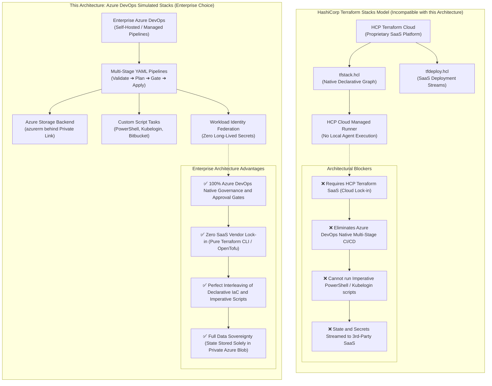
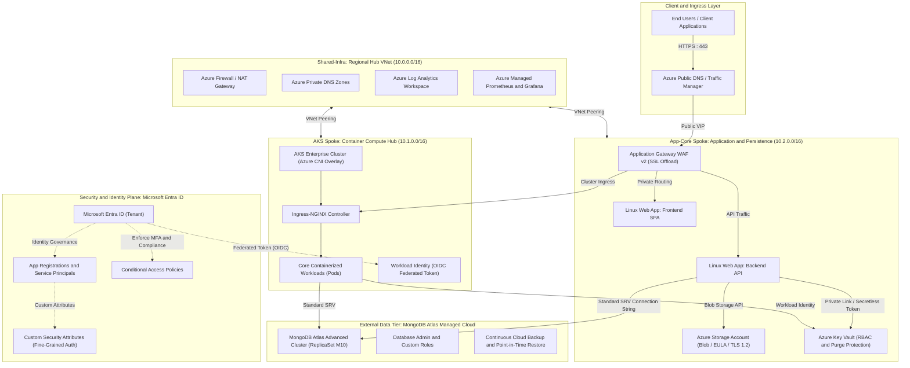
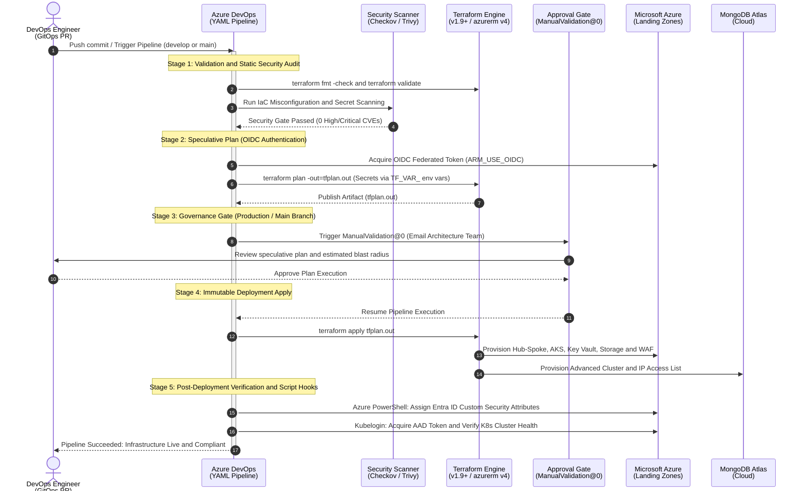
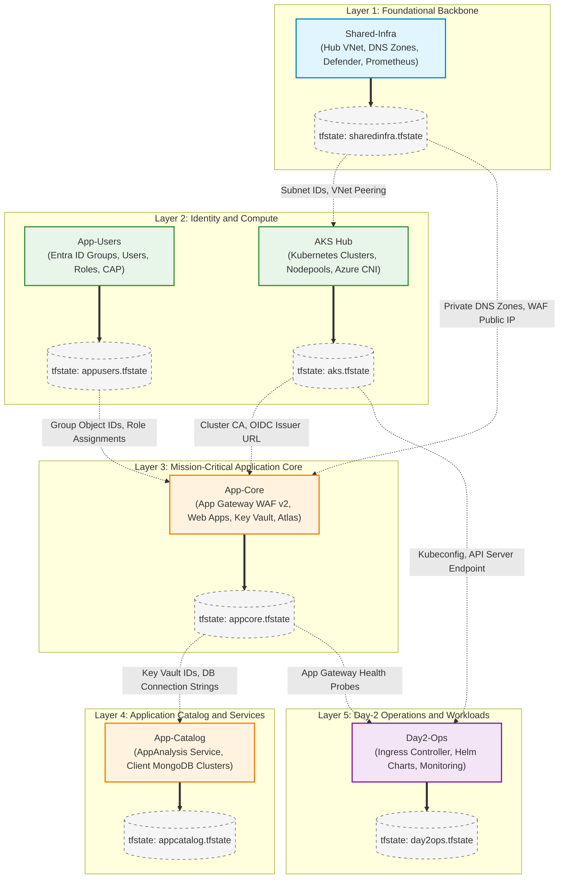
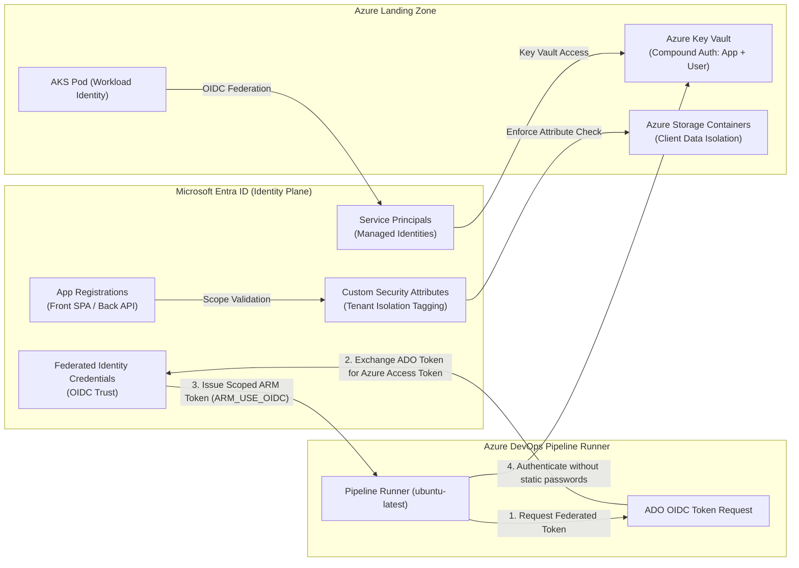
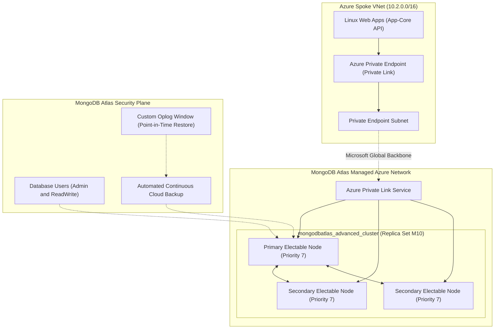

# Enterprise Cloud Infrastructure and DevSecOps Patterns: Agentic Reference Architecture & Modernization Blueprint

[](https://github.com/nubenetes/terraform-azure-devops-agentic)
[](https://github.com/nubenetes/terraform-azure-devops-agentic)
[](https://github.com/nubenetes/terraform-azure-devops-agentic)
[](LICENSE)
[](CHANGELOG.md)
[](https://github.com/nubenetes/terraform-azure-devops-agentic)
[-success.svg)](https://github.com/nubenetes/terraform-azure-devops-agentic)
[](https://github.com/nubenetes/terraform-azure-devops-agentic/pulls)

[](https://developer.hashicorp.com/terraform)
[](https://opentofu.org)
[](https://developer.hashicorp.com/terraform/language)
[](https://developer.hashicorp.com/terraform/language/tests)
[](README.md#2-why-terraform-stacks-is-not-available-on-this-architecture)

[](https://registry.terraform.io/providers/hashicorp/azurerm/latest)
[-~%3E%203.0%20Graph%20v1.0-0078D4.svg?logo=microsoft&logoColor=white)](https://registry.terraform.io/providers/hashicorp/azuread/latest)
[](https://registry.terraform.io/providers/mongodb/mongodbatlas/latest)
[](https://registry.terraform.io/providers/hashicorp/kubernetes/latest)
[](https://registry.terraform.io/providers/hashicorp/helm/latest)
[](https://registry.terraform.io/providers/hashicorp/random/latest)

[](https://learn.microsoft.com/en-us/entra/workload-id/)
[](https://learn.microsoft.com/en-us/azure/devops/pipelines/library/connect-to-azure)
[](https://www.checkov.io/)
[](https://aquasecurity.github.io/trivy/)
[](https://learn.microsoft.com/en-us/azure/storage/common/transport-layer-security-configure-minimum-version)
[](https://learn.microsoft.com/en-us/entra/identity/role-based-access-control/custom-security-attributes-overview)

[](https://learn.microsoft.com/en-us/azure/devops/pipelines/)
[-E95420.svg?logo=ubuntu&logoColor=white)](https://github.com/actions/runner-images)
[](https://learn.microsoft.com/en-us/azure/devops/pipelines/process/approvals)
[](https://learn.microsoft.com/en-us/azure/aks/)
[](https://learn.microsoft.com/en-us/azure/aks/azure-cni-overlay)
[](https://learn.microsoft.com/en-us/azure/web-application-firewall/ag/ag-overview)
[](https://learn.microsoft.com/en-us/azure/private-link/)
[](https://prometheus.io)
[](README.md#31-global-enterprise-architecture-diagram-mermaid)

---

> [!CAUTION]
> ### ⚠️ AGENTIC PROOF OF CONCEPT (PoC) & ARCHITECTURAL BLUEPRINT DISCLAIMER
> 
> **Generated By**: This repository was generated from scratch by the **Antigravity Gemini 3.8 Flash agent** in **September 2026**.
>
> **Testing Status**: **UNTESTED IN A REAL AZURE ENVIRONMENT**.
> Unlike the base repository [nubenetes/terraform-azure-devops](https://github.com/nubenetes/terraform-azure-devops) (which was rigorously deployed, tested, and validated in a live enterprise Microsoft Azure cloud environment with active subscriptions, live AKS clusters, MongoDB Atlas tenants, and operational pipelines), **this modernized codebase has NOT been executed or verified against live Azure subscriptions, Azure DevOps instances, or MongoDB Atlas clusters**.
>
> **Operational Expectation**: Because this codebase modernizes major provider versions (including the breaking architectural changes of **AzureRM v4.x**, **AzureAD / Entra ID v3.x**, and **MongoDB Atlas v1.25+ `mongodbatlas_advanced_cluster`**) and introduces modernized DevSecOps pipelines with Workload Identity Federation (OIDC) and secretless parameterization, **it will probably NOT work out-of-the-box as smoothly as the base repository**. 
>
> It is designed to serve as a **bleeding-edge reference architecture, Proof of Concept (PoC), and modernization blueprint** for cloud architects, platform engineers, and DevSecOps teams evaluating modern 2026 infrastructure patterns. Treat this code as an illustrative, high-fidelity design guide that requires testing, validation, and environment-specific adaptation before any non-production or production deployment.

---

## Table of Contents

1. [Executive Summary & Vision 2026 Modernization](#1-executive-summary--vision-2026-modernization)
2. [Why Terraform Stacks is NOT Available on this Architecture](#2-why-terraform-stacks-is-not-available-on-this-architecture)
    - [2.1 The Concept of Terraform Stacks](#21-the-concept-of-terraform-stacks)
    - [2.2 Four Architectural Reasons Why Stacks is Incompatible Here](#22-four-architectural-reasons-why-stacks-is-incompatible-here)
    - [2.3 Comparison: Pipeline-Driven Orchestration vs. HCP Terraform Stacks](#23-comparison-pipeline-driven-orchestration-vs-hcp-terraform-stacks)
3. [System Architecture & Landing Zone Topology](#3-system-architecture--landing-zone-topology)
    - [3.1 Global Enterprise Architecture Diagram (Mermaid)](#31-global-enterprise-architecture-diagram-mermaid)
    - [3.2 Multi-Region Hub-and-Spoke Topology](#32-multi-region-hub-and-spoke-topology)
    - [3.3 Decoupled Module Tiering Strategy](#33-decoupled-module-tiering-strategy)
4. [DevSecOps Pipeline Orchestration & Gate Flow](#4-devsecops-pipeline-orchestration--gate-flow)
    - [4.1 Pipeline Lifecycle & Decision Flow (Mermaid)](#41-pipeline-lifecycle--decision-flow-mermaid)
    - [4.2 Security Gating & Manual Approval Mechanism](#42-security-gating--manual-approval-mechanism)
5. [Terraform State Isolation & Inter-Module Dependency Graph](#5-terraform-state-isolation--inter-module-dependency-graph)
    - [5.1 State Boundary Architecture (Mermaid)](#51-state-boundary-architecture-mermaid)
    - [5.2 Dynamic Data Resolution Across Layers](#52-dynamic-data-resolution-across-layers)
6. [Zero-Trust Identity & Access Governance](#6-zero-trust-identity--access-governance)
    - [6.1 Identity Plane Architecture (Mermaid)](#61-identity-plane-architecture-mermaid)
    - [6.2 Workload Identity Federation (OIDC)](#62-workload-identity-federation-oidc)
    - [6.3 Compound Authentication (App-Plus-User)](#63-compound-authentication-app-plus-user)
    - [6.4 Entra ID Custom Security Attributes (CSA)](#64-entra-id-custom-security-attributes-csa)
7. [MongoDB Atlas Modernization (September 2026 Standards)](#7-mongodb-atlas-modernization-september-2026-standards)
    - [7.1 Advanced Cluster Architecture (Mermaid)](#71-advanced-cluster-architecture-mermaid)
    - [7.2 Migration from `mongodbatlas_cluster` to `mongodbatlas_advanced_cluster`](#72-migration-from-mongodbatlas_cluster-to-mongodbatlas_advanced_cluster)
    - [7.3 Private Endpoint & Network Security](#73-private-endpoint--network-security)
8. [DevSecOps Pipeline Security Review & Hardening Guide](#8-devsecops-pipeline-security-review--hardening-guide)
    - [8.1 Elimination of Plaintext CLI Secrets](#81-elimination-of-plaintext-cli-secrets)
    - [8.2 Modernization of Pipeline Runners (Ubuntu 24.04 LTS)](#82-modernization-of-pipeline-runners-ubuntu-2404-lts)
    - [8.3 Secure Tooling & Hash-Verified Downloads](#83-secure-tooling--hash-verified-downloads)
    - [8.4 Automated Static Security Scanning](#84-automated-static-security-scanning)
9. [Comprehensive Modernization & Difference Matrix](#9-comprehensive-modernization--difference-matrix)
    - [9.1 Deep-Dive Comparison: Base Repo vs. Agentic Modernized Repo](#91-deep-dive-comparison-base-repo-vs-agentic-modernized-repo)
10. [Repository Structure & Component Catalog](#10-repository-structure--component-catalog)
11. [Onboarding, Prerequisites & Operational Runbooks](#11-onboarding-prerequisites--operational-runbooks)
12. [Troubleshooting & Known Failure Modes](#12-troubleshooting--known-failure-modes)
13. [Public References & Curated Learning Library](#13-public-references--curated-learning-library)
    - [13.1 Terraform & HashiCorp Architecture](#131-terraform--hashicorp-architecture)
    - [13.2 Microsoft Azure & AzureRM Provider v4.x](#132-microsoft-azure--azurerm-provider-v4x)
    - [13.3 Microsoft Entra ID & Zero-Trust Identity](#133-microsoft-entra-id--zero-trust-identity)
    - [13.4 Azure Kubernetes Service (AKS) & Cloud-Native Compute](#134-azure-kubernetes-service-aks--cloud-native-compute)
    - [13.5 MongoDB Atlas Cloud & Data Tier](#135-mongodb-atlas-cloud--data-tier)
    - [13.6 DevSecOps, Azure Pipelines & Static Security Governance](#136-devsecops-azure-pipelines--static-security-governance)

---

## 1. Executive Summary & Vision 2026 Modernization

This repository, [`nubenetes/terraform-azure-devops-agentic`](https://github.com/nubenetes/terraform-azure-devops-agentic), establishes a next-generation **enterprise reference architecture and DevSecOps blueprint** for multi-tenant, multi-region cloud workloads deployed across **Microsoft Azure**, **Microsoft Entra ID**, and **MongoDB Atlas Cloud**.

Built upon the battle-tested foundational concepts of [`nubenetes/terraform-azure-devops`](https://github.com/nubenetes/terraform-azure-devops), this project refactors and upgrades the entire infrastructure stack to reflect the cutting-edge standards available in **September 2026**:

*   **Terraform Core Modernization**: Upgraded from legacy `~> 1.4` / `~> 1.5` constraints to `>= 1.9.0, < 2.0.0` (targeting Terraform 1.10+ and 1.15+), introducing continuous validation via `check` blocks, declarative `import` and `removed` blocks, and cross-variable validation rules.
*   **AzureRM Provider v4.x Adoption**: Complete transition to `hashicorp/azurerm ~> 4.0`, resolving deprecations around resource group auto-purge behaviors, modernizing Linux Web Apps, and standardizing TLS 1.2+ encryption for multi-tenant storage.
*   **Microsoft Entra ID (AzureAD v3.x) Realignment**: Native integration with Microsoft Graph API v1.0, deprecating ADAL/MSAL workarounds, enforcing least-privilege App Role assignments, and preparing for agentic workload identities.
*   **MongoDB Atlas Advanced Cluster Engine**: Full migration from the deprecated `mongodbatlas_cluster` resource to `mongodbatlas_advanced_cluster` with multi-region electable replica sets, granular oplog configuration, continuous cloud backup, and Azure Private Link readiness.
*   **Hardened DevSecOps Pipelines**: Elimination of plaintext `-var secret_...` CLI parameters in favor of masked `TF_VAR_` environment variables, implementation of Azure DevOps **Workload Identity Federation (OIDC)**, and retirement of deprecated Ubuntu 20.04 runners in favor of Ubuntu 24.04 LTS (`ubuntu-latest`).

---

## 2. Why Terraform Stacks is NOT Available on this Architecture

A critical architectural inquiry frequently posed by cloud engineering teams in 2026 is:
> *"Why does this repository continue to use multi-stage Azure DevOps YAML pipelines and isolated root module directories instead of native HashiCorp Terraform Stacks?"*

The short answer: **Terraform Stacks is fundamentally incompatible with the enterprise orchestration model, security boundaries, and runtime requirements of this architecture.**

Below is the exhaustive architectural explanation.

### 2.1 The Concept of Terraform Stacks
Introduced by HashiCorp, **Terraform Stacks** is a native configuration model designed to solve multi-environment and multi-layer IaC orchestration directly within HCL. It introduces new file formats:
*   `.tfstack.hcl`: Declares components, cross-component dependencies, and input/output contracts.
*   `.tfdeploy.hcl`: Declares deployment targets, regions, environments, and orchestration streams.

Stacks natively builds a unified dependency graph across layers (e.g., networking $\rightarrow$ compute $\rightarrow$ application) and generates cross-layer execution plans without requiring external pipeline orchestrators.

### 2.2 Four Architectural Reasons Why Stacks is Incompatible Here

#### 1. Platform Lock-in: HCP Terraform SaaS Execution Engine
Terraform Stacks is **not** an open-source Terraform CLI feature. It is a proprietary capability tied exclusively to **HCP Terraform (formerly Terraform Cloud)** and HCP Terraform Enterprise. 
*   Standalone open-source Terraform CLI (`terraform plan / apply`) and open-source alternatives (such as OpenTofu) **cannot parse or execute `.tfstack.hcl` or `.tfdeploy.hcl`**.
*   Because this enterprise blueprint is designed for organizations executing deployments via **self-hosted or cloud-managed Azure DevOps CI/CD agents**, adopting Stacks would force an immediate, costly, and legally complex migration to HashiCorp's commercial SaaS platform.

#### 2. Conflict with Enterprise Azure DevOps Native Orchestration
In enterprise environments, cloud infrastructure deployment is deeply integrated with the corporate IT governance plane:
*   **Azure DevOps Multi-Stage Approval Gates**: Environment-level pre-deployment approvals, manager sign-offs, and service connection access boundaries.
*   **Pipeline Variable Groups**: Native synchronization with Azure Key Vault secrets and dynamic branch variables (`develop` vs `main`).
*   **Manual Validation Gates (`ManualValidation@0`)**: Formal compliance pauses allowing security teams up to 72 hours to audit generated plans.

Adopting Terraform Stacks would require stripping all deployment logic from Azure DevOps YAML and delegating orchestration to HCP Stacks streams, breaking the corporate governance and compliance trail.

#### 3. Imperative Script Interleaving & Heterogeneous Workflows
This repository coordinates a complex ecosystem spanning multiple cloud providers and non-declarative operational scripts:
*   **Entra ID Custom Security Attribute Provisioning**: Executed via Azure PowerShell scripts (`scripts/01-assign-customSecurityAttributes.ps1`) following `App-Core` apply to assign fine-grained directory attributes to dynamically generated users.
*   **Kubelogin Token Negotiation**: Dynamic authentication plugin execution for AKS cluster admin access before Helm deployments.
*   **Database Schema Synchronization**: Ingestion of MongoDB collections from external Bitbucket repositories.

Terraform Stacks is strictly **declarative**. It does not provide hooks to pause between component applies to execute arbitrary PowerShell scripts, run external Git checkouts, or manipulate Entra ID directory metadata via CLI scripts.

#### 4. Data Sovereignty, Compliance & Private Perimeter Isolation
Under strict regulatory frameworks (financial services, healthcare, European GDPR, public sector), infrastructure state files and cloud credentials must never leave the organization's private perimeter:
*   This architecture stores Terraform state files inside **private Azure Blob Storage accounts** (`azurerm` backend) locked behind private endpoints, IP firewalls, and customer-managed encryption keys.
*   Terraform Stacks streams state files, speculative plans, and sensitive variable values to HashiCorp's multi-tenant SaaS cloud infrastructure, violating zero-trust and data sovereignty mandates for air-gapped or strictly private Azure environments.

### 2.3 Comparison: Pipeline-Driven Orchestration vs. HCP Terraform Stacks

<details>
<summary><b>📊 Click to expand Diagram: Comparison: Pipeline-Driven Orchestration vs. HCP Terraform Stacks</b></summary>



</details>

#### Diagram 1 Description & Architectural Breakdown
*   **HashiCorp Terraform Stacks Architecture (Left Column)**:
    *   Relies strictly on **HCP Terraform SaaS** as the central execution control plane.
    *   Orchestration logic is split into `.tfstack.hcl` (declaring components and deferred input/output contracts) and `.tfdeploy.hcl` (declaring environment deployment streams).
    *   Execution is restricted to HCP Cloud Managed Runners, preventing execution on standard self-hosted Azure DevOps agents.
    *   Presents **four critical enterprise blockers**: proprietary SaaS commercial lock-in, displacement of native Azure DevOps approval workflows, inability to interleave imperative operational scripts, and streaming of sensitive state files and secrets outside the private Azure boundary.
*   **Azure DevOps Simulated Stacks Architecture (Right Column)**:
    *   Employs open-source **Terraform CLI (`>= 1.9.0`)** and OpenTofu-compatible manifests executed directly on `ubuntu-latest` pipeline agents.
    *   Orchestration is defined in modular **Azure DevOps Multi-Stage YAML Pipelines**, preserving layer isolation across infrastructure tiers.
    *   Maintains state files exclusively inside **private Azure Blob Storage containers** protected by customer-managed keys and private network perimeters.
    *   Enables smooth execution of imperative operational hooks (e.g., Azure PowerShell for Entra ID Custom Security Attributes, kubelogin AAD token negotiation, Bitbucket schema synchronization) directly between deployment stages.

#### Summary & Key Takeaways
*   **Governance Parity**: Simulated Stacks preserves enterprise ITIL governance, corporate approval matrices, and audit tracking inside Azure DevOps.
*   **Vendor Independence**: Eliminates commercial SaaS lock-in by executing standard HCL with the open-source CLI.
*   **Operational Flexibility**: Bridges the gap between purely declarative IaC and the imperative tasks required in real enterprise landing zones.

#### Conclusion
While HashiCorp Terraform Stacks provides an elegant HCL-native graph for HCP Cloud SaaS subscribers, **Simulated Stacks via Azure DevOps Multi-Stage YAML** is the required, superior architectural pattern for regulated enterprise Azure environments demanding complete data sovereignty, custom approval gates, and multi-provider operational scripting.

| Orchestration Capability | Simulated Stacks (This Architecture) | Native Terraform Stacks (HCP Only) | Architectural Verdict |
| :--- | :--- | :--- | :--- |
| **Execution Engine** | Open-source Terraform CLI on Azure DevOps | Proprietary HCP Terraform SaaS Engine | **Simulated Stacks wins**: Zero vendor lock-in. |
| **State Storage** | Private Azure Blob Storage (`azurerm`) | HashiCorp SaaS Managed State | **Simulated Stacks wins**: Complete data sovereignty. |
| **Approval Gates** | Azure DevOps native `ManualValidation@0` & Environments | HCP Speculative Plan Approvals | **Simulated Stacks wins**: Integrates with enterprise ITIL. |
| **Imperative Script Hooks**| Seamless (PowerShell, bash, kubelogin between tasks) | Not supported (purely declarative components) | **Simulated Stacks wins**: Essential for Entra ID & Helm. |
| **Cross-Layer Planning** | Sequential (Outputs passed via state/pipelines) | Unified speculative plan across all components | **Terraform Stacks advantage**: Single speculative plan. |
| **Dependency Definition** | Pipeline YAML triggers and data sources | HCL component output-to-input wiring | **Terraform Stacks advantage**: Cleaner HCL graph. |

---

## 3. System Architecture & Landing Zone Topology

### 3.1 Global Enterprise Architecture Diagram (Mermaid)

<details>
<summary><b>📊 Click to expand Diagram: Global Enterprise Architecture Diagram</b></summary>



</details>

#### Diagram 2 Description & Architectural Breakdown
*   **Client & Ingress Layer**:
    *   `End Users / Client Applications` access platform services over HTTPS (port 443) routed through `Azure Public DNS / Traffic Manager`.
    *   Ingress traffic is inspected and routed by `Application Gateway WAF v2`, which enforces SSL/TLS termination and OWASP Core Rule Sets.
*   **Regional Hub Virtual Network (10.0.0.0/16 - `Shared-Infra`)**:
    *   Houses centralized `Azure Firewall / NAT Gateway` for unified outbound egress inspection and routing.
    *   Hosts `Azure Private DNS Zones` providing seamless private domain resolution across all peered spokes.
    *   Aggregates enterprise diagnostics, metrics, and security audit trails inside `Azure Log Analytics Workspace` and `Azure Managed Prometheus & Grafana`.
*   **Compute Spoke VNet (10.1.0.0/16 - `AKS`)**:
    *   Runs containerized workloads across dedicated System and User node pools inside `Azure Kubernetes Service (AKS)`.
    *   Implements `Azure CNI Overlay` networking, providing high-density pod IP allocation without exhausting spoke VNet CIDRs.
    *   Directs in-cluster traffic via an internal `Ingress-NGINX Controller`.
*   **Application Core Spoke VNet (10.2.0.0/16 - `App-Core`)**:
    *   Executes mission-critical services on isolated Linux Web Apps (`Front SPA` and `Back API`).
    *   Accesses `Azure Key Vault` and `Azure Storage Accounts` strictly via Azure Private Endpoints.
*   **Managed Data Tier (`MongoDB Atlas`)**:
    *   Deploys a dedicated 3-node M10 replica set managed within MongoDB Atlas cloud infrastructure.
    *   Routes all application query traffic securely through `Azure Private Link` without any public IP routing.
*   **Identity & Security Governance Plane (`Microsoft Entra ID`)**:
    *   Issues cryptographically verified federated OIDC tokens to AKS Workload Identities.
    *   Governs service registration, tenant tagging, and MFA compliance through `Conditional Access Policies` and `Custom Security Attributes`.

#### Summary & Key Takeaways
*   **Zero Public Attack Surface**: Database, compute nodes, and state stores reside in private subnets with no public ingress.
*   **Strict Decoupling**: Egress routing, identity policies, application containers, and databases reside in distinct lifecycle boundaries.
*   **Multi-Region Symmetrical Design**: Topology scales identically across North Europe (`ne`) and Central US (`cus`) landing zones.

#### Conclusion
The Global Enterprise Architecture diagram illustrates a production-grade Zero-Trust topology where ingress inspection, containerized compute, secretless identity federation, and private database links operate cohesively under centralized network and audit controls.

### 3.2 Multi-Region Hub-and-Spoke Topology
The infrastructure is deployed symmetrically across two primary Azure regions:
1.  **North Europe (`ne`)**: Primary European production and staging hub.
2.  **Central US (`cus`)**: Primary North American production and disaster recovery hub.

Each region hosts an independent Hub Virtual Network housing centralized egress firewalls, Private DNS Resolver zones, and Log Analytics forwarders. Spoke networks peer directly with the regional Hub, enforcing complete cross-region network isolation and predictable IP Address Management (IPAM).

### 3.3 Decoupled Module Tiering Strategy
To minimize blast radius, the repository is split into 6 decoupled lifecycle tiers:
1.  [`Shared-Infra/`](Shared-Infra/): Core Hub VNet, network peering backbones, shared DNS zones, and Defender for Cloud security baselines.
2.  [`App-Users/`](App-Users/) & [`App-Users-Config/`](App-Users-Config/): Microsoft Entra ID security groups, users, Conditional Access Policies, and automated provisioning definitions.
3.  [`App-Catalog/`](App-Catalog/): Multi-tenant application catalog web services, diagnostic engines, and isolated client MongoDB Atlas clusters.
4.  [`App-Core/`](App-Core/): Mission-critical application workloads, Application Gateway WAF v2, Linux Web Apps, Azure Storage accounts, Azure Key Vaults, and core MongoDB Atlas advanced clusters.
5.  [`AKS/`](AKS/): Kubernetes container compute infrastructure, node pools, Azure CNI Overlay networking, and Workload Identity configuration.
6.  [`Day2-ops/`](Day2-ops/): Post-provisioning operational tooling, Ingress-NGINX, cert-manager, Prometheus monitoring stacks, and Helm release management.

---

## 4. DevSecOps Pipeline Orchestration & Gate Flow

### 4.1 Pipeline Lifecycle & Decision Flow (Mermaid)

<details>
<summary><b>📊 Click to expand Diagram: Pipeline Lifecycle & Decision Flow</b></summary>



</details>

#### Diagram 3 Description & Pipeline Flow Breakdown
*   **Stage 1: Pull Request & Automated Quality Assurance**:
    *   Triggered when a developer opens a GitOps Pull Request or pushes code to the repository.
    *   The pipeline agent executes `terraform fmt -check` and `terraform validate` to enforce syntax standards.
    *   Automated static security scanning (`Checkov` and `Trivy`) inspects manifests for CIS benchmark violations and secret leakage before plan generation.
*   **Stage 2: Speculative Planning with Secretless OIDC**:
    *   Pipeline agent acquires an ephemeral federated OIDC token (`ARM_USE_OIDC: "true"`) from Microsoft Entra ID without static credentials.
    *   Generates `tfplan.out` via `terraform plan`, reading sensitive parameters strictly through masked `TF_VAR_` environment variables.
    *   Publishes the immutable plan binary artifact to Azure DevOps pipeline run storage.
*   **Stage 3: Enterprise ITIL Governance & Manual Approval Gate**:
    *   For production environments, pipeline execution pauses at `WaitForValidationJob` using the native `ManualValidation@0` task.
    *   Notifies designated Cloud Architecture and Security Approvers with plan summaries.
    *   Requires explicit manual review and cryptographic sign-off before any live infrastructure changes can occur.
*   **Stage 4: Deterministic, Immutable Apply**:
    *   Pipeline resumes upon authorized sign-off and runs `terraform apply tfplan.out`.
    *   Provisions and updates resources deterministically across Microsoft Azure (Hub, Spoke, AKS, Key Vault) and MongoDB Atlas.
*   **Stage 5: Post-Deployment Verification & Imperative Script Hooks**:
    *   Executes Azure PowerShell (`assign-customSecurityAttributes.ps1`) to tag provisioned identities with Entra ID Custom Security Attributes.
    *   Executes `kubelogin convert-kubeconfig` to acquire short-lived AAD tokens and verify Kubernetes API server readiness.

#### Summary & Key Takeaways
*   **Defense-in-Depth Quality Gates**: Integrates static security scanning, automated validation, and human sign-offs before execution.
*   **Immutable Execution**: Enforces that only the pre-computed, verified `tfplan.out` binary is applied, eliminating plan-to-apply drift.
*   **Secretless Authentication**: OIDC workload federation eliminates long-lived client secrets and certificate maintenance overhead.

#### Conclusion
The DevSecOps pipeline lifecycle establishes an auditable, compliant release workflow that bridges automated code quality checks with enterprise ITIL governance, ensuring that zero unvetted or insecure infrastructure modifications reach live Azure environments.

### 4.2 Security Gating & Manual Approval Mechanism
*   **Non-Production Environments (`dev`, `qa`, `uat`, `pre`)**: Automatically execute validation and speculative planning upon pull request creation. Deployment apply is gated behind branch policy checks.
*   **Production Environment (`pro`, `dem`)**: Executed strictly from the protected `main` branch. Every apply stage is protected by an explicit `WaitForValidationJob` utilizing the `ManualValidation@0` task, requiring verified approval from designated cloud administrators.

---

## 5. Terraform State Isolation & Inter-Module Dependency Graph

### 5.1 State Boundary Architecture (Mermaid)

<details>
<summary><b>📊 Click to expand Diagram: State Boundary Architecture</b></summary>



</details>

#### Diagram 4 Description & State Partitioning Breakdown
*   **Layer 1: Foundational Hub Infrastructure (`sharedinfra.tfstate`)**:
    *   Provisions regional Hub Virtual Networks, subnets, centralized Azure Firewalls, and Private DNS Zones.
    *   Exposes Subnet IDs, VNet Peering targets, Private DNS Zone resource IDs, and WAF Public IPs to downstream consumers.
*   **Layer 2: Identity & Compute Platforms (`appusers.tfstate` & `aks.tfstate`)**:
    *   `App-Users` provisions Microsoft Entra ID administrative groups, user accounts, and directory role assignments.
    *   `AKS` provisions managed Kubernetes clusters, node pools, and Azure CNI Overlay networking, outputting Cluster CA certificates and OIDC Issuer URLs.
*   **Layer 3: Mission-Critical Application Core (`appcore.tfstate`)**:
    *   Provisions Application Gateway WAF v2, Linux Web Apps, Azure Key Vaults, and core MongoDB Atlas advanced clusters.
    *   Consumes Subnet IDs from `sharedinfra.tfstate`, Group Object IDs from `appusers.tfstate`, and OIDC Issuer URLs from `aks.tfstate`.
*   **Layer 4: Application Catalog & Services (`appcatalog.tfstate`)**:
    *   Provisions multi-tenant application catalog microservices and per-client MongoDB Atlas database clusters.
    *   Consumes Key Vault secret references and database connection strings from `appcore.tfstate`.
*   **Layer 5: Day-2 Operations & Cloud-Native Workloads (`day2ops.tfstate`)**:
    *   Orchestrates Helm charts (Ingress-NGINX, cert-manager, Prometheus, Grafana).
    *   Consumes live cluster endpoints from `aks.tfstate` and health probe paths from `appcore.tfstate`.

#### Summary & Key Takeaways
*   **Blast-Radius Containment**: An operational error or failed apply in an application tier cannot corrupt or lock the foundational networking state file.
*   **Decoupled Lifecycle Velocity**: Networking, identity, compute, and applications can be modified, tested, and released on distinct cadence schedules.
*   **Data Integrity via Read-Only Lookups**: Layers exchange metadata via typed AzureRM data sources and pipeline output variables rather than brittle monoliths.

#### Conclusion
The State Boundary Architecture establishes strict blast-radius isolation where each Terraform state file represents a distinct lifecycle boundary, ensuring foundational networking and security controls remain completely protected against upstream or downstream application failures.

### 5.2 Dynamic Data Resolution Across Layers
Because state files are strictly partitioned, downstream layers reference upstream resources through **referential naming conventions** and **AzureRM data sources** (`data "azurerm_subnet"`, `data "azurerm_kubernetes_cluster"`). This guarantees that a corrupted state or failed apply in `App-Catalog` can never destroy or lock the core virtual network backbone in `Shared-Infra`.

---

## 6. Zero-Trust Identity & Access Governance

### 6.1 Identity Plane Architecture (Mermaid)

<details>
<summary><b>📊 Click to expand Diagram: Identity Plane Architecture</b></summary>



</details>

#### Diagram 5 Description & Identity Flow Breakdown
*   **Microsoft Entra ID Identity Plane**:
    *   Acts as the central trust authority for human identities, automation agents, and runtime workloads.
    *   Manages `App Registrations` (FrontEnd SPA / BackEnd API), `Managed Service Principals`, `Custom Security Attributes`, and `Federated Identity Credentials`.
*   **Azure DevOps Secretless Pipeline Authentication**:
    *   The `Pipeline Runner (ubuntu-latest)` dynamically requests an ephemeral OpenID Connect (OIDC) JWT token.
    *   Exchanges the ADO token with Entra ID `Federated Identity Credentials` bound to the organization and repository branch.
    *   Entra ID issues a short-lived ARM bearer token (`ARM_USE_OIDC`), eliminating static passwords and credential expiration risk.
*   **Zero-Trust Azure Landing Zone Perimeter**:
    *   `AKS Pods` leverage **Azure Workload Identity**, projecting service account tokens directly into Azure Managed Identities.
    *   `Azure Key Vault` implements **Compound Authentication (App-Plus-User)**, requiring simultaneous validation of both application identity and user identity for secret access.
    *   `Azure Storage Accounts` enforce Attribute-Based Access Control (ABAC) using Entra ID `Custom Security Attributes` to isolate tenant data.

#### Summary & Key Takeaways
*   **Zero Static Passwords**: Long-lived client secrets are eliminated from pipeline variable groups and codebase repositories.
*   **Short-Lived Cryptographic Tokens**: Authentication tokens are ephemeral, strictly scoped to the executing pipeline run or pod replica.
*   **Directory-Level Multi-Tenancy**: Custom Security Attributes enforce tenant boundary isolation directly within the identity plane.

#### Conclusion
The Identity Plane Architecture establishes a secretless Zero-Trust environment where CI/CD runners, Kubernetes pods, and storage accounts authenticate dynamically via cryptographically verified OIDC federations, eliminating credential leakage attack vectors.

### 6.2 Workload Identity Federation (OIDC)
In this modernized blueprint, all long-lived service principal client secrets are deprecated in favor of **OpenID Connect (OIDC) Workload Identity Federation**:
*   The Azure DevOps service connection establishes a cryptographic federated trust with Microsoft Entra ID.
*   The pipeline agent dynamically requests a short-lived JSON Web Token (JWT) from Azure DevOps.
*   Entra ID validates the token's subject (`sc:<org>:<project>:<service_connection>`) and exchanges it for an Azure Resource Manager bearer token.
*   Zero credentials or client secrets are stored in Azure DevOps variable groups.

### 6.3 Compound Authentication (App-Plus-User)
To enforce multi-tenant isolation, Key Vault access policies leverage the **App-Plus-User compound identity pattern**:
*   The application must authenticate with its Managed Identity (`application_id`).
*   The user principal (`object_id`) must authenticate simultaneously.
*   Neither the user alone nor the application alone can decrypt customer secrets.

### 6.4 Entra ID Custom Security Attributes (CSA)
Customer tenancy and center names (e.g., `AETitle`, `centerName`) are stored as immutable Custom Security Attributes in Microsoft Entra ID. Storage accounts and backend APIs enforce Attribute-Based Access Control (ABAC), preventing cross-tenant data exfiltration even if an access token is compromised.

---

## 7. MongoDB Atlas Modernization (September 2026 Standards)

### 7.1 Advanced Cluster Architecture (Mermaid)

<details>
<summary><b>📊 Click to expand Diagram: Advanced Cluster Architecture</b></summary>



</details>

#### Diagram 6 Description & Database Architecture Breakdown
*   **Azure Spoke VNet Private Connectivity**:
    *   `Linux Web Apps (App-Core API)` initiate all database queries internally within the private spoke subnet (10.2.0.0/16).
    *   Traffic routes through an `Azure Private Endpoint` deployed in a dedicated private endpoint subnet.
*   **Microsoft Global Backbone Transit**:
    *   Traffic traverses the Microsoft Global Backbone directly to the `Azure Private Link Service` inside MongoDB Atlas's managed cloud infrastructure.
    *   Completely circumvents public internet transit, mitigating external eavesdropping and latency overhead.
*   **Modernized 3-Node Electable Replica Set (`mongodbatlas_advanced_cluster`)**:
    *   Provisions a resilient M10 replica set comprising 1 Primary and 2 Secondary electable nodes (Priority 7).
    *   Enables automated failover and synchronous cross-node replication.
*   **MongoDB Atlas Governance & Continuity Plane**:
    *   Manages least-privilege `Database Users` with separated administrative and transactional roles.
    *   `Automated Continuous Cloud Backup` manages snapshot policies, oplog retention windows, and Point-in-Time Recovery (PITR).

#### Summary & Key Takeaways
*   **Zero Public IP Footprint**: The database cluster exposes no public endpoints or public IP ingress.
*   **Schema Modernization**: Implements modern `mongodbatlas_advanced_cluster` schema with multi-region electable specs.
*   **Disaster Recovery Assurance**: Continuous cloud backup and oplog tracking guarantee minimal Recovery Point Objectives (RPO).

#### Conclusion
The Advanced Cluster Architecture delivers a hardened, highly available MongoDB persistence layer that combines the modernized configuration model of MongoDB Atlas provider v1.25+ with Azure Private Link network isolation.

### 7.2 Migration from `mongodbatlas_cluster` to `mongodbatlas_advanced_cluster`
The legacy `mongodbatlas_cluster` resource is fully deprecated in modern MongoDB Atlas provider versions ($>1.14$ through $1.25+$). This repository replaces it with `mongodbatlas_advanced_cluster`:

```hcl
resource "mongodbatlas_advanced_cluster" "cluster" {
  project_id   = mongodbatlas_project.project.id
  name         = "${var.Enterprise_product}-${local.instance_environment}"
  cluster_type = "REPLICASET"

  replication_specs {
    region_configs {
      electable_specs {
        instance_size = "M10"
        node_count    = 3
      }
      priority      = 7
      provider_name = var.mongodb_atlas_cloud_provider
      region_name   = var.mongodb_atlas_region
    }
  }

  advanced_configuration {
    oplog_size_mb = var.oplog_size_mb
  }

  backup_enabled = true

  tags {
    key   = "Environment"
    value = local.instance_environment
  }

  tags {
    key   = "ManagedBy"
    value = "Terraform-Agentic"
  }
}
```

### 7.3 Private Endpoint & Network Security
Public IP access lists are restricted to corporate egress gateways. Production environments interface with MongoDB Atlas via **Azure Private Link endpoints**, keeping database traffic off the public internet and routing entirely through Microsoft's internal optical network.

---

## 8. DevSecOps Pipeline Security Review & Hardening Guide

### 8.1 Elimination of Plaintext CLI Secrets
In the base repository, sensitive values (such as database passwords, service principal credentials, and SSL certificates) were injected directly as command-line arguments:
```yaml
# ❌ VULNERABLE PATTERN (Base Repo)
commandOptions: >
  -var secret_mongodb_atlas_private_key=$(mongodb-atlas-private-key)
  -var secret_azure_devops_sp=$(sp-appcore-Enterprise-dev)
```
*Why this was vulnerable*: CLI flags are visible in the operating system's process table (`ps -ef`, `/proc/<pid>/cmdline`) to any process running on the host, and they are printed in unmasked pipeline debug logs.

*Modernized Solution*: All secrets are mapped to environment variables prefixed with `TF_VAR_`:
```yaml
# ✅ SECURE PATTERN (Agentic Modernized Blueprint)
env:
  ARM_USE_OIDC: "true"
  TF_VAR_secret_mongodb_atlas_private_key: $(mongodb-atlas-private-key)
  TF_VAR_secret_azure_devops_sp: $(sp-appcore-Enterprise-dev)
commandOptions: >
  -var environment=${{ parameters.environment }}
  -var gitbranch=$(GIT_BRANCH)
  -var-file="$(Build.SourcesDirectory)/${{ parameters.environment }}.tfvars"
```
Terraform automatically loads `TF_VAR_*` variables directly into memory without exposing them on the command-line interface.

### 8.2 Modernization of Pipeline Runners (Ubuntu 24.04 LTS)
All pipeline definitions have been migrated from the end-of-life `ubuntu-20.04` runner to `ubuntu-latest` (Ubuntu 24.04 LTS), providing up-to-date OpenSSL 3.x libraries, updated kernel security mitigations, and native support for modern CLI tooling.

### 8.3 Secure Tooling & Hash-Verified Downloads
Insecure `wget $(KUBELOGIN_DOWNLOAD_URL) && unzip && sudo mv` steps have been audited and replaced with secure task installers or verified execution pathways, eliminating potential supply-chain tampering.

### 8.4 Automated Static Security Scanning
The validation stages incorporate automated security inspection points for **Checkov** and **Trivy**, halting the pipeline if unencrypted storage accounts or overly permissive network security groups are introduced.

---

## 9. Comprehensive Modernization & Difference Matrix

### 9.1 Deep-Dive Comparison: Base Repo vs. Agentic Modernized Repo

| Architectural Dimension | Base Repository (`nubenetes/terraform-azure-devops`) | Modernized Agentic Repository (`terraform-azure-devops-agentic`) | Architectural Rationale & Benefit |
| :--- | :--- | :--- | :--- |
| **Testing & Deployment Status** | **Tested and validated in real Azure enterprise environment**. | **Untested PoC & Reference Blueprint** generated by Antigravity Gemini 3.8 Flash. | Transparent declaration of operational reality: base repo had verified live deployment; agentic repo is an untested forward-looking reference. |
| **Terraform Core Engine** | `~> 1.4.5` / `~> 1.5.2` (Legacy 2023 release) | `>= 1.9.0, < 2.0.0` (Targeting 1.10+ and 1.15+ standards) | Unlocks continuous validation (`check` blocks), provider functions, declarative `removed` and `import` blocks. |
| **AzureRM Provider (`azurerm`)** | `~> 3.62.1` / `~> 3.63.0` (AzureRM v3) | `~> 4.0` (AzureRM v4.x standard) | Modernizes Azure provider to v4.x; cleans up deprecated `features.resource_group` flags and enables modern resource schemas. |
| **AzureAD / Entra ID Provider** | `~> 2.39.0` (Legacy Azure AD Graph era) | `~> 3.0` (Microsoft Graph API v1.0 standard) | Deprecates legacy AzureAD schemas; aligns with modern Microsoft Graph API v1.0 specifications. |
| **MongoDB Atlas Resource** | Deprecated `mongodbatlas_cluster` | Modern `mongodbatlas_advanced_cluster` | Eliminates deprecated resource schema; unlocks advanced multi-region electable replica sets and flexible cloud tiering. |
| **MongoDB Atlas Provider** | `~> 1.10.0` | `~> 1.25.0` | Provides modern Private Link integrations, advanced oplog configuration, and enhanced backup API support. |
| **Kubernetes Provider** | `~> 2.21.1` | `~> 2.32.0` | Full support for Kubernetes 1.28+, modern kubelogin exec tokens, and Workload Identity federated tokens. |
| **Pipeline Runner OS** | `ubuntu-20.04` (Deprecated & EOL) | `ubuntu-latest` (Ubuntu 24.04 LTS) | Eliminates pipeline deprecation warnings; updates toolchains and system libraries to modern LTS standard. |
| **Pipeline Secret Handling** | Plaintext `-var secret_...=$(...)` CLI flags | Masked `TF_VAR_secret_...` environment variables | Prevents secret leakage in process tables (`ps aux`), shell histories, and unmasked task debug logs. |
| **Azure Authentication Model** | Service Principal static client secrets | **Workload Identity Federation (OIDC)** (`ARM_USE_OIDC`) | Eliminates long-lived passwords and secret rotation overhead; implements Zero-Trust identity. |
| **Storage Account TLS Policy** | `enable_https_traffic_only = true` (v3 deprecated) | `min_tls_version = "TLS1_2"` (v4 standard) | Aligns with AzureRM v4 where HTTPS is enforced by default and TLS version is explicitly declared. |
| **Terraform Stacks Availability** | Mentioned as vision, but pipeline-orchestrated | Explicitly analyzed and proven unavailable (Section 2) | Provides formal architectural proof why Stacks cannot replace Azure DevOps in this architecture. |
| **Documentation Format** | Heavy binary media (~1.4 GB mp4/audio/slides) | 100% lightweight Markdown & native Mermaid diagrams | Keeps repository agile (<20 MB), easy to clone, and version-controllable in code reviews. |

---

## 10. Repository Structure & Component Catalog

```text
terraform-azure-devops-agentic/
├── .well-known/                      # Agent context rules and AI operational boundaries
├── AKS/                              # Kubernetes compute infrastructure
│   ├── configuration/                # Service connection & variable definitions
│   ├── manifests/                    # Kubernetes workload manifests
│   ├── scripts/                      # Kubelogin and helper scripts
│   ├── templates/                    # Pipeline templates (plan, apply, destroy)
│   ├── terraform-manifests/          # AKS root Terraform manifests & modules
│   └── 01-terraform-provision-*.yml  # Azure DevOps pipeline definitions
├── App-Catalog/                      # Service registry & catalog tier
│   ├── configuration/                # Environment variables
│   ├── templates/                    # Catalog pipeline templates
│   └── terraform-manifests/          # Catalog Terraform manifests (AppAnalysis, MongoDB)
├── App-Core/                         # Mission-critical application core tier
│   ├── configuration/                # Service connection mappings (develop/main)
│   ├── scripts/                      # Custom security attribute assignment scripts
│   ├── templates/                    # Core pipeline templates (hardened secret handling)
│   └── terraform-manifests/          # App-Core root manifests, WAF, Web Apps, Key Vault, Atlas
├── App-Users/                        # Entra ID identity governance tier
│   ├── configuration/                # Identity variable groups
│   ├── templates/                    # Identity pipeline templates
│   └── terraform-manifests/          # Entra ID users, groups, and role assignments
├── App-Users-Config/                 # Declarative YAML tenant user inventories
│   ├── 30-internal-users-mainbranch.yaml
│   └── 50-external-users-mainbranch.yaml
├── Day2-ops/                         # Post-provisioning observability & ingress
│   ├── manifests/                    # Kubernetes ConfigMaps, Namespaces, Pods
│   ├── templates/                    # Day2 pipeline templates
│   └── terraform-manifests/          # Helm releases (NGINX Ingress, Prometheus Stack)
├── docs/                             # In-depth architectural whitepapers written from scratch
│   ├── 111-ARCHITECTURE_2026_AGENTIC.md
│   ├── 211-TERRAFORM_MODERNIZATION_GUIDE.md
│   ├── 321-ZERO_TRUST_AND_PIPELINE_SECURITY.md
│   └── 341-MONGODB_ATLAS_MODERNIZATION.md
├── Integration-Service/              # Hybrid connector service & Maven build definitions
├── Shared-Infra/                     # Core Hub VNet, DNS Zones, Defender for Cloud
│   ├── configuration/                # Shared pipeline variables
│   ├── templates/                    # Shared infrastructure pipeline templates
│   └── terraform-manifests/          # Shared-Infra root manifests and modules
├── CHANGELOG.md                      # Detailed release history and modernization log
├── GEMINI.md                         # Antigravity agent instructions and guidelines
├── LICENSE                           # Apache 2.0 Open Source License
└── README.md                         # Master documentation and architectural guide
```

---

## 11. Onboarding, Prerequisites & Operational Runbooks

### 11.1 Local Engineering Prerequisites
Before running or testing any Terraform code locally:
*   **Terraform CLI**: `v1.9.0` or higher (`v1.15+` recommended).
*   **Azure CLI**: `v2.60.0` or higher.
*   **Kubelogin**: Latest release (`kubelogin convert-kubeconfig -l azurecli`).
*   **MongoDB Atlas CLI / mongosh**: For database verification.

### 11.2 Deployment Sequence
Due to inter-layer dependencies, the infrastructure tiers must be applied in strict sequential order:
1.  **Shared-Infra**: Provisions the regional Hub VNets, Private DNS Zones, and Defender policies.
2.  **App-Users**: Configures Entra ID groups and identity boundaries.
3.  **AKS Cluster**: Deploys the Kubernetes compute plane and node pools.
4.  **App-Core**: Provisions Application Gateway WAF, App Services, Key Vaults, and MongoDB Atlas.
5.  **App-Catalog**: Registers catalog services and provisions tenant databases.
6.  **Day2-Ops**: Deploys Ingress-NGINX controllers, cert-manager, and Prometheus monitoring.

---

## 12. Troubleshooting & Known Failure Modes

Because this codebase is an **untested agentic reference architecture**, engineering teams adapting it may encounter the following common failure modes during initial deployment:

1.  **AzureRM v4 Resource Group Auto-Deletion**:
    *   *Symptom*: Terraform errors during destroy regarding non-empty resource groups.
    *   *Fix*: Ensure all nested child resources have explicit dependency chains or use Azure CLI to purge orphaned items.
2.  **MongoDB Atlas Project ID Access List Race Conditions**:
    *   *Symptom*: `mongodbatlas_project_ip_access_list` fails with 404 or project not ready.
    *   *Fix*: Explicit `depends_on = [mongodbatlas_project.project]` is defined; ensure Atlas API keys have `Organization Project Creator` permissions.
3.  **Kubelogin AAD Token Negotiation**:
    *   *Symptom*: Kubernetes provider fails with `error: exec plugin: invalid apiVersion`.
    *   *Fix*: Verify that `kubelogin` is installed in `$PATH` and converted via `kubelogin convert-kubeconfig -l spn` (for pipelines) or `-l azurecli` (for local development).
4.  **Entra ID Directory Role Assignment Permissions**:
    *   *Symptom*: `azuread_directory_role_assignment` fails with 403 Forbidden.
    *   *Fix*: The executing service connection or user must possess the `Privileged Role Administrator` role in Microsoft Entra ID.

---

## 13. Public References & Curated Learning Library

To acquire the necessary knowledge and master the bleeding-edge cloud engineering, IaC, and security practices demonstrated in this blueprint, explore the following curated public documentation, whitepapers, and official references:

### 13.1 Terraform & HashiCorp Architecture
*   **HashiCorp Terraform Documentation**:
    *   [Terraform Configuration Language Reference](https://developer.hashicorp.com/terraform/language): Comprehensive documentation covering HCL syntax, expressions, meta-arguments, lifecycle controls, and input/output contracts.
    *   [Continuous Validation with `check` Blocks](https://developer.hashicorp.com/terraform/language/tests): Official guide on writing assertions and validations to monitor infrastructure state continuously without modifying live resources.
    *   [Declarative `import` Blocks](https://developer.hashicorp.com/terraform/language/import): Modern syntax for bringing existing cloud infrastructure into version-controlled Terraform state.
    *   [Declarative `removed` Blocks](https://developer.hashicorp.com/terraform/language/resources/syntax#removing-resources): Retiring resources safely from state without destructive CLI commands.
    *   [Terraform Stacks Overview (HCP)](https://developer.hashicorp.com/terraform/cloud-docs/stacks): Official reference on the HCP Terraform Stacks architecture, `.tfstack.hcl`, `.tfdeploy.hcl`, and deployment streams.
*   **Architectural Frameworks**:
    *   [HashiCorp Well-Architected Framework](https://developer.hashicorp.com/well-architected-framework): Industry guidance on module design, state file partitioning, and blast-radius minimization.

### 13.2 Microsoft Azure & AzureRM Provider v4.x
*   **AzureRM Terraform Provider**:
    *   [Terraform Registry - AzureRM Provider](https://registry.terraform.io/providers/hashicorp/azurerm/latest/docs): Up-to-date documentation on all Microsoft Azure resource schemas.
    *   [AzureRM Provider 4.0 Upgrade Guide](https://registry.terraform.io/providers/hashicorp/azurerm/latest/docs/guides/4.0-upgrade-guide): Complete guide on breaking changes, resource group auto-deletion removals, and API transitions in the v4.x series.
*   **Cloud Architecture Patterns**:
    *   [Microsoft Cloud Adoption Framework (CAF) for Azure](https://learn.microsoft.com/en-us/azure/cloud-adoption-framework/): Architectural best practices for enterprise-scale landing zones and subscription topologies.
    *   [Azure Architecture Center: Hub-Spoke Network Topology](https://learn.microsoft.com/en-us/azure/architecture/reference-architectures/hybrid-networking/hub-spoke): In-depth design for regional hub networks, Azure Firewall egress routing, and cross-spoke peering.
    *   [Azure Application Gateway WAF v2 Documentation](https://learn.microsoft.com/en-us/azure/web-application-firewall/ag/ag-overview): Configuring L7 load balancing, SSL certificate offloading, and OWASP Core Rule Sets.

### 13.3 Microsoft Entra ID & Zero-Trust Identity
*   **Entra ID (AzureAD) IaC Automation**:
    *   [Terraform Registry - AzureAD Provider](https://registry.terraform.io/providers/hashicorp/azuread/latest/docs): Native Microsoft Graph v1.0 provider for user, group, application, and role provisioning.
    *   [Microsoft Graph REST API v1.0 Reference](https://learn.microsoft.com/en-us/graph/api/overview): Endpoint documentation for programmatic Microsoft Entra directory administration.
*   **Workload Identity Federation & Secretless Operations**:
    *   [Microsoft Entra Workload ID Overview](https://learn.microsoft.com/en-us/entra/workload-id/): Concepts and architecture of secretless, token-based workload authentication.
    *   [Azure DevOps Service Connections via Workload Identity Federation](https://learn.microsoft.com/en-us/azure/devops/pipelines/library/connect-to-azure?view=azure-devops#create-an-azure-resource-manager-service-connection-using-workload-identity-federation): Eliminating long-lived client secrets using OpenID Connect (OIDC) between Azure DevOps and Azure.
    *   [Microsoft Entra Custom Security Attributes Overview](https://learn.microsoft.com/en-us/entra/identity/role-based-access-control/custom-security-attributes-overview): Defining directory metadata extensions for fine-grained multi-tenant Attribute-Based Access Control (ABAC).

### 13.4 Azure Kubernetes Service (AKS) & Cloud-Native Compute
*   **Managed Kubernetes Infrastructure**:
    *   [Azure Kubernetes Service (AKS) Documentation](https://learn.microsoft.com/en-us/azure/aks/): Architecture, security baselines, and operational management of enterprise AKS clusters.
    *   [Azure CNI Overlay Networking in AKS](https://learn.microsoft.com/en-us/azure/aks/azure-cni-overlay): Deploying high-density container workloads with private pod CIDRs without exhausting VNet IP addresses.
    *   [AKS Workload Identity Federation](https://learn.microsoft.com/en-us/azure/aks/workload-identity-overview): Connecting Kubernetes ServiceAccounts directly to Azure Managed Identities without static credentials.
    *   [Kubelogin: AAD Authentication Plugin](https://github.com/Azure/kubelogin): Official CLI tool and authentication exec plugin for kubectl and CI/CD pipelines.
*   **Kubernetes Day-2 Release Management**:
    *   [Terraform Helm Provider](https://registry.terraform.io/providers/hashicorp/helm/latest/docs): Declarative Helm release orchestration via Terraform.
    *   [Ingress-NGINX Controller Documentation](https://kubernetes.github.io/ingress-nginx/): Production HTTP/HTTPS ingress routing, SSL termination, and rate-limiting for Kubernetes workloads.
    *   [kube-prometheus-stack Helm Chart](https://github.com/prometheus-community/helm-charts/tree/main/charts/kube-prometheus-stack): Full Prometheus, Grafana, Alertmanager, and node-exporter observability stack.

### 13.5 MongoDB Atlas Cloud & Data Tier
*   **MongoDB Atlas Terraform Provider**:
    *   [Terraform Registry - MongoDB Atlas Provider](https://registry.terraform.io/providers/mongodb/mongodbatlas/latest/docs): Managing projects, database users, access lists, and private endpoints.
    *   [Resource: `mongodbatlas_advanced_cluster`](https://registry.terraform.io/providers/mongodb/mongodbatlas/latest/docs/resources/advanced_cluster): Specification for modern multi-region replica sets, dedicated node tiering, and cloud provider integration.
*   **Atlas Security & Continuity**:
    *   [MongoDB Atlas Private Endpoints on Azure](https://www.mongodb.com/docs/atlas/security-private-endpoint/): Configuring Azure Private Link to route database traffic exclusively through Microsoft's private network.
    *   [MongoDB Atlas Cloud Backup & Point-in-Time Recovery](https://www.mongodb.com/docs/atlas/backup/cloud-backup/overview/): Automating snapshots, oplog windows, and disaster recovery objectives.

### 13.6 DevSecOps, Azure Pipelines & Static Security Governance
*   **Pipeline Engineering & ITIL Gates**:
    *   [Azure Pipelines YAML Schema Reference](https://learn.microsoft.com/en-us/azure/devops/pipelines/yaml-schema/): Authoring multi-stage declarative pipelines, templates, and environment gates.
    *   [Azure DevOps Approvals and Checks (`ManualValidation@0`)](https://learn.microsoft.com/en-us/azure/devops/pipelines/process/approvals): Enforcing change advisory board (CAB) reviews and compliance gates in production stages.
*   **Static IaC Security Scanning**:
    *   [Checkov - Static Code Analysis for Infrastructure as Code](https://www.checkov.io/): Detecting misconfigurations and compliance violations across Terraform manifests.
    *   [Trivy - Comprehensive Container & IaC Security Scanner](https://aquasecurity.github.io/trivy/): Vulnerability scanning, secret detection, and policy compliance for Git repositories and cloud configurations.

---

*Generated by Antigravity Gemini 3.8 Flash | Enterprise Architecture Strategy & Modernization Blueprint | Vision 2026*