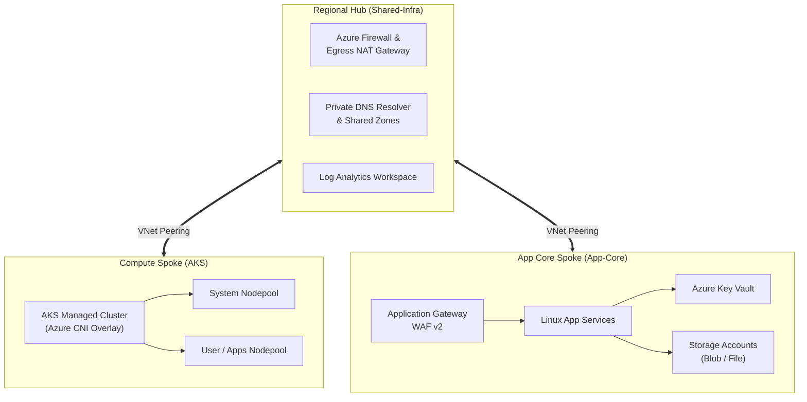
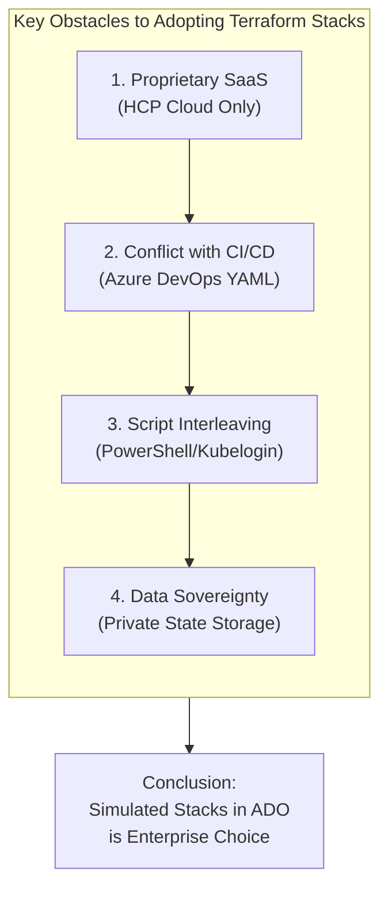

[⬅️ Previous: 112. Presentation Notebook](112-PRESENTATION_NOTEBOOK.md) | [🏠 Home](../README.md) | [➡️ Next: 121. Provenance and Legal](121-PROVENANCE_AND_LEGAL.md)

---

# 113. Agentic Architecture Blueprint

## Executive Overview

This whitepaper outlines the strategic architectural principles of the **Agentic Reference Architecture & Blueprint** (`terraform-azure-devops-agentic`).

### PoC & Untested Nature Notice
> [!WARNING]
> This architecture was generated by the **Antigravity Gemini 3.8 Flash agent** in **September 2026** as an experimental Proof of Concept (PoC) and reference architecture. While its predecessor ([`nubenetes/terraform-azure-devops`](https://github.com/nubenetes/terraform-azure-devops)) was thoroughly validated and deployed in live Azure environments, this modernized codebase has **not been tested in a real Azure environment** and will probably require manual adjustments and testing to execute without errors.

---

## 1. Hub-and-Spoke Regional Topology

The infrastructure enforces a strict **Hub-and-Spoke** topology across two geographic regions:
*   **North Europe (`ne`)**
*   **Central US (`cus`)**

<b>📊 Click to expand Diagram: Hub-and-Spoke Regional Topology</b>

#### Diagram 1 Description & Topology Breakdown
*   **Regional Hub VNet (`Shared-Infra`)**: Serves as the centralized egress security transit point containing Azure Firewall, Private DNS Resolver zones, and Log Analytics workspaces.
*   **Compute Spoke VNet (`AKS`)**: Dedicated container runtime hosting managed Kubernetes node pools configured with Azure CNI Overlay networking.
*   **App Core Spoke VNet (`App-Core`)**: Application tier housing Application Gateway WAF v2, Linux App Services, Key Vaults, and Storage Accounts.
*   **Bi-Directional Peering**: High-speed, low-latency Microsoft backbone peering connects each spoke directly to the regional Hub.

#### Summary & Key Takeaways
*   Centralizes outbound network egress, monitoring telemetry, and private DNS resolution.
*   Isolates container workloads from web applications and foundational network routing.

#### Conclusion
The Hub-and-Spoke model ensures strict blast-radius containment, centralized security enforcement, and predictable IPAM allocation across geographic Azure regions.

### Why Hub-and-Spoke?
1.  **Centralized Network Security**: All outbound egress traffic from AKS and App Services passes through the Hub's security perimeter.
2.  **Shared DNS Resolution**: Internal private endpoints for Key Vault and Storage Accounts are registered in centralized Private DNS zones housed in the Hub, avoiding fragmented DNS resolution.
3.  **Strict Blast Radius Isolation**: Changes to application spokes cannot inadvertently alter regional network routing or DNS rules.

---

## 2. In-Depth Analysis: Why Terraform Stacks is NOT Available on This Architecture

A major architectural focus of this modernized blueprint is clarifying why **HashiCorp Terraform Stacks** cannot be adopted on this architecture.

### The Promise of Terraform Stacks
Terraform Stacks introduces a native HCL orchestration framework:
*   `.tfstack.hcl` files define stack components and dynamic input/output bindings.
*   `.tfdeploy.hcl` files define deployment targets, environments, and orchestration streams.
*   Cross-component dependencies are resolved automatically by the engine, generating a unified speculative execution plan across all components.

### Why Stacks Fails in this Enterprise Azure Architecture

<b>📊 Click to expand Diagram: Why Stacks Fails in this Enterprise Azure Architecture</b>

#### Diagram 2 Description & Stacks Impediment Breakdown
*   **1. Proprietary SaaS Requirement**: Stacks mandates HCP Terraform SaaS; neither open-source Terraform CLI nor OpenTofu can parse `.tfstack.hcl`.
*   **2. Conflict with Enterprise CI/CD**: Displaces native Azure DevOps multi-stage approval gates (`ManualValidation@0`), pipeline variable templates, and RBAC governance.
*   **3. Inability to Interleave Imperative Scripts**: Purely declarative model cannot execute imperative Azure PowerShell, kubelogin, or Bitbucket schema scripts between stages.
*   **4. Data Sovereignty Violation**: Streams sensitive state files and secrets to external SaaS infrastructure, breaching regulatory compliance.

#### Summary & Key Takeaways
*   Native Stacks forces organizations into third-party cloud lock-in and strips out existing ITIL change controls.
*   Simulated Stacks in Azure DevOps preserves open-source tooling, data privacy, and imperative automation flexibility.

#### Conclusion
Simulated Stacks orchestrated via Azure DevOps Multi-Stage YAML pipelines remains the only viable and compliant architecture for this enterprise landing zone.

#### 1. Platform Lock-in to HCP Terraform Cloud
Terraform Stacks is strictly an **HCP Terraform (formerly Terraform Cloud)** proprietary feature. Standalone open-source Terraform CLI (`terraform plan` / `terraform apply`) and alternative runtimes like OpenTofu **cannot execute `.tfstack.hcl` or `.tfdeploy.hcl`**. Organizations using self-hosted Azure DevOps agents would be forced to subscribe to HashiCorp's commercial SaaS platform.

#### 2. Conflict with Enterprise Azure DevOps Governance
Enterprise deployments rely heavily on the Azure DevOps governance plane:
*   Multi-stage approval gates with formal business sign-offs (`ManualValidation@0`).
*   Dynamic pipeline variable templates linked to Azure Key Vault secrets.
*   Service connection security boundaries mapped to Entra ID security groups.
Adopting Stacks eliminates the CI/CD pipeline in favor of HashiCorp-managed execution streams, stripping away enterprise ITIL governance.

#### 3. Inability to Interleave Imperative Scripts
The end-to-end provisioning of this architecture requires non-declarative operational scripts between stages:
*   Assigning Entra ID Custom Security Attributes via Azure PowerShell.
*   Executing `kubelogin convert-kubeconfig` to negotiate dynamic AAD tokens.
*   Cloning external Bitbucket repositories for database schema ingestion.
Terraform Stacks is purely declarative and does not support interleaving imperative shell/PowerShell steps between component lifecycle events.

#### 4. Data Sovereignty and Private Network Perimeters
Financial and healthcare compliance rules frequently forbid streaming state files, resource metadata, and configuration secrets to a third-party SaaS cloud. This architecture preserves complete data sovereignty by storing all state files in private Azure Blob Storage containers behind private endpoints.

---

## 3. Simulated Stacks: The Enterprise Alternative

To obtain the blast-radius benefits of Stacks without its SaaS liabilities, this repository implements **Simulated Stacks**:

| Simulated Stacks Pattern | Implementation Mechanism |
| :--- | :--- |
| **Component Isolation** | Partitioned directories (`Shared-Infra`, `AKS`, `App-Core`, `App-Catalog`, `Day2-ops`) with independent state files. |
| **Dependency Binding** | Azure DevOps YAML stage dependencies (`dependsOn: TerraformPlanJob`) and `data` sources (`data.azurerm_subnet`). |
| **Approval Gates** | Native `ManualValidation@0` tasks pausing production deployments for human validation. |
| **State Security** | State stored in Azure Storage with TLS 1.2+ and private network isolation. |

---

*Enterprise Architecture Blueprint | Vision 2026*

---

[⬅️ Previous: 112. Presentation Notebook](112-PRESENTATION_NOTEBOOK.md) | [🏠 Home](../README.md) | [➡️ Next: 121. Provenance and Legal](121-PROVENANCE_AND_LEGAL.md)

---

*Technical Documentation: Agentic Reference Architecture and Modernization Blueprint | Vision 2026 Architectural Guide*
