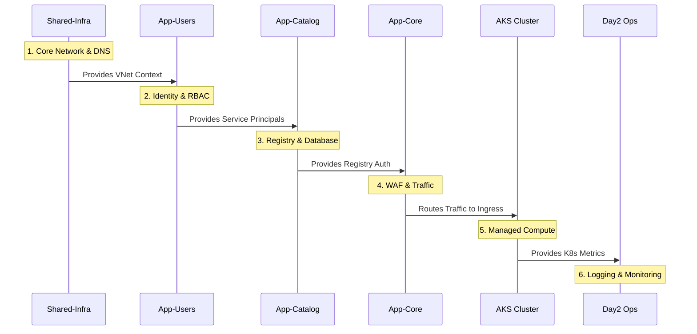
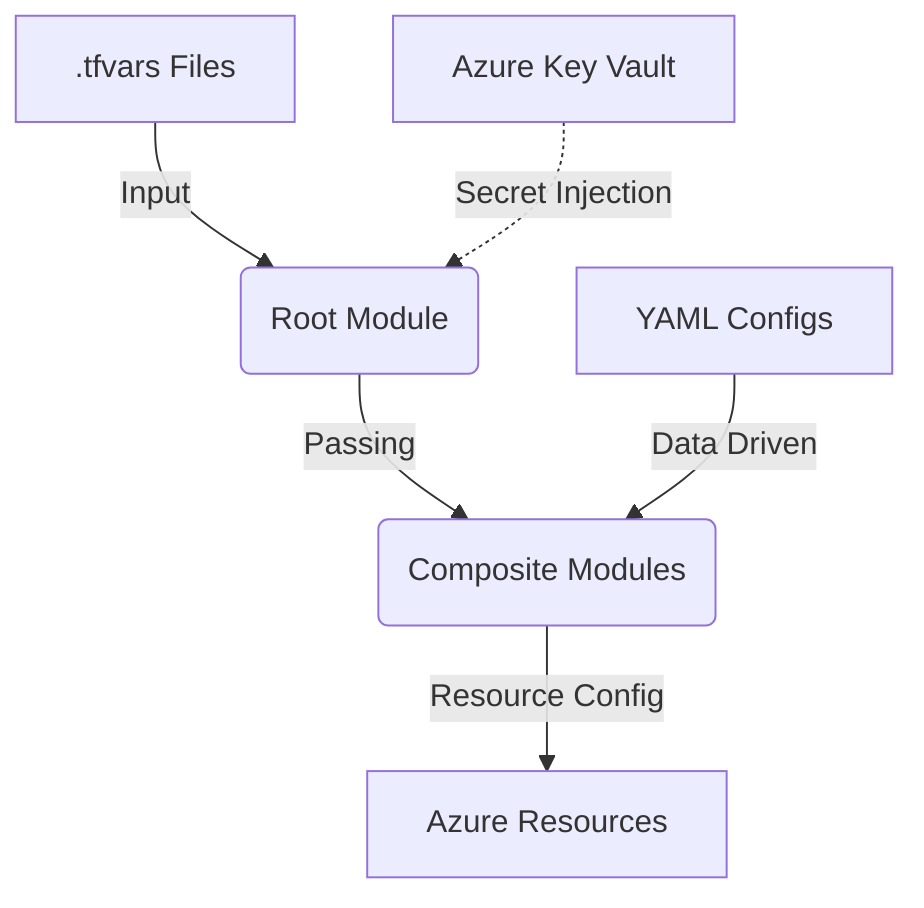

[ Previous: 212. Variable Architecture](212-TERRAFORM_VARIABLE_ARCHITECTURE_AND_DATA_STRATEGY.md) | [ Home](../README.md) | [ Next: 221. Visualizations](221-TERRAFORM_VISUALIZATIONS_AND_DEPENDENCY_GRAPHS.md)

---

# 213. Environment Configuration and .tfvars Inventory

This document provides a comprehensive inventory and explanation of the Terraform environment configuration files (`.tfvars`) used across the enterprise infrastructure. It details how environment parity is achieved, the **Provisioning Sequence** based on dependencies, and how sensitive data is managed through anonymization.

## 📑 Table of Contents
- [1. Introduction](#1-introduction)
- [2. Configuration Hierarchy](#2-configuration-hierarchy)
- [3. Dependency and Provisioning Sequence](#3-dependency-and-provisioning-sequence)
- [4. Variable Flow Architecture](#4-variable-flow-architecture)
- [5. Anonymization and Safety Standards](#5-anonymization-and-safety-standards)
- [6. Detailed Inventory Matrix](#6-detailed-inventory-matrix)
    - [6.1 Standard Infrastructure Modules](#61-standard-infrastructure-modules)
    - [6.2 Application Layer Modules](#62-application-layer-modules)

---

## 1. Introduction

In this architecture, `.tfvars` files are used to provide environment-specific values to the root Terraform modules. Unlike `variables.tf`, which defines the structure and types, `.tfvars` files contain the actual data (e.g., subscription IDs, Docker image tags, environment flags).

To maintain strict **Environment Isolation**, each module has a set of dedicated configuration files corresponding to different stages of the lifecycle (DEV, QA, UAT, PRO, etc.) and different Git branches (`develop` vs. `main`).

## 2. Configuration Hierarchy

The configuration follows a tiered approach:
1.  **Global Defaults**: Defined in `variables.tf` within each module.
2.  **Environment Overrides**: Provided via the specific `.tfvars` file during the Azure DevOps pipeline execution.
3.  **Secrets**: Sensitive values (like API keys or private certificates) are never stored in these files; they are retrieved dynamically from **Azure Key Vault**.

---

## 3. Dependency and Provisioning Sequence

The infrastructure is designed with a strict layer-based dependency model. Resources must be provisioned in a specific order to ensure that shared dependencies (like VNets or DNS zones) are available for downstream services.

### 3.1 Provisioning Workflow (The "Bottom-Up" Approach)

1.  **Shared-Infra**: Foundation layer (VNet, Peering, Core DNS).
2.  **App-Users**: Identity layer (Governance, Groups, Roles).
3.  **App-Catalog**: Service Registry layer (Database, App Service).
4.  **App-Core**: Application layer (Traffic Orchestration, WAF).
5.  **AKS Cluster**: Compute layer (Managed K8s, Node Pools).
6.  **Day2 Ops**: Management layer (Observability, Ingress).

### 3.2 Decommissioning Workflow (The "Top-Down" Approach)

To safely destroy infrastructure, the order must be **inverted** to avoid dependency violations:
**Day2 Ops** $\rightarrow$ **AKS** $\rightarrow$ **App-Core** $\rightarrow$ **App-Catalog** $\rightarrow$ **App-Users** $\rightarrow$ **Shared-Infra**.

### 3.3 Dependency Visualization

<b>📊 Click to expand Diagram: Dependency Visualization</b>

---

## 4. Variable Flow Architecture

The diagram below illustrates how configuration data flows from the files into the infrastructure resources:

<b>📊 Click to expand Diagram: Variable Flow Architecture</b>

---

## 5. Anonymization and Safety Standards

To ensure security and support AI-assisted engineering without exposing sensitive data, all `.tfvars` files in this repository follow strict anonymization rules:

-   **Domain Harmonization**: All email addresses and internal DNS references use `enterprise.com`.
-   **Identity Anonymization**: Real names are replaced with role-based identifiers (e.g., `admin.user1`, `dev.user1`).
-   **Subscription Protection**: Azure Subscription IDs are replaced with sequential generic UUIDs (e.g., `00000000-0000-0000-0000-000000000001`).
-   **Database Security**: Organizational IDs and internal keys (e.g., MongoDB Atlas Org ID) are replaced with null-value placeholders (`000000000000000000000000`).

---

## 6. Detailed Inventory Matrix

This section provides a matrix-based view of the configuration files, categorized by Tier (ENG/PRO) and Lifecycle Context.

### 6.1 Standard Infrastructure Modules

These modules follow a strict 4-way parity matrix. **Row numbering indicates the mandatory provisioning order.**

| Order | Module | Tier | `develop` Branch Context | `main` Branch Context | Functional Summary |
| :--- | :--- | :--- | :--- | :--- | :--- |
| **1** | **Shared-Infra** | **ENG** | [eng-developbranch.tfvars](../Shared-Infra/terraform-manifests/eng-developbranch.tfvars) | [eng-mainbranch.tfvars](../Shared-Infra/terraform-manifests/eng-mainbranch.tfvars) | Defines the **VNet/DNS backbone** for the Engineering tier. |
| | | **PRO** | [pro-developbranch.tfvars](../Shared-Infra/terraform-manifests/pro-developbranch.tfvars) | [pro-mainbranch.tfvars](../Shared-Infra/terraform-manifests/pro-mainbranch.tfvars) | Defines the **Backbone Hub** for Production and Global services. |
| **2** | **AKS Cluster** | **ENG** | [eng-developbranch.tfvars](../AKS/terraform-manifests/eng-developbranch.tfvars) | [eng-mainbranch.tfvars](../AKS/terraform-manifests/eng-mainbranch.tfvars) | Configures **Compute Nodepools** for DEV/QA/UAT workloads. |
| | | **PRO** | [pro-developbranch.tfvars](../AKS/terraform-manifests/pro-developbranch.tfvars) | [pro-mainbranch.tfvars](../AKS/terraform-manifests/pro-mainbranch.tfvars) | Configures high-availability **Production Compute Hub**. |
| **3** | **Day2 Ops** | **ENG** | [eng-developbranch.tfvars](../Day2-ops/terraform-manifests/eng-developbranch.tfvars) | [eng-mainbranch.tfvars](../Day2-ops/terraform-manifests/eng-mainbranch.tfvars) | Setup of **Log Analytics** and Monitoring for Engineering. |
| | | **PRO** | [pro-developbranch.tfvars](../Day2-ops/terraform-manifests/pro-developbranch.tfvars) | [pro-mainbranch.tfvars](../Day2-ops/terraform-manifests/pro-mainbranch.tfvars) | Critical **Observability/SRE stack** for Production Ops. |

### 6.2 Application Layer Modules

These modules are typically provisioned **after the Shared-Infra foundation and before the AKS Compute nodes** if integrated.

| Order | Environment | Module | `develop` Branch File | `main` Branch File | Key Details and Purpose |
| :--- | :--- | :--- | :--- | :--- | :--- |
| **1.1** | **DEV** | App-Catalog | [dev-developbranch.tfvars](../App-Catalog/terraform-manifests/dev-developbranch.tfvars) | [dev-mainbranch.tfvars](../App-Catalog/terraform-manifests/dev-mainbranch.tfvars) | Initial integration tier for **Catalog services** and DB. |
| **1.2** | | App-Core | [dev-developbranch.tfvars](../App-Core/terraform-manifests/dev-developbranch.tfvars) | [dev-mainbranch.tfvars](../App-Core/terraform-manifests/dev-mainbranch.tfvars) | **Rapid prototyping** environment for Web Apps and APIs. |
| **2.1** | **QA** | App-Catalog | [qa-developbranch.tfvars](../App-Catalog/terraform-manifests/qa-developbranch.tfvars) | [qa-mainbranch.tfvars](../App-Catalog/terraform-manifests/qa-mainbranch.tfvars) | **Quality Assurance** tier for registry verification. |
| **2.2** | | App-Core | [qa-developbranch.tfvars](../App-Core/terraform-manifests/qa-developbranch.tfvars) | [qa-mainbranch.tfvars](../App-Core/terraform-manifests/qa-mainbranch.tfvars) | Stable QA tier for **WAF and Traffic** testing. |
| **3.1** | **UAT** | App-Catalog | [uat-developbranch.tfvars](../App-Catalog/terraform-manifests/uat-developbranch.tfvars) | [uat-mainbranch.tfvars](../App-Catalog/terraform-manifests/uat-mainbranch.tfvars) | **User Acceptance** for catalog/registry features. |
| **3.2** | | App-Core | [uat-developbranch.tfvars](../App-Core/terraform-manifests/uat-developbranch.tfvars) | [uat-mainbranch.tfvars](../App-Core/terraform-manifests/uat-mainbranch.tfvars) | Full **End-to-End** testing with dummy client data. |
| **4.1** | **PRE** | App-Catalog | [pre-developbranch.tfvars](../App-Catalog/terraform-manifests/pre-developbranch.tfvars) | [pre-mainbranch.tfvars](../App-Catalog/terraform-manifests/pre-mainbranch.tfvars) | **Pre-production** stage for registry migrations. |
| **4.2** | | App-Core | [pre-developbranch.tfvars](../App-Core/terraform-manifests/pre-developbranch.tfvars) | [pre-mainbranch.tfvars](../App-Core/terraform-manifests/pre-mainbranch.tfvars) | **Staging** tier using Production-like WAF policies. |
| **5.1** | **PRO** | App-Catalog | [pro-developbranch.tfvars](../App-Catalog/terraform-manifests/pro-developbranch.tfvars) | [pro-mainbranch.tfvars](../App-Catalog/terraform-manifests/pro-mainbranch.tfvars) | The definitive **Production Registry** configuration. |
| **5.2** | | App-Core | [pro-developbranch.tfvars](../App-Core/terraform-manifests/pro-developbranch.tfvars) | [pro-mainbranch.tfvars](../App-Core/terraform-manifests/pro-mainbranch.tfvars) | **Live Core Production** services and DNS traffic. |
| **6** | **DEMO** | App-Core | [dem-developbranch.tfvars](../App-Core/terraform-manifests/dem-developbranch.tfvars) | [dem-mainbranch.tfvars](../App-Core/terraform-manifests/dem-mainbranch.tfvars) | Specialized **Public Demo** tier for core apps. |
| **7** | **RES** | App-Core | [res-developbranch.tfvars](../App-Core/terraform-manifests/res-developbranch.tfvars) | [res-mainbranch.tfvars](../App-Core/terraform-manifests/res-mainbranch.tfvars) | **Researcher/Sandbox** tier for advanced AppCore analytics. |

---

## 📚 Validated Reference Library (Official and Community)
- [HashiCorp: Terraform Variable Files (.tfvars)](https://developer.hashicorp.com/terraform/language/values/variables#variable-definitions-files-tfvars)
- [Microsoft: Azure DevOps Pipelines - Terraform Variable Handling](https://learn.microsoft.com/en-us/azure/devops/pipelines/tasks/transforms-variable-substitution)
- [Keep a Changelog: Parity Standards](https://keepachangelog.com/en/1.1.0/)

---

[ Previous: 212. Variable Architecture](212-TERRAFORM_VARIABLE_ARCHITECTURE_AND_DATA_STRATEGY.md) | [ Home](../README.md) | [ Next: 221. Visualizations](221-TERRAFORM_VISUALIZATIONS_AND_DEPENDENCY_GRAPHS.md)

---
*Technical Documentation: Environment Configuration and .tfvars Inventory | Vision 2026 Architectural Guide*
