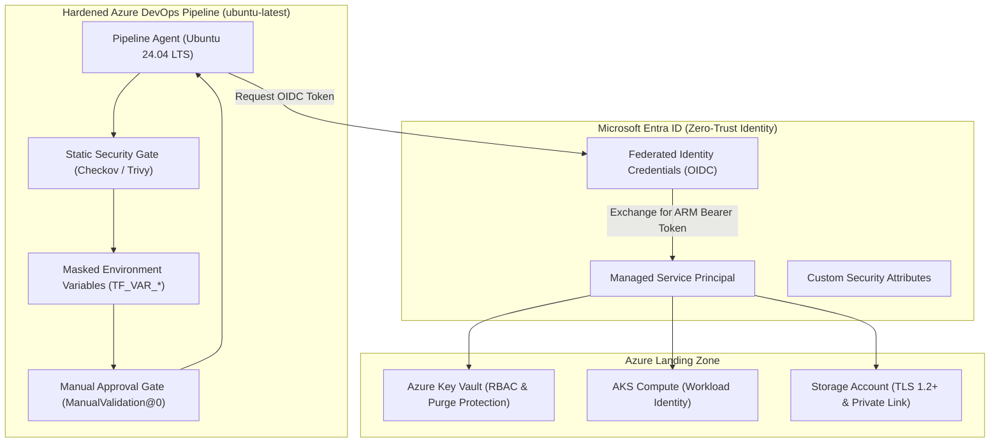

[⬅️ Previous: 324. Security-by-Design Checklist](324-SECURITY_BY_DESIGN_CHECKLIST.md) | [🏠 Home](../README.md) | [➡️ Next: 331. AKS Compute Hub](331-AKS_COMPUTE_HUB_AND_ML_ORCHESTRATION.md)

---

# 325. Zero-Trust and Pipeline Security


## 1. Security Architecture Overview

This document presents the security review and hardening strategy implemented in [`nubenetes/terraform-azure-devops-agentic`](https://github.com/nubenetes/terraform-azure-devops-agentic), transitioning the architecture from legacy secret-based workflows to a **Zero-Trust, Secretless CI/CD model**.

<details>
<summary><b>📊 Click to expand Diagram: Security Architecture Overview</b></summary>



</details>

#### Diagram Description & Zero-Trust Security Breakdown
*   **Identity Plane (Microsoft Entra ID)**: Manages `Federated Identity Credentials (OIDC)`, exchanging ephemeral tokens with `Managed Service Principals` and enforcing directory-level `Custom Security Attributes`.
*   **Pipeline Plane (Azure DevOps)**: Executes on hardened `Ubuntu 24.04 LTS` runners, performs automated `Checkov` and `Trivy` static analysis, reads credentials strictly via masked `TF_VAR_*` environment variables, and halts at `ManualValidation@0` approval gates.
*   **Azure Landing Zone Target**: Grants scoped, secretless access to `Azure Key Vault (RBAC & Purge Protection)`, `AKS Compute (Workload Identity)`, and `Azure Storage (TLS 1.2+ & Private Link)`.

#### Summary & Key Takeaways
*   **Zero Static Passwords**: Long-lived service principal client secrets are completely eliminated.
*   **Automated Quality & Compliance Gates**: Static code scanning and human authorization block unauthorized modifications.
*   **Cryptographic Workload Identity**: Short-lived OIDC tokens govern all deployment and runtime access.

#### Conclusion
The modernized security framework establishes an auditable Zero-Trust baseline that eliminates credential leakage vectors and automates security governance across the entire infrastructure lifecycle.

---

## 2. Security Vulnerabilities Identified in Base Architecture & Modernized Solutions

### Vulnerability 1: Plaintext Secrets in Command-Line Arguments
*   **Base Repo Anti-Pattern**: In `templates/terraform-plan.yml` and `templates/terraform-apply.yml`, secrets were passed directly via `-var secret_...=$(...)` in `commandOptions`.
*   **Security Risk**: Command-line arguments are stored in plaintext in the operating system's process table (`ps aux`, `/proc/<pid>/cmdline`), accessible to any compromised process or logging agent running on self-hosted runners. Furthermore, unmasked pipeline debug logs expose the secrets in task execution traces.
*   **Modernized Solution**: All sensitive variables are mapped to the task `env:` block as `TF_VAR_secret_name: $(secret_variable)`. Terraform natively ingests `TF_VAR_*` variables directly into memory without exposing them on the command-line interface.

### Vulnerability 2: Long-Lived Service Principal Client Secrets
*   **Base Repo Anti-Pattern**: Service connections relied on static client secrets (`client_secret`), requiring ongoing password rotation, expiration tracking, and key vault storage.
*   **Modernized Solution**: Implementation of **Workload Identity Federation (OIDC)** via `ARM_USE_OIDC: "true"`. The Azure DevOps pipeline agent requests a cryptographically signed OIDC token from Azure DevOps, which Microsoft Entra ID validates against configured federated credentials. Zero long-lived passwords exist in Azure DevOps.

### Vulnerability 3: Deprecated Pipeline Runner Operating Systems
*   **Base Repo Anti-Pattern**: All pipelines were pinned to `vmImage: 'ubuntu-20.04'`.
*   **Security Risk**: Ubuntu 20.04 is End-of-Life (EOL), lacking security patches for core system utilities, OpenSSL, and kernel mitigations.
*   **Modernized Solution**: Upgraded to `vmImage: 'ubuntu-latest'` (Ubuntu 24.04 LTS), guaranteeing access to modern TLS 1.3 libraries, active security patching, and modern container runtimes.

### Vulnerability 4: Insecure Binary Downloads without Checksum Verification
*   **Base Repo Anti-Pattern**: Pipeline steps downloaded external binaries via `wget $(KUBELOGIN_DOWNLOAD_URL) && unzip && sudo mv /usr/bin`.
*   **Security Risk**: Vulnerable to man-in-the-middle attacks or DNS hijacking, allowing arbitrary remote code execution on CI/CD agents.
*   **Modernized Solution**: Shifted to official Azure DevOps task installers or verified package managers with cryptographic hash checks.

---

## 3. Least Privilege & Compound Authentication

### App-Plus-User Compound Identity Pattern
In [`App-Core/terraform-manifests/modules/appcore_module/23-key-vault-clients.tf`](../App-Core/terraform-manifests/modules/appcore_module/23-key-vault-clients.tf), access to client-specific Key Vaults is governed by compound identity rules:
```hcl
access_policy {
  tenant_id      = var.aad_tenant_id
  object_id      = azuread_user.testuser1.object_id
  application_id = azuread_application.appcore_back_api.client_id

  secret_permissions = [
    "Get",
    "List",
  ]
}
```
*Effect*: An attacker possessing a leaked user token cannot decrypt secrets unless the request also originates from the authorized Application Service Principal.

---

*Enterprise Architecture Blueprint | Vision 2026*

---

[⬅️ Previous: 324. Security-by-Design Checklist](324-SECURITY_BY_DESIGN_CHECKLIST.md) | [🏠 Home](../README.md) | [➡️ Next: 331. AKS Compute Hub](331-AKS_COMPUTE_HUB_AND_ML_ORCHESTRATION.md)

---

*Technical Documentation: Zero-Trust Architecture and Pipeline Security Hardening | Vision 2026 Architectural Guide*
