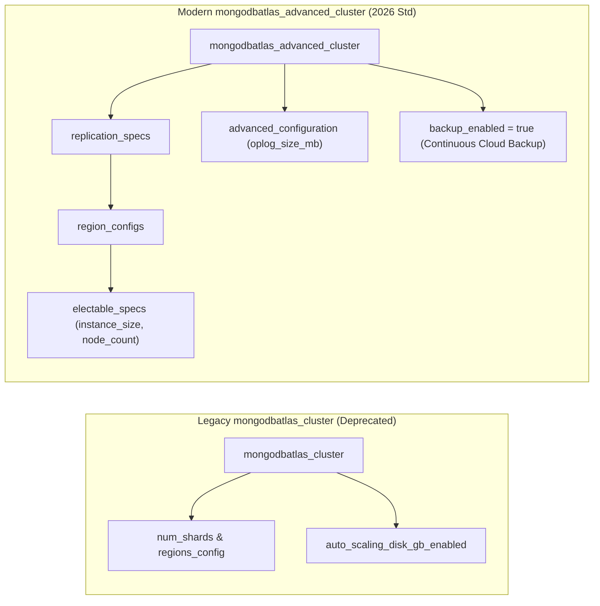

[⬅️ Previous: 342. Storage Governance](342-STORAGE_GOVERNANCE_AND_LIFECYCLE.md) | [🏠 Home](../README.md) | [➡️ Next: 411. Azure DevOps Pipelines](411-AZURE_DEVOPS_PIPELINES_ORCHESTRATION.md)

---

# 343. MongoDB Atlas Modernization Guide


## 1. Overview

In modern MongoDB Atlas Terraform provider releases ($>1.14$ through $1.25+$), the legacy `mongodbatlas_cluster` resource has been deprecated. This document explains the complete modernization to `mongodbatlas_advanced_cluster` implemented in [`nubenetes/terraform-azure-devops-agentic`](https://github.com/nubenetes/terraform-azure-devops-agentic).

---

## 2. Architectural Differences: Legacy vs. Advanced Cluster

<details>
<summary><b>📊 Click to expand Diagram: Architectural Differences: Legacy vs. Advanced Cluster</b></summary>



</details>

#### Diagram Description & Schema Modernization Breakdown
*   **Legacy `mongodbatlas_cluster` (Left Column - Deprecated)**:
    *   Relied on monolithic, inflexible parameters (`num_shards`, `regions_config`, `auto_scaling_disk_gb_enabled`).
    *   Lacked granular multi-cloud region tiering and flexible electable node configurations.
    *   Deprecated in modern releases of the MongoDB Atlas Terraform provider ($>1.14$ through $1.25+$).
*   **Modern `mongodbatlas_advanced_cluster` (Right Column - 2026 Standard)**:
    *   Decomposes cluster architecture into modular nested blocks: `replication_specs`, `region_configs`, and `electable_specs`.
    *   Explicitly configures instance sizing (`M10`), node counts (`3`), and failover priorities (`7`).
    *   Enables granular `advanced_configuration` (e.g., `oplog_size_mb`) and continuous cloud backup (`backup_enabled = true`).

#### Summary & Key Takeaways
*   **Architectural Flexibility**: Supports multi-region replica sets with independent node counts and priorities per geographic region.
*   **Provider Compliance**: Eliminates deprecation warnings and future-proofs provider upgrade paths.
*   **Integrated Data Protection**: Directly binds automated continuous cloud backups and Point-in-Time Restore (PITR) policies.

#### Conclusion
Migrating from `mongodbatlas_cluster` to `mongodbatlas_advanced_cluster` transforms the persistence layer into a resilient, enterprise-grade database deployment aligned with modern cloud standards.

---

## 3. Code Implementation Comparison

### Legacy Implementation (Base Repo):
```hcl
# ❌ DEPRECATED RESOURCE
resource "mongodbatlas_cluster" "cluster" {
  name                   = "${var.Enterprise_product}-${local.instance_environment}"
  project_id             = mongodbatlas_project.project.id
  mongo_db_major_version = var.mongodb_atlas_mongodbversion
  cluster_type           = "REPLICASET"
  cloud_backup           = true
  replication_specs {
    num_shards = 1
    regions_config {
      region_name     = var.mongodb_atlas_region
      electable_nodes = 3
      priority        = 7
      read_only_nodes = 0
    }
  }
  provider_name               = var.mongodb_atlas_cloud_provider
  provider_instance_size_name = "M10"
}
```

### Modernized Implementation (Agentic Repo):
```hcl
# ✅ MODERN SEPTEMBER 2026 STANDARD
resource "mongodbatlas_advanced_cluster" "cluster" {
  project_id   = mongodbatlas_project.project.id
  name         = "${var.Enterprise_product}-${local.instance_environment}"
  cluster_type = "REPLICASET"

  replication_specs {
    region_configs {
      electable_specs {
        instance_size = "M10"
        node_count    = 3
      }
      priority      = 7
      provider_name = var.mongodb_atlas_cloud_provider
      region_name   = var.mongodb_atlas_region
    }
  }

  advanced_configuration {
    oplog_size_mb = var.oplog_size_mb
  }

  backup_enabled = true

  tags {
    key   = "Environment"
    value = local.instance_environment
  }

  tags {
    key   = "ManagedBy"
    value = "Terraform-Agentic"
  }
}
```

---

## 4. Key Advantages of `mongodbatlas_advanced_cluster`

1.  **Multi-Cloud & Cross-Region Replica Sets**: Enables complex multi-region and multi-cloud topology configurations within a single declarative resource.
2.  **Dedicated Node Sizing**: Dedicated electable, read-only, and analytics nodes can each have independent instance sizes.
3.  **Continuous Cloud Backup**: Integrated directly via `backup_enabled = true` without external snapshot policies.
4.  **Native Private Link Integration**: Directly binds with Azure Private Endpoint connections for zero-trust traffic routing.

---

*Enterprise Architecture Blueprint | Vision 2026*

---

[⬅️ Previous: 342. Storage Governance](342-STORAGE_GOVERNANCE_AND_LIFECYCLE.md) | [🏠 Home](../README.md) | [➡️ Next: 411. Azure DevOps Pipelines](411-AZURE_DEVOPS_PIPELINES_ORCHESTRATION.md)

---

*Technical Documentation: MongoDB Atlas Modernization Guide | Vision 2026 Architectural Guide*
